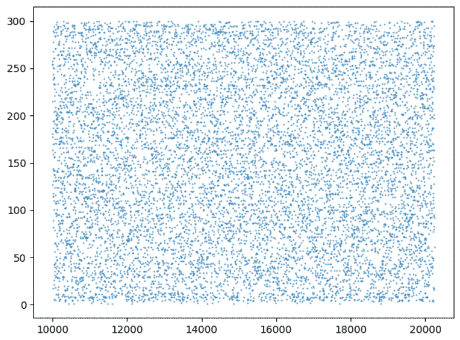
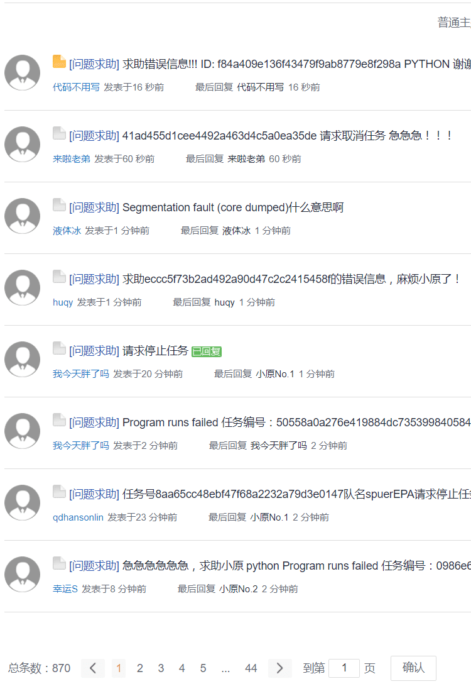
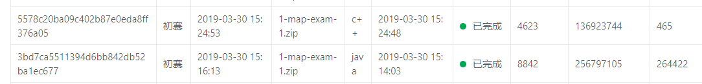

一次有意义的比赛，值得纪念

<!--more-->

**2019年3月15日正式開始比赛**

创建了5个类文件，虽然都不大，但很伤脑，一开始程序总是报错，后来才发现是我一个常量数组开小了，再后来正式地图集下来了，我开的1000常量又不够用了，这次长点记性直接开20000，

输入格式得按照顺序来，否则会出问题

**2019年3月21日**

在刷了二天左右的科目一试题之后，就过去考试了，结果还不错96分，合格了，考试的过程中突然弹出来一个错误提示框，说：**remote connection has stopped……** 第一次遇见这种情况，心里比较紧张，多点了两下，然后系统就提示我错了两道题(做完就知道正确还是错误)，所幸并无大碍。

晚上的2019年IEG游戏安全技术大赛就要截至了，马上就胡乱的做了几下就交了。

早上一大早就发现，喵喵同学的结果出来了，虽然是用的dij但是也还行了，1180*2 暂时排在27名左右。

**2019年3月22日**

现在我需要做的就是如何提高分数了，首先看死锁产生的原因，再看判题器。

**2019年3月26日**

守了一年的GSOC开始了，但是现在我却被这个HUAWEI比赛所困扰，现在无法解决路径问题，而喵喵同学的C＋＋代码看上去又是如此的奇怪，所以当务之急就是写出JAVA的迪杰兰特拉算法，答案有三个要素，分别是carId，carStartime，还有就是路径了，现在我的路径算是解决了，只剩下Starttime了，这个时间关系到调度分数，所以说是一个不得不做的事情，晚上在我的努力之下终于获得了回报，终于跑通了，很开心，QQ聊天陈义杰也获得了不错的结果，收到了三七互娱的offer，难以想象一年前的今天他还是个连helloworld都打不出来的菜鸟，看来信息的获取途径直接决定了下一步的计划。

**2019年3月27日**

在使用迪杰斯特拉跑通代码之后，马上需要解决一下startTime问题，一开始确实死锁了，怪哉怪哉，carID=10感觉就是一个神车，怎么调都是dead Lock，思考了一下，先上个分再说，不赖，目前能跑出分来，但是结果不行，看来还得在这种上面多下点功夫了。目前Car里面的数据有一项没有用到，那就是CarSpeed，还有就是Road中的roadMaxSpeed和roadChannel没有用到，这三个应该就是关键了，直觉吧希望后面的两天会有帮助，看来又得加班喽，想去上海旅个游不容易啊。

一开始还打算用Floyd,结果写完之后死活不对，连最短路径都出问题了，第一关都没过还谈什么后面的问题，在写完迪杰斯特拉之后忍痛将写好的代码删了，删了怪可惜的，还是好好截个图保留下来吧

目前的分数在这个位置，这肯定无法通过复赛，去上海旅游的，先不说还有藏分的各位大腿，单单这个排名就已经out了，

啥也别说了，加油吧，写判题器，蚁群模拟退火搞起来！

**2019年3月28日**

天气潮湿，最近又到了月末，手机和校园网都使没了，感觉有些淡淡的忧伤，没办法继续到老李实验室蹭网，实验室环境还是好啊，说话又好听，超喜欢在这里，免费网用的很爽，二话不说就往树莓派里装了一个kali，结果死活都不适配那个3.5寸的显示屏，没办法谁叫人家是GPIO接口的呢。本来想着自己也能做一个zoomeye，现在想想还是省省吧，装完系统后这件事就先搁一搁在说，毕竟这个HUAWEI比赛还有几天就结束了。
这是初始化图一的结果，x=carId y=carPassTime

这是得分400的情况

 可以看到分布的异常均匀

   现在已经将邻接矩阵的权值从路长变换到时间了，理论上的最短路径时间已经求出来了，现在就差放置的策略了，今年的题目感觉跟去年的有点像，去年是预测出数据去放置，今年的套路是求出最短路径然后放置时间去得分，关于时间这一块暂时还没有一个什么好的思路，不知道队友喵喵大腿撸出所谓的判题器没，感觉这货最近没少喝红牛。闲话少说，目前还在调参所谓的最优时间策略，祝好运。

**2019年3月29日**

自从对数据进行分析之后，发现只要合理的分布时间，理论上是能够达到所谓的最优的，这是比较好的一次结果

**2019年3月30日**
正式比赛开始了，看不到排名，但是各位大佬的成绩似乎都非常的好，我们队凉凉,
这图太可怕了

今年的画风也挺奇怪的，

仔细思考了一下，大致有了以下心得，真难。

怎么说呢，比赛的意义还是挺大的，毕竟这么多问题，感觉也摸到了出题人的思路，和往年一样，都是先求策略再求另外一个策略。不得不说，编码能力还是得加强啊，对了，关于Java的处理速度，我从这件事情上可谓是买到了足够的教训，用C写的500ms以内就跑完了，用Java要花250,000ms才能跑完，实在是实力坑人，以后还是机灵点，如果碰到数据量大还好，碰到计算复杂度高的程序，还是得用c来写，毕竟处理速度惊人。