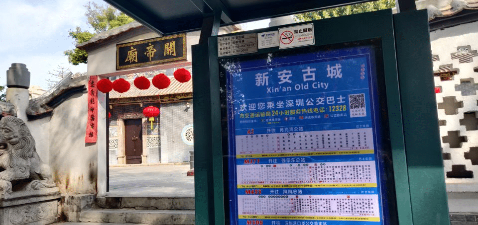
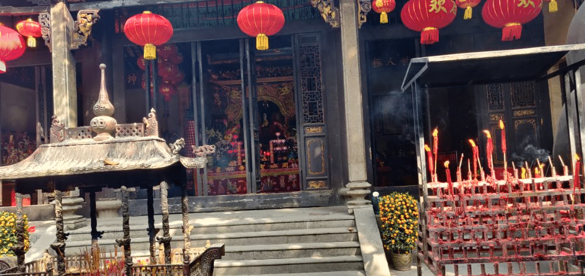
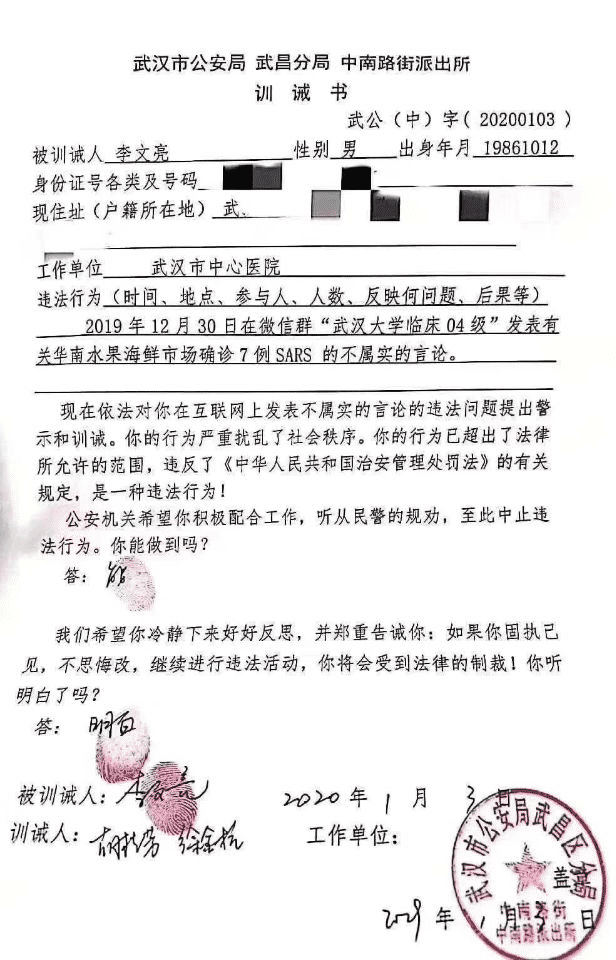
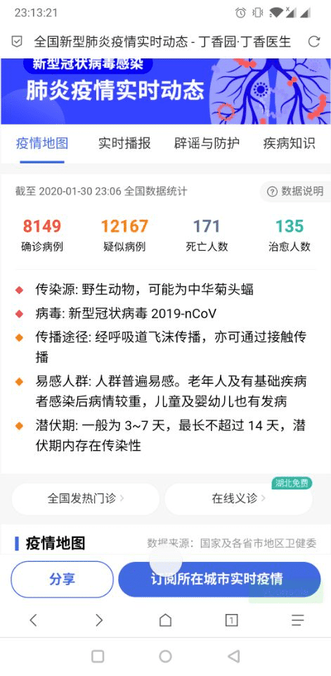

2020年1月24日是中国农历2020年的的除夕夜，1.20日调休两天，1月23日晚18时，我从深圳踏上了回家的路程……

<!--more-->

​		&nbsp;&nbsp;&nbsp;&nbsp;2020年1月20日，离春节还不到一个礼拜，国家法定放假日是大年三十那天，但周围的同事越来越少基本都申请调休回家过年了，之前加班时间比较多，现在手里活不多，心里也有了休息的想法，于是我申请了调休2天，虽然新闻上关于武汉出现不明原因肺炎的报道越来越频繁，但是远在深圳的我，每天日常就是工作，加上周围并没有出现恐慌，所以认为应该只是一个局部事情。

​		&nbsp;&nbsp;&nbsp;2020年1月21日，通过互联网平台主要是[知乎热搜](https://www.zhihu.com/question/363894293/answers/updated)和微博热搜，武汉传染病似乎越来越严重，我也由此提高了警惕，在出门前，于小区门口药店，购买了N95口罩和抗病毒口服液以及提高抵抗力的维生素C，只是没想到N95口罩会这么贵，40¥/片，平常好像只需要1-2¥/片；考虑到1月23日会前往人流大站--深圳北站，忍痛买下了2片，回去一片，回来一片，但谁能料想到往后口罩成了紧俏货，厦门已经开始摇号购买了，当然这都是后话了。已经办好了金融社保卡，五险一金已经开始正常缴纳了，看到了药店门口醒目的支持医保标语，这次买药本想刷医保，结果店主提示医保刷不了，我顿时一惊，心想为啥刷不了，账号无效？很快店主打消了我的疑惑，“你的医保余额不足，要5000以上才能刷，大概再交一个月就可以了”，这次刷不了就算了，有了这句话，心中石头也算落地一半了。

​	&nbsp;&nbsp;申请调休的理由是办理档案和置办年货，当然年货只是一个幌子，该买的东西早已京东买好，给家人买了小米电动牙刷，我已经使用了半个月左右，比较不错，独乐乐不如众乐乐，所以也给家人捎上了。重点还是档案的事情，我是2019届的毕业生，来到深圳工作，作为应届生户口落在了深圳南山区南头派出所，深圳市政十分方便，1978年邓公亲自圈下的这块小渔村，经历40年的改革开放如今早已成长为中国大陆的南天门，深圳市民政务效率十分迅速，我在2019年6月本科毕业之后，就开始准备材料，按照知乎前辈总结的办法很快就将落户流程熟悉清楚了，大致可以参考一下--[2019 毕业两年内大学生落户深圳指南](https://zhuanlan.zhihu.com/p/67609618)，因为工作时间原因，一直没空去办理落户的事情，后来挑了一个吉利的日子 2019.09.10日，总算是把落户的事情搞定了，然后办理了身份证。但是最后一个办理毕业生档案还没有弄好，所以这次调休的目的就是完成这档案的存放问题。一切都很顺利，在办理完这件事情之后，车站旁发现了一个祈神拜佛的地方，心情愉悦之下萌生了拜访之意

寺庙不大，但香火不断，也有人正在虔诚的祈祷

作为无神论者，我理解他们是在寻求心理的慰藉，但本着求同存异的想法，未敢打扰，继续参观内院去了，

院子古色古香，香火不断，是一个清静的地方，时间也不早了，我也就此打住，回去了。

​	&nbsp;&nbsp;时间很充裕，下午，老家好友交流回家日程，约定聚会时间，闲谈中，让我帮忙购买一些口罩使用，我没有放引起重视，但依然答应他购买，傍晚在永和大王店吃完晚饭后，去了药店，这才惊讶的发现口罩越来越稀缺了，于是我赶紧购置了一定数量的口罩，药店只有三种口罩类型，而且还是限量购买，在和好友沟通中，通话质量断断续续，心情似乎也受到了波动十分忐忑，在查看了口罩种类的价格后，最终选择了价格贵的那种，毕竟身体才是革命的本钱。

&nbsp;&nbsp;第一次看到这种限购的架势，不免有些紧张，于是我也为自家购买了一批口罩，没想到后面竟然直接无货了。时间终于到了1月23日，网上消息关于武汉肺炎越来越严重，我开始重视起来了，收拾完东西，处理了房内的杂物，带上了N95口罩和墨镜+帽子，把自己裹的严严实实的。到了地铁站，人群中有些安逸，好像大家都没把这件事情放在心上，但我知道，这只是暴风雨的前夕，果然，到达深圳北站，远远望去，每个人都挂着一个口罩，白色医用口罩居多，N95因为贵+限购的原因，戴的人反而不多，仔细想了想，发展离不开经济，有了物质基础，才有机会完善精神世界，这更佳坚定了我对于经济的需求。

​	&nbsp;&nbsp;火车终于开动了，打了个电话回去，告诉了我已经出发了以及到站的时间，车厢内每个人都很自觉的戴着口罩，几声清脆的咳嗽，往往会吸引车内人的注意，毕竟在这种紧要关头，降低风险概率是唯一确保自身安全的做法。车厢有点闷，只有列车员来来往往的推销货物，经历过漫长的等待终于要接近尾声了，高铁开始减速，到家了。

​	&nbsp;&nbsp;1月24日，除夕夜，很安静，没有了往年的喧嚣，群里的气氛不如当年学生时代了，但还好我有一群志同道合的伙伴，相互问候了一下之后，就是发红包环节，今年的红包主题是短视频，快手10亿，抖音20亿，微视10亿，短视频狂欢，因为疫情的缘故，今年算是第一次正儿八经的看春晚，其中一个记忆犹新的小品片段是关于财富和快乐的，讲的很深刻，但最后也并没有把如何解决社会财富分配不均的办法说出来；还有一个小品是讲讽刺官场形式主义作风的，里面带火了一个词：“词穷”，事实上对于2020年春节这魔幻色彩的开端，我也想说一声，词穷啊。

&nbsp;&nbsp;	1月25日-1月31日，初一到初七是国家法定放假日，按照惯例，初八要上班，所以我已购买初七的返程票，但是让人意外的事情是疫情的严重性超过了想象，类比于2003年的[非典事件](https://wuu.wikipedia.org/wiki/%E9%9D%9E%E5%85%B8%E5%9E%8B%E6%80%A7%E8%82%BA%E7%82%8E)，很快在春节伊始，按照《国家突发公共卫生事件应急预案》，各省市宣布进入重大突发公共卫生事件一级响应，根据突发公共卫生事件性质、危害程度、涉及范围，突发公共卫生事件划分为特别重大（Ⅰ级）、重大（Ⅱ级）、较大（Ⅲ级）和一般（Ⅳ级）四级。其中，一级响应属于最高级别的响应。公司很快作出行动，开始启动在家办公机制，后来又调整为在家休息，2月1日至2月9日休息，只不过公司的决策在部门中实施上出现了偏差，我们小组默认加班三天，事有轻重缓急，比起大多数公司来说，我们应该是幸福的。

​		&nbsp;&nbsp;这次疫情打破了往日的宁静，经济重灾区旅游、餐饮、交通纷纷叫苦不迭，无数中产阶级宣告破产，其中在新世纪中获利的房主和租客身上也演了一幕幕戏剧性的对话。余生很长，平淡是衡量幸福的标杆，但需要历史上的悲壮色彩才能衬托出这种幸福。很快WHO的总干事宣布2019-nCoV疫情构成国际关注的*突发公共卫生事件*，事情有了定性，但依然没有结束，武汉每时每刻都在上演历史性的悲剧，其中有让人愤慨的红十字会事件(主要围绕武汉协和医院和武汉仁爱医院)，也有令人失望的武汉市政府办公厅车牌号事件（该汽车*车牌*为 **鄂A0260W** ），但是更多的是一些让人悲痛的因疫情造成的医护事件，故事很多，其中最为壮烈的莫过于李文亮医生的事迹了。李文亮医生，2019年12月30日因在互联网平台散布非典谣言，被武汉市公安局武昌分局训诫，2月1日自身感染的疫情被确诊，2月6日因感染新型冠状病毒肺炎病逝，从一个之前的造谣者，变成这场疫情的受害者，我有些失神，事实上，这种悲剧来的太突然了，这种前后带来的反转让人感觉到了强烈的悲剧色彩，

&nbsp;&nbsp;看到这张训诫书，似乎有了很大的讽刺意味，李文亮医生作为这次疫情的“吹哨人”，却因此献出了自己的生命，这个代价很大，超过了一切，于法，这是未可厚非的，但于情这是骇人听闻的，所以相关机构若无法给予民众合乎情理的解释和安排，那么社会和公众将会对机构丧失公信力，一旦缺口打开，带给我们的将会是无尽的风暴。

&nbsp;&nbsp;这次事件极有可能写入史册，李文亮医生，缅怀你，也祝贺你，在历史的长河中，你找到了自己的定位，作为一个疫情的“吹哨人”，安息吧。

​	

​	然而，这场疫情并没有结束，1月30日的数据显示，人传人已证据确凿，

目前是 2月7日，事情过去一周，正好是处于春节返工高峰期，数据显示，疫情正在加重，还没达到高峰拐点

​		&nbsp;&nbsp;目前是2020年2月7日17:00分左右，未来是不可确定的，但可以通过预测来做好准备，一部电影：[《传染病》](https://movie.douban.com/subject/4301043/)，虽然是2011年拍的，但是导演预测了未来传染病爆发后所带来的连锁事件，我认为是具有参考价值的，电影中首先是交通管制，然后是食物短缺，金融千股跌唯医药股大热，最后持续一段时间，疫苗研制成功，开始实行疫苗生产派发管制，就像一个小挫折，然后社会继续有条不紊的向前发展下去，只是少了一些主角，多了一些陌生的面孔。将电影中的情况兑现到现实生活中，具有一定的借鉴意义，目前交通管制已开始实施，金融领域也出现千股跌停，口罩、抗病毒和抗生素概念股大热，事情也仍然在继续发酵中，疫情将会在什么时候出现拐点呢，目前是未知的，在这历史的长河中，撑着一艘小船，顺利抵达目的地，不容易，期待雨过天晴的到来。

