> 大学比较有意思的校外活动，尤其是Hack文化

<!--more-->

*   Hacker，一直是每个搞IT人心目中的神秘且相当羡慕的一种角色，在这个It江湖中，可以简单的理解为Hacker是一群行走江湖的独行侠，他们每个人都身怀绝技，武艺超群，却又大隐隐于市，颇有一种看破红尘的味道。。说的有点远最近我参加了几次面向全国大学生的Hackathon活动，这种Hackathon活动，更多的是一种一群很牛的人，聚在一个很牛的地方，在一个很牛的时间段，做出了一个很牛的东西，简单的来讲，就是一次周末头脑风暴。下面我来简单的讲一讲我的经历。

#### 一次机缘

*   大约在某个无聊的下午，我突发奇想地想去了解一下面向大学生的Hack文化，想看看当代的大学生对于Hack是一种怎样的体验，于是借助万能的搜索引擎，我成功的get到了一个网址[大学生的Hackathon](https://www.hackx.org/)不得不说，这是一次成功的机缘，在今年的2018年5月前期，我闲下来的那段时间里，报名了最近的一场Hackathon，
*   [华中“Hackathon”创客马拉松大赛](https://www.hackx.org/competitions/hackathon)以下是官方介绍

> 本次由湖南大学和微软亚洲研究院主办，由国家超级计算长沙中心、微软学生俱乐部等承办的华中“Hackathon”创客马拉松大赛，将邀请150名高校中创意、开发、设计、营销达人聚集在一起，在24小时连续不间断工作坊中大展身手，我们将全力以赴让创客精神在华中地区迸发魅力。

*   在经过官方人员的简历筛选下，我成功的拿到了入场券门票，于是5月28日，我从宣城坐着火车就飞奔到了湖南长沙的国家超级计算中心，就体验效果而言，因为是第一次举办，所以网络资源并没有得到有效的提供，这样的话就会导致干活的效率极大的降低，毕竟我们也差不多是面向网络编程嘛，一开始是需要组队的，一个团队大约3-5人，很不幸的是我居然是团队中的最高年纪，作为一个菜鸡，我真的表示无法做到carry 全场，本次组队的过程很是艰辛，鉴于年代久远，就不细细详谈。当然最开心的莫过于体验了一把24小时头脑风暴的过程，在这个过程中，我居然还有心思去做了一把吉比特的笔试题，后面居然还意外的过了，又去厦门好好的完了一把，当然这都是后话了，这个以后再说了。
    
*   头脑风暴的过程确实非常刺激，我们团队七嘴八舌，技术主力是我，其他的都是PPT设计之类的，都是大一新生。。。最终出品的东西是一个–启蒙诗教的玩意儿，具体的内容是利用AI技术将古诗词场景化教会幼儿的一个东西，东西只做出来了一个demo，比较的心塞，我也是奔着划水的心态来的。最终的结果自然是跑了龙套了，不过这应该是最容易得奖的一次了，因为下面上海的那次简直就是残暴了。
    

补上长沙那次的图片吧

国家长沙超级计算中心门口，没错我们就是在它里面比赛的
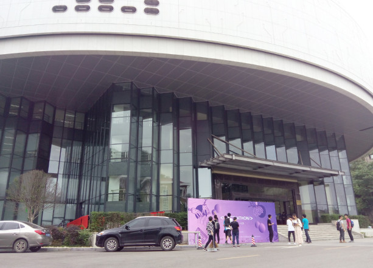

正门拍照，真香警告  
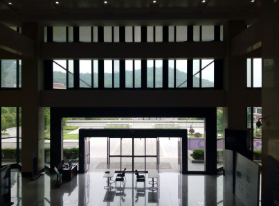

咸猪手午饭，还算凑合吧  
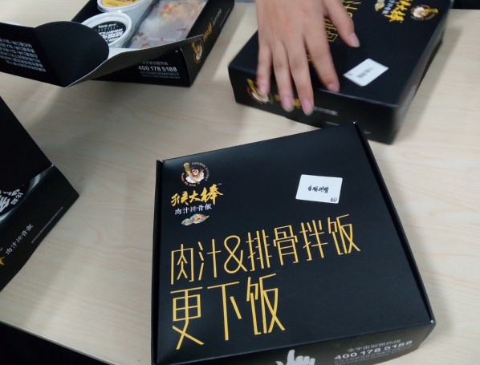

这可是现实版的超级计算机，摸了一下，确实是真的
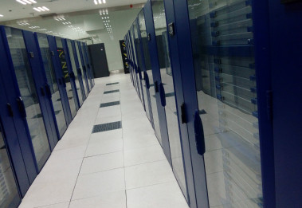

来了长沙了，怎么着也得去趟岳麓书院呐

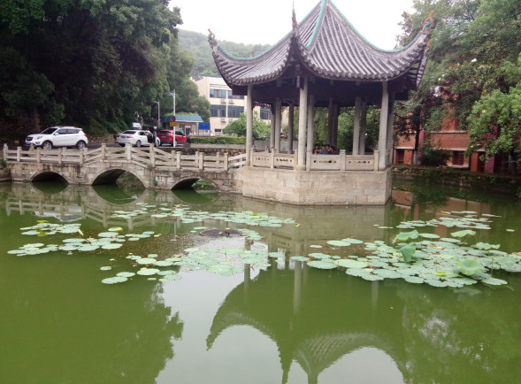

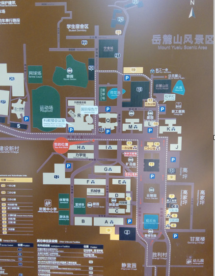

骑车哈罗助力车，狂踩几个小时，也算是体力风暴了

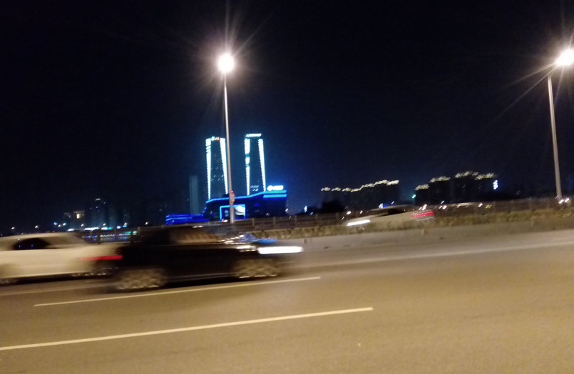

长沙是个好地方，就是有点热，来长沙的第一天是在一个民宿过夜的，里面的人还不错，晚上还和一个美女打了一把桌球，挺有意思的，晚上本来预定的是阳台，结果店家主动将自己的客厅让出来让我睡沙发，那一晚真的很美妙！

#### 上海Hackathon

[第二届上海交大黑客马拉松 HACKxSJTU 2018](https://www.hackx.org/competitions/hackxsjtu2018https://www.hackx.org/)

> 因为是第二届，所以吸引了很多大牛，比如说我们队的有上交的土著，复旦的科班，还有杭电的ACMer,以及最后一位Leader—某国际班已拿CMU大学offer的高三生。。

我们队一开始的实力就展现爆棚，特别是那个Leader，真的不服不行，看来90后是真的该让位了，00后已经开始已经开始表演了。

我们做的是一个面向留学生的智能搜索引擎，确切的说是一个服务平台，起因是leader 在申请国外大学的时候的这个过程太过于痛苦，所以考虑到大家都可能会有这这样的一个需求，于是这筐产品就诞生了，名字叫做，章鱼哥，据说章鱼哥曾经去过斯坦福商学院进行路演，并且成功的拿到了5000$的赞助。。。  

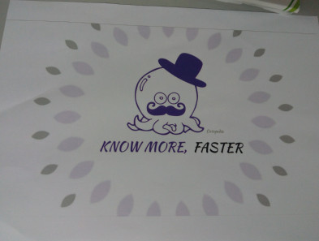

最后因为demo的问题，又是惨遭划水，但是这一次真的让人体验到了hacker的感觉，整个活动都是在大脑的刺激中度过的，我在团队中负责数据的提供，写了一个简单的爬虫，也算是过了一把编程瘾了。

比赛地点  
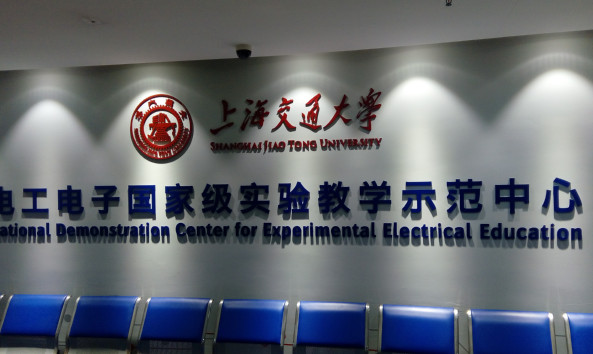

还u不错，受到了老朋友的热情款待
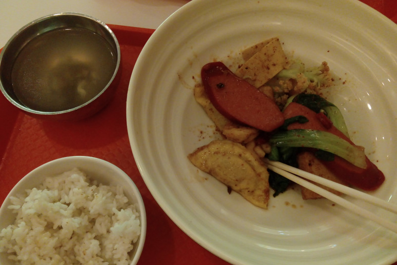

最后，带着收获的经验和见识，踏上了前进的道路
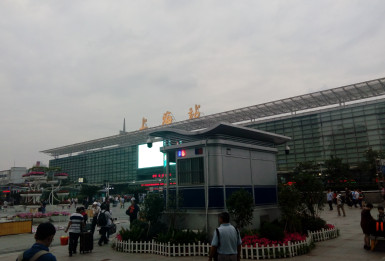