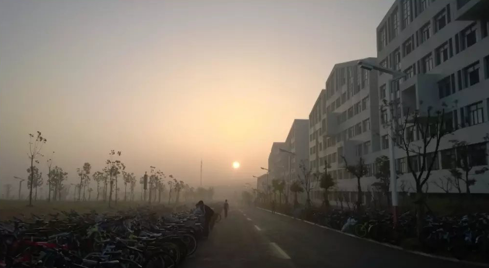

过去的日子是美好的，就像清晨投下的第一缕阳光，照的人心里暖洋洋的，这是一首属于青春的歌。

<!--more-->

&nbsp;&nbsp;2015年9月10日，教师节的到来丝毫没有影响到我们大学开学的日子，反倒因为节假日的关系，校园开始显得更加欢快热闹起来了，按照惯例，大一新生军训是少不了的重要一环，刚刚保持新鲜感的一周就这么晃晃悠悠的过去了，为其半个月的军训正式拉开了帷幕，闹钟响起，天刚刚灰朦朦，时间还不到6点半，小A在睡梦中被走廊外熙熙攘攘的人流声吵醒，洗漱完毕踏出宿舍，宣城的秋天较之南方有些湿冷，早上起雾了， 尽管太阳已经升起，但显得有些朦胧

人很多，从各个宿舍的四面八方涌来，瞬间清静的道路上开始变得有些拥挤和嘈杂，不过好在教官们的出现打破了这种局面，很快，一只只整齐的方队，喊着：” 1，2，1“ 列队站在了道路两边，随着教官们的指示，队伍开始有条不紊的前往 操场进行 军事体能训练了。此时的队伍按照清一色的男生和女生方队来排列的，不时空气中传来阵阵洗发水的香味，男生女生在前进中，传来阵阵欢声和笑语，铿锵有力且步调一致的脚步声很快就打破了这种青春的味道，那是教官们正在喊话了：” 全体都有，起步跑，1，2 ，1…“

一晃时间，五年过去了，那些场面有些遥远，记忆中的那些面孔有了些许模糊，在时间面前， 再好的画面也经不起岁月的抚痕，然而有些记忆，似乎是根植于大脑深处，就像是大脑的一部分，早已挥之不去了。

2015年10月20日星期二，这是一个值得纪念的日子。小A联系上了小Y，尽管小A不认识小Y，但小A却对小Y很熟悉，第一次见到她时是在军训结束的路上，某个下午军训结束了，熙熙嚷嚷的吃饭部队融入了食堂，小Y一袭白衣，长发飘飘，在人群中显得十分的突兀，小A看到她的第一眼，不是心动的感觉，而是一种心跳加速的感觉，就像《仙剑奇侠传》里的神仙姐姐，真像是从画卷里面的走出来的人呀。之所以是单方面的联系完全取决于一场意外，虽然小A认识小Y，但也仅限于认得她，诸如班级姓名等信息则一概不知，小A不是没想过小跑上前，讨要联系方式，但奈何五年前的小A脸皮实在太薄，没有这个胆儿，然而缘分这种东西好像是虚无缥缈却又真实存在一样，一个偶然的饭局，小A听老乡自我介绍时，意外注意到了一些关键信息，一打听原来是对方一个班的，很快就通过这个老乡联系到了小Y，自从联系上小Y后，日常的聊天摸鱼成了小A大学生活的一部分，小A每天都会准备一些搞笑的段子和图片用于聊天的素材专用，军训结束，紧张的大学生活似乎就这么结束了，往后的生活开始变得单调起来了，三点一线的时光日复一日的发生着，小A的性格不错，在大学颇有人缘，文质彬彬又不拘小节的性格很快让他身边有了一群靠谱的朋友，然而似乎和电视剧里面的大学有些不同，这里的大学仍然是高中学派式的作风，学风很浓厚，上课占据了生活的大部分时间，但这丝毫没有影响到小A与小Y的发展，小A依然琢磨着如何和小Y保持愉快的聊天，每天的晚安是必不可少的，尽管小Y并没有见过小A，但这丝毫不妨碍两人彼此的联通，有时候网络就是这么多的神奇，你完全不必知晓对方是谁，只需要享受这种感觉就可以了。大学的生活在军训达到了低估也在军训中达到了顶点，后续波澜不惊的生活中很难泛起大浪，但是小A的生活中总是充满着惊喜，一次次不经意间的和小Y擦肩而过就像是涟漪一样，久久难以平静。就这样，大一上学期带着失落和期待结束了。

2016年4月9日-2016年4月20日，发生了一个小插曲，这个小插曲来源于少年的冲动与迷茫，2016年8月的夏天要给这个小插曲说结束了，晚上有点热，躺在草地上，小A看着天空，星星很多， 但是没有风，第一次主动和一个女孩子见面，这个女孩是高中同学，和她见面的感觉有些平静，脑海中除了漫天的星星和草地里的蝉鸣，再也没有其他东西了，空气也意外出奇的安静，：” 我走了，有缘再见。“  那是青春的样子吗，这是小A记忆中第一次主动向爱情示好，结果是失败的，应该是 18岁，是的，小A并没有准备好，懵懂少年的无知行为，回忆起来不免让人感觉有些无厘头的幽默。

2016年9月，大一结束了，大二正式开始了，回顾大一时光，一无所获，不免让昔日骄子黯然失色，小A因为家里原因也开始变得异常紧张起来，手足无措的样子还是头一次看见，虽然没有准备好，但大二还是开始了，：“未来在哪里，我的路又在哪里.” 小A不止一遍的在内心深处询问着自己，小A是个日记迷，高中有速记的习惯，翻看着以前的旧记，似乎此刻的小A正逐渐的朝着反方向发展，小A慌了，痛定思痛后小A决定要开始做点什么了，一个清晰的计划出现在了小A的脑海中，在不断的践行这个计划时，小A也慢慢知道了些道理，：” 大学只有三年。“  这更加剧了小A对于时间的渴望，就像一块海绵，不断的畅游在知识的海洋里，2017年的年终总结中，小A读了63本书，根据一万小时定律，这给了小A步入技术舞台的门票，剩下的就是小A自己的要走的路了。

大二上学期，小A竞选了学校竞赛部的一些职位，幸运的通过了竞选，一次部门面向全体学院举办的一场活动，小A 和小Y有了线下的第一次面对面交流，让人忍俊不禁的是小A和小Y第一次对话竟然是围绕一瓶香水展开的：”你好，请问有什么需要可以帮助你的吗。“ 原来这个活动是义卖现场，小A是活动的helper，小Y说了什么没太记住，只是听着声音很好听，小A本想多说几句，但奈何话到嘴边，好像喉咙被卡住了一样，使不上来劲了。不过小A默默拍了一张小Y的背影，晚上打开了许久未聊的好友列表，小Y很惊奇的问道：” 你也在现场吗。“， 小A哭笑的发了自拍给她，算是大家的第一次正式见面了，尽管小A还想继续聊下去，但迫于大二的压力，小A默默的淡出了这种聊天方式，就像平静的湖面，一个小小的插曲，泛起了涟漪，很快涟漪消失，湖面归于平静。

事情后续发展有些让人意外，2016年9月底的一个早晨，小A照例骑上单车前往课堂，在吃完早餐后，单车鬼使神差的被其他单车堵塞在了停车位上，考虑到时间还算充裕，小A于是选择了步行上课，然而，一段时间后，小A注意到了一个熟悉的背景，这个背景很孤单，是属于小Y的，小A犹豫片刻，还是选择了快步小跑追了上去，拍了拍小Y的右肩，来到了小Y的左边，并做了简单的自我介绍，小Y有些惊讶，原来是你，距离学堂这段不足四百米的道路，小A和小Y有一句没一句的聊着，小A虽有不舍，却又万般无奈，但凡事都要有始有终，抱着这个信念，小A第一次主动请小Y吃饭了，是《韩宫宴》，小A记得很清楚，因为那里的烤肉是当地最贵的，吃完饭还留有时间，逃课看电影的感觉很刺激也很有趣，热映的电影是《从你的全世界路过》，本来是有其他选择的，不过其他选择都是些不知名的片子，所以老天爷多少是有些幽默感的，只是不知道多年以后的小A回忆起当时的场景会是一番什么感觉。吃饭看电影，坐出租车回学校，一番操作后，小A如释重负，继续开始了漫漫求学之路。

大三的事情，按照：”大学只有三年的时间。“，大三是小A最为忙碌的时候，因为到了最终检验结果的时刻了，尽管过程很坎坷，但也收获颇丰，打过比赛，拿过奖状，去过名企实习，拿到BAT offer，只是小A觉得，自己的心里始终都有一道坎，尽管看似已经放下，却从未真正的了结过。大四的日子反而显得有些悠闲，有一天小A从朋友口中得知，小Y开始考研了，现在正在xxx教室上自习，你要不要过去看看，在朋友的建议下，小A买了一瓶蒙牛优酸乳，找到了小Y，小Y有些惊讶，小A给她递了饮料，小Y开始吐槽了一些考研的种种焦躁，小A也有些突兀，但很快借着高中练就的演讲本领，对小Y进行了一番鼓励和安慰，临走时，小Y给了小A一个拥抱，小A有些意外，思索几秒后，苦笑的接受了，分开道别后，小A消失在了小Y的视线中，再回头，小Y也已不在原地了。

大四毕业季，是时候给大学画上完美的句号了，小A和伙伴们穿上毕业学术服，

未完待续。。。

注：以上内容来源于真实生活，文中人物均已做化名处理。