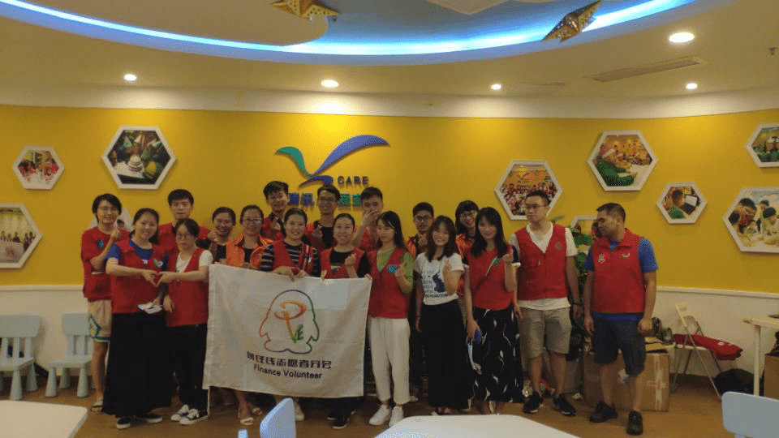
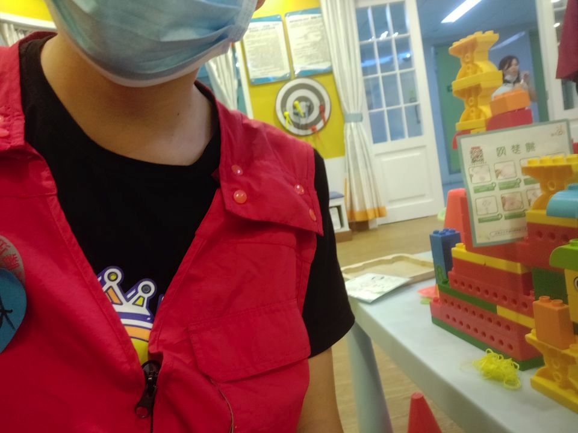
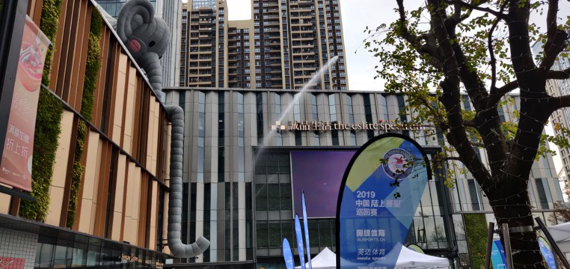
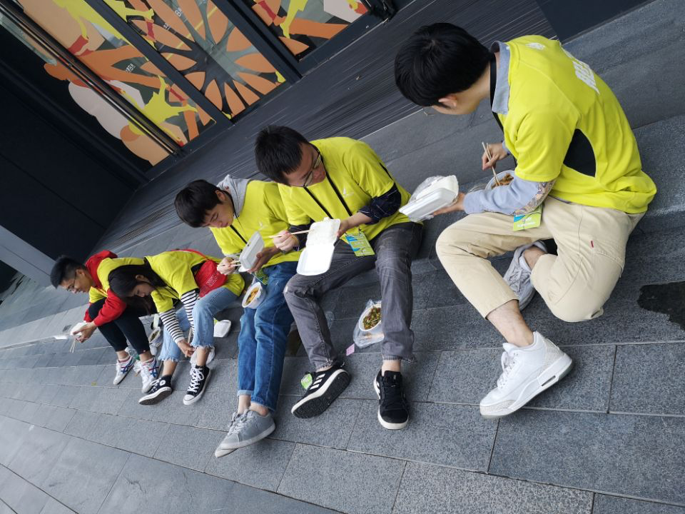
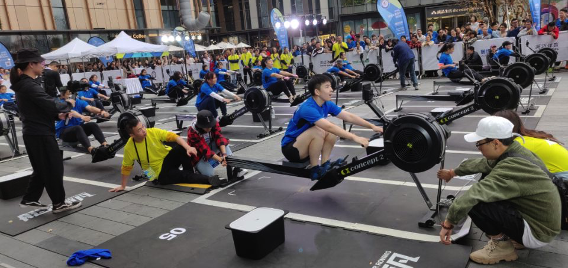

借助公司平台，参加过两次公益志愿者活动，分别是福田儿童医院项目和陆上赛艇项目

<!--more-->

&nbsp;&nbsp;折腾，是我参加这两次后总结出来的结论。

#### 福田儿童医院项目

&nbsp;&nbsp;2019年8月18日，星期天下午14点，按照计划，我来到了深圳福田儿童医院，通过公司设置在医院定点的儿童爱心仓，我了解了这次志愿者活动的内容：“丰富患儿的祝愿生活，让住院患儿在轻松愉悦的环境下尽早恢复健康，给孩子无聊、枯燥的祝愿生活留下温习温暖的回忆。” 

&nbsp;&nbsp;主意打定，我开始了准备工作，首先确定交流对象，为了保护隐私，这里将患儿化名为小a，小a看上去很健康，当得知我们的到来，早早的就站在了病房门口，这种热情我还是第一次见，心里也不由得对这个小家伙有了第一印象--活泼。通过简单的介绍，我们很快了解了小a的情况，一个面部半瘫的9岁小孩，住院半年多了，平时都是母亲和姑姑来照顾，可能家里还需要其他人来获取经济支持，所以现场并没有看到小a的父亲。小a十分热情，主动和我们交流玩闹，按照活动项目，我们陪小a进行了智力大拼盘游戏，一盘超大的动物拼图摆放在病床前，因为隐私问题，并没有照片记录，这个硕大的拼图很快就吸引了隔壁病床小朋友的注意，也兴致勃勃的加入了我们的游戏当中，……时间过得很快，在欢声笑语中，活动结束了。然而当我摘下医用口罩的时候，心里却产生了一股莫名的悲伤，这种心情似乎是对人生波澜中不同境遇的感慨，每个人都期望自己是最幸运的，但又有谁能料想到自己的明天会是什么样子呢，作为群体动物中的一员，你能决定自己的未来吗，在乘坐返程的地铁上，我想了很久，最终也没有领悟到什么道理。

#### 陆上赛艇

&nbsp;&nbsp;2019年12月15日，星期天上午11点45分，活动开始的时间，这次活动的主题是：2019中国陆上赛艇巡回赛深圳站志愿者，天气很好，早早出门，刚一到达这个地方，突然有些失神，深圳万象天地，这个地方十分气派，像是电影中的国际大都市的样子，高楼大厦，名牌服装店……，到处充满着高雅昂贵的气息，按照高德地图导航，我小心翼翼的来到了活动现场，人不多，大家都正在有条不紊的准备着手上的工作，

选址在诚品书店门口，这是第一次见，现场的气氛有些热闹，虽然天气很凉爽，但热情高涨，来了很多看热闹的观众。活动开始后，来自四面八方的参赛选手会进入活动地点参赛，我的任务就是对参赛人员的名单进行检录，活动现场给我们发了一个大喇叭，暂时不知道有啥用，后面才知道，它才是主角……。

大约12点40，我还没吃早饭，现在已经到了午饭的饭点，所以十分饥饿，项目组织方热心的给我们发了盒饭，吃起来确实很香，考虑到没有位置，所以我们就席地而坐，在马路牙子上开饭了，毕竟吃完这顿饭之后，接下来就是一场硬战了。

虽然是比较简单的红烧土豆肉丝，但是在特定的时间和地点，一口下去，竟然吃出了山珍海味的味道，我开始狼吞虎咽起来了，很香，一碗红烧土豆肉丝很快就光盘了。

终于到了活动的重点，人越来越多，检录的比赛人员也越来越多，这个时候，任何不起眼的声音都会被淹没在这毫无规律的嘈杂中，我想起了项目方发的这个大喇叭，心领神会的拿起了它，开始了让我疑惑的喊麦行为，我的目的是为了让四处游走的比赛人员能够来到正确的地方进行比赛检录，但我拿着这个大喇叭却总是叫不出声来，我一度怀疑是大喇叭坏了，后来才发现，是我自己的胆子太小了，发出的声音太小了，在闹市大声喧哗让我总感觉有辱斯文，后来认真起来，却也总想起：“冰箱、彩电、洗衣机……”之类的话语，这项工作终归是不适合我的，后来索性也就放下去，继续忙活起笔录的工作去了。

活动很成功，现场的气氛达到了高点，在活动现场，里里外外围绕了很多人，大多是看热闹的，也有一些游客，举着相机，开始记录下自己的所见，而我作为志愿者，此时的任务就是站在旁边随时支援可能发生的意外。

&nbsp;&nbsp;夜晚很快就降临了，然而活动依然没有结束，在漫长的期待中，一个小时过去了，大约一个半小时过后，活动终于宣告了结束，坐在回去的公交上，身体很累，心里也很累，不由自主的联想起上次去福田儿童医院的场景，我有些迷蒙，那里是安静的，这里是热闹的；那里是让人心情恍惚的，这里是让人身体疲惫的；那里的天空很蓝，这里的天空有点朦胧，看着车窗外的车水马龙，我有些失神，似乎人生的色彩本就应该充满黑色与白色，仔细想想答案依然没有找到，只是多了一份这样的经历。

