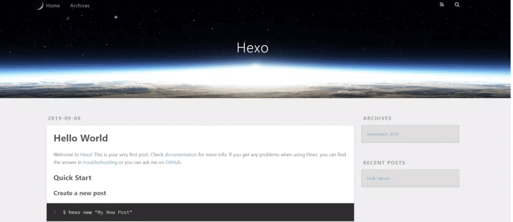
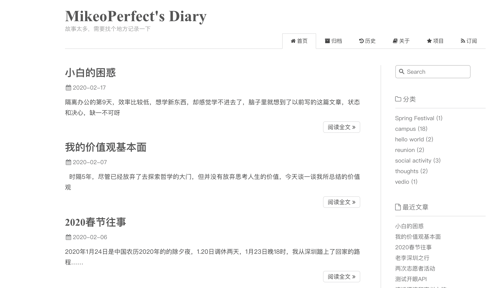
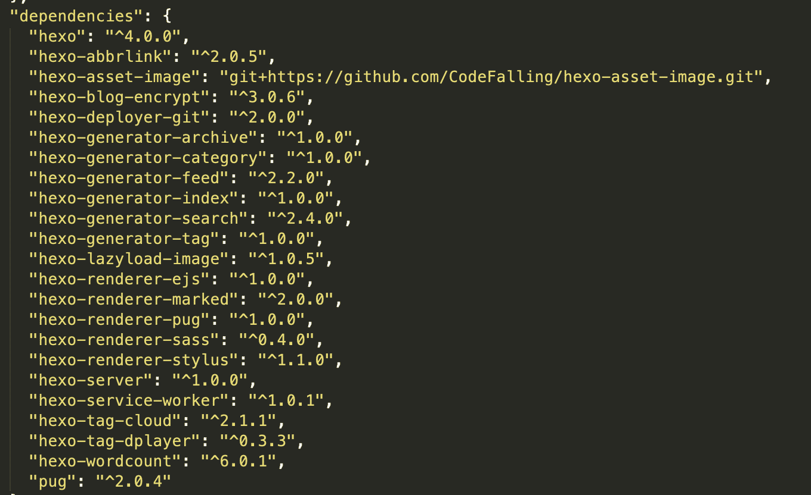

导语：本篇文章面向对个人站点感兴趣的伙伴，本着最快最优的速度，结合自己的搭建经验，从介绍到实际应用，让你拥有一个属于自己的个人博客站点。

<!--more-->

### **一、介绍个人博客**

个人博客，类似于一块在互联网上属于自己的地盘，你可以通过手机或者电脑等联网设备通过自己的网址来访问你的个人网站，所以你必须具备两样东西：1、域名或者ip地址，2、网站。首先简单介绍下，我们是如何访问到个人博客的，当打开浏览器，输入网址(URL或者IP都行)时，会通过DNS服务器查询到需要访问的服务器地址，然后通过服务器就可以访问到服务器上的个人网站，这里涉及的网络知识较多，具体可以查看文章：[**从输入URL到看到页面发生了什么？**](https://juejin.im/post/5cc573c85188252e741ccbb6)。搭建博客需要两样东西：

1. 域名，2、个人网站。

### **1.1 域名购买**

域名就是我们看到的网址，这个是需要钱来购买的，我这里推荐去 [腾讯云域名注册](https://dnspod.cloud.tencent.com/) ，后缀 .com的比较贵，但是比较普遍，一般每年收费 七八十元左右，我的经验就是想好需要购买的域名，然后购买十年，大概花费不到五百元，我目前已经购买了一个十年域名: http://www.mikeoperfect.com/  这个域名还没有备案(国内的网站才需要备案)，所以访问不了我的网站，但是我用了二级域名（购买的域名自动包含了二级、三级等域名）来解析我的站点，我的站点在国外所以不需要备案就能访问 https://blog.mikeoperfect.com/ ，当然这里面还会涉及到http和https访问和证书的关系，这个暂时不影响使用，有兴趣可以后面再说。

### **1.2 个人网站**

个人网站，就是我们的主题，这个可以通过购买阿里云、腾讯云的服务器来搭建，但是我个人不建议这么干，因为购买这些云服务器是需要钱的，我两年前通过学生的身份购买了阿里云服务器，大概花了400元左右，如果失去了学生优惠这个价格就是*10的增加，这也就意味着一年的服务器成本就是千元，这是无法接受的。所以我这里采用了全网最佳性价比选择：GitHub是免费的，且github.io可以搭建个人网站，使用 **hexo+github** 的方案就可以实现永久免费，而且自带流量效果，也就是说你可以自由的写作，你的资料全部都会保存在github上，而github已经宣布，所有的资料都将会永久的备份在北极地下，这意味着，你不需要担心资料丢失，或者交钱之类的情况，你只需要关注写作和记录就可以了。

### **二、开始搭建个人博客**

首先是域名购买，因为域名购买比较简单，直接网上搜 **腾讯云域名注册** 就有很多资料，我的建议就是可以先去购买好域名，然后将域名的资料先记录下来，接下来就是搭建自己的个人博客了，因为**hexo+github** 搭建个人博客的方案网上资料超级多，所以这次的重点放在了一些步骤和重点建议上。

因为篇幅原因，这里推荐阅读网上成熟方案：[**Hexo+github pages搭建个人独立网站，绑定域名全教程**](https://juejin.im/post/5d74c1dd518825168d37db2c)  

### **2.1 注册github**

github官网：https://github.com/   这里需要关注一下github的账号，如果有就下一步，没有就到GitHub网址上，注册一个自己的账号，账号是英文的，且后续的github.io主页都是按照这个英文来注册的，所以得慎重考虑自己的英文账号。

### **2.2 工具安装**

因为涉及到了hexo和GitHub，所以需要电脑上安装好对应的软件，hexo是基于Node.js来渲染的，所以需要你电脑上安装好 **node.js**软件，建议配置好国内的**npm软件源(**网上搜索**npm国内软件源 )，**这些都是重点；然后就是github，这个需要你安装好**git工具,** 如果你觉得自己访问github比较慢，可以通过配置自己电脑的host来通过ip直接访问github, 这个可以访问 这个网址https://github.com.ipaddress.com/www.github.com  拿到github的真实ip地址，然后在自己的电脑上的host配置好ip映射即可，怎么配置具体操作可以网上搜索 **配置ip host** 

### **2.3 hexo主题选择**

hexo渲染出来的页面默认的主题如下，比较难看

​                        

所以可以选择配置比较好看的主题，这里的主题有很多，网上搜索**hexo 主题**，就会出来很多推荐的内容，这里我推荐 我使用的主题，当时我搭建的时候也想要一个好看的主题，后来千幸万苦找到了这个 [Maupassant hexo简洁主题](https://www.haomwei.com/technology/maupassant-hexo.html)  效果如下：

​                        

### **2.4 自动化hexo构建**

当你将hexo页面部署到github上时，你可能会惊讶，自己每次写作完都需要去手动hexo命令推送，这样的重复工作会浪费掉自己的耐心，万幸的是，有一种方案，可以实现你自动推送写作记录到github，然后CI工具会自动化的构建并发布你的hexo主页，关于如何进行，我这里推荐阅读：[**Github 使用 Travis CI 实现 Hexo 博客自动部署**](https://michael728.github.io/2019/06/16/cicd-hexo-blog-travis/) **当你** 配置好了CI工具，理论上你就能够实现，在本地写好文章之后，通过git工具推送到github仓库，你就能够访问自己的域名，看到自己写的文章了。

### **2.5 hexo插件 优化**

当你写作的时候，这个hexo主题可能需要考虑很多优化的地方，比如，开启文章评论插件、文章图片加载、开启阅读访问量等，这些可以通过 网上查询 **hexo 插件** 来进行优化，

这里我介绍我使用的几个插件如下图所示，具体的使用方式可以在网上 搜索这些 dependencies的名字来进行实际操作。                        

**结束语：**搭建过程中如果遇到什么问题，可以先去网上看看，如果没有找到解决办法，可以和我聊一聊，一起来看看如何解决问题