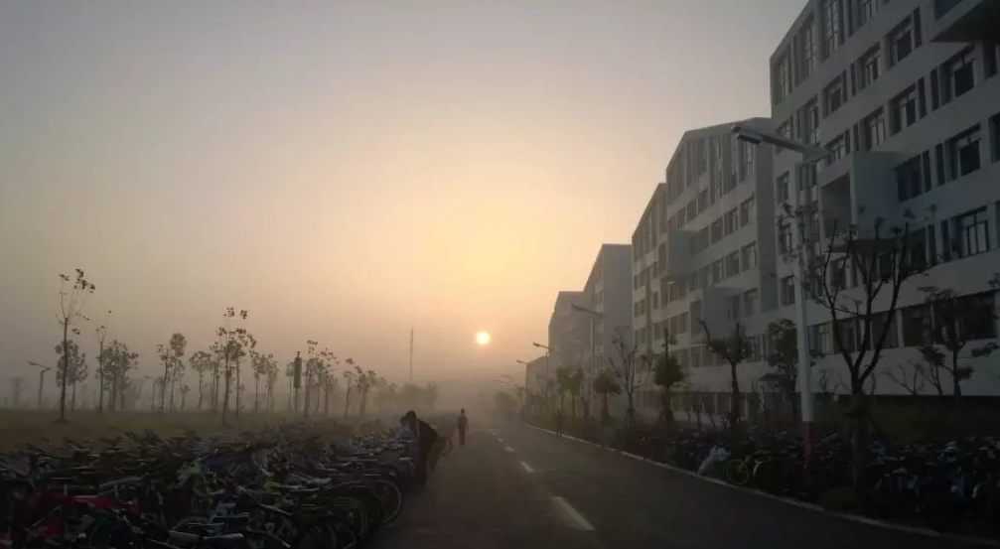

过去的日子是美好的，就像清晨投下的第一缕阳光，照的人心里暖洋洋的，这是一个关于小A和小C的故事，一首属于青春的歌。

<!--more-->

&nbsp;&nbsp;2015年9月10日，教师节的到来丝毫没有影响到我们大学开学的日子，反倒因为节假日的关系，校园开始显得更加欢快热闹起来了，按照惯例，大一新生军训是少不了的重要一环，刚刚保持新鲜感的一周就这么晃晃悠悠的过去了，为其半个月的军训正式拉开了帷幕，闹钟响起，天刚刚灰朦朦，时间还不到6点半，小A在睡梦中被走廊外熙熙攘攘的人流声吵醒，洗漱完毕踏出宿舍，宣城的秋天较之南方有些湿冷，早上起雾了， 尽管太阳已经升起，但显得有些朦胧

人很多，从各个宿舍的四面八方涌来，瞬间清静的道路上开始变得有些拥挤和嘈杂，不过好在教官们的出现打破了这种局面，很快，一只只整齐的方队，喊着：” 1，2，1“ 列队站在了道路两边，随着教官们的指示，队伍开始有条不紊的前往 操场进行 军事体能训练了。此时的队伍按照清一色的男生和女生方队来排列的，不时空气中传来阵阵洗发水的香味，男生女生在前进中，传来阵阵欢声和笑语，铿锵有力且步调一致的脚步声很快就打破了这种青春的味道，那是教官们正在喊话了：” 全体都有，起步跑，1，2 ，1…“

一晃时间，五年过去了，那些场面有些遥远，记忆中的那些面孔有了些许模糊，在时间面前， 再好的画面也经不起岁月的抚痕，然而有些记忆，似乎是根植于大脑深处，就像是大脑的一部分，早已挥之不去了。

2015年10月20日星期二，这是一个值得纪念的日子。小A联系上了小C，尽管小C不认识小A，但小A却对小C很熟悉，第一次见到她时是在军训结束的路上，下午军训结束了，熙熙嚷嚷的吃饭部队融入了食堂，小C一袭白衣，长发飘飘，在人群中显得十分的突兀，小A看到她的第一眼，不是心动的感觉，而是一种心跳加速的感觉，就像《仙剑奇侠传》里的神仙姐姐，真像是从画卷里面的走出来的人呀。自从联系上小C后，小A开始了日常的聊天模式，每天都会准备一些搞笑的段子和图片用于聊天的素材专用，军训结束，紧张的大学生活似乎就结束了，也生活开始变得单调起来了，三点一线的时光日复一日的发生着，小A依然琢磨着如何和小C保持愉快的聊天，每天的晚安是必不可少的，尽管小C并没有见过小A，但这丝毫不妨碍两人彼此的联通，有时候网络就是这么多的神奇，你完全不必在意对方是谁，只需要享受这种感觉就可以了，小A生活中的惊喜就是不经意间的校园路上迎面走来的小C，

2016年4月9日-2016年4月20日，2016年8月的夏天要给这个小插曲说结束了，晚上很热，躺在草地上，我看着天空，星星很多， 但是没有风，第一次主动和一个女孩子见面，这种感觉很平静，空气也意外出奇的安静，：” 我走了，有缘再见。“  那是青春的样子吗，这是我记忆中第一次主动向爱情示好，结果是失败的，应该是 18岁，是的，我并没有准备好，懵懂少年的无知行为。

未完待续。。。