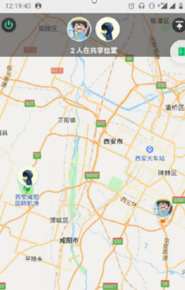
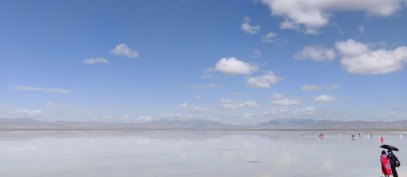
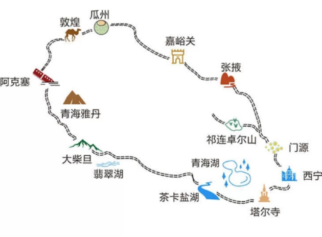
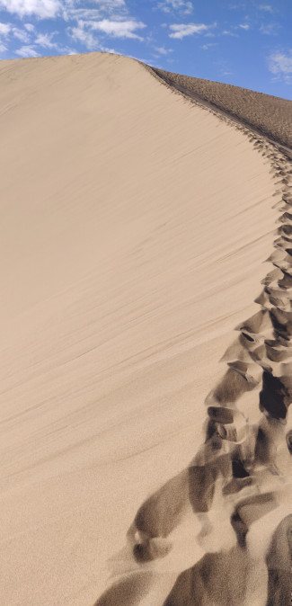
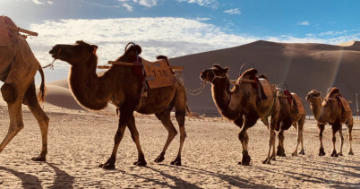
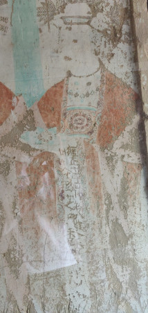
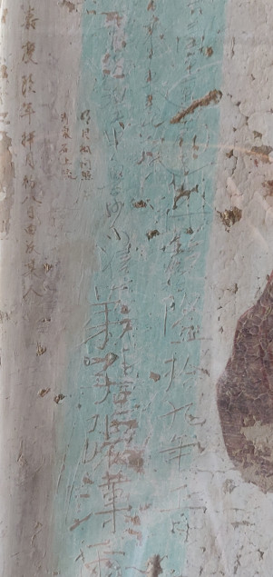

 一年一度的部门团建又开始了，路线很多，这一次开始了环大西北之旅

<!--more-->

8月开始， 关于公司一年一度的团建活动的讨论，似乎并没有因为疫情的原因受到干扰，讨论的热度反而因此越来越高，有些部门 比如看点，直接取消了 1800￥的团建活动，改为运动会团建的方式， 大家对这种方式表示 不看好，毕竟好端端的旅游变成了 运动会 ，这多少有点让人难以接受。一开始 还担心部门团建也被取消了，毕竟这段时间 新疆又出现了大批感染者，幸好 我们部门 比较顺利的开始了 团建方案选择了，方案很多：海南线路、张家界线路、成都线路、广州线路、青海线路等，考虑到 自己从未去过 北方，于是这次 选择了 青海线路，开始了一段环大西北之旅。

&nbsp;&nbsp;团建的日子快要到了，在顺利的安排完工作交接后， 剩下的就只有准备团建旅游的事情了，6月中旬办理的一张 招行信用卡，刷卡礼是一个 17寸的行李箱，正好拿来旅游出行最方便不过了，考虑到 此次出行 路途遥远，飞机时间较长，很有必要买个延误险，大西北常见的天气是日炎夜寒，所以外套是必不可少的，当然沙漠地带，带双拖鞋也是需要的，帽子和墨镜等必需品都得带上。

8.13日，团建正式开始了，飞机的起飞时间是 8.25分，住的地方距离 机场 大约50分钟车程，所以我必须7点30之前赶到机场，打开高德地图，竟然惊讶的发现最早的地铁是6点30开的，计算一下 行程，有点紧张，一宿没睡，倒也不是兴奋，而是期待，早早的上了地铁，有惊无险的到了机场，现在的机场设施很完善， 只需要一张身份证，再加上电子登记牌就可以 开始登机了。

飞机上的时光是无聊且漫长的，本以为今天早上的台风会让飞机延误飞行，但没想到 台风来晚了，飞机早起飞了，于是 去的延误险就这么失效了，目的地是 西宁市，它是青海的省会城市，我对青海的概念 一无所知，只知道 它在 祖国的 西北方向，从地图上看，从 深圳到 西宁简直就是横跨 祖国 的疆土了，中转 西安咸阳机场，西安老友 河东在 华为，打开地图看看，距离还是蛮近的，hhh

终于到了西宁市， 我们的第一站是 茶卡盐湖，据说那是一个一尘不染的地方，整个湖都是白茫茫的一片，在此之前，我只能从 旅游供应商那里得到对它的第一印象，大约 13:00 我们落地是在西宁市，西宁市和其他城市差不多，估计省会城市都一样，但是西宁市离茶卡镇还有好几百公里，这意味着 我们又得在车上度过一段无聊的时间了，车程很远，但路况很好，长长的大马路，让我有种想要飙车的冲动，但没有车，只能作罢，偶尔的休息时间，马路上迎着夕阳拍个照还是挺不错的。

当天晚上我们抵达了 茶卡镇，这个镇的生意比较奇特, 生意周期是 7~9月份，其余时间不对外营业，因为 其余时间都冷的让人异常，这一点 我也注意到了，我们抵达茶卡镇大约在 20:00左右，惊奇的是这边的天居然 还是亮的，不过很快 21点一过，天就变暗了，晚上出来觅食，才发现外面居然 还要穿 厚厚的外套，要不然按照深圳夏天的着装只能在 寒风中瑟瑟发抖的份了。

8.14日，茶卡盐湖之旅正式开始，据 导游介绍，茶卡盐湖是一个天然的盐湖，以前是对工业开采封闭式的，后来发展成了 旅游经济才对外开放，尽管 此时已经是 暑假淡季，但热度依然不减，茶卡盐湖景区人数还是十分可观，当然以老年人观光团最为多众，这也说明 祖国近几年的发展确实 不错，大家都很悠闲。

茶卡盐湖是一个大型的 内陆湖，是固液并存的卤水湖。盐湖卤水矿化度322.4克/升，相对密度1.2178，pH值7.8，水化学类型为硫酸盐型硫酸镁亚型。所以有时候湖水表面会有一层厚厚的结晶体，结晶体的上面则是 盐水，结晶体的下面也是盐水，人可以踩在上面，由于整个湖面都是白色的，所以素有“天空之境”的美称，不过 体验了一下，感觉一般，湖中心的风还是蛮大的，去的时候记得多带点衣服。

茶卡盐湖是我们的第一站， 找了一张地图，我们接下来的旅途分别是：青海湖、瓜州、敦煌、兰州，可以说分别绕了整个大西北一大圈了。

8.15日，我们前往了青海湖，景点与景点之间的距离还是挺远的，坐在车上只能 补交，第一次感觉睡觉 也是会累的，犹记得 上学时学过一篇课文叫做 《青海湖，梦幻般的湖》，课文片段如下：

> 我们同启明星一起上路了。和我们一起上路的，还有那各种各样的扑朔迷离的关于[高原]的梦。
>
> 汽车在[青藏公路上行驶，但没有往日的颠簸。窗外，是一片漆黑和寂静，细细的雨丝斜打在车窗[玻璃])上，雨丝中夹杂着几声遥远的犬吠。我在轻轻的摇晃中，又接上了刚才的温暖的兵站未完的梦。
>
> 也不知过了多久，我从睡梦中惊醒，不解地望着身旁年轻的司机。这个自从上路就没有说过几句话的铁道兵战士，此时轻轻地说了声：
>
> “青海湖到了，下车看看吧！”
>
> ……………..
>
> 我幻想着，当年大自然这真正的造物主在创造青海湖的时候，面对偌大一块画帘，一定毫无犹豫地甩下那些精细的刻刀，酣畅淋漓地挥舞着最大的画笔，一抹黄，一抹绿，一抹蓝……大笔泼洒勾勒，因此，留下的这没有丝毫粉饰和雕琢的湖，留下这粗犷的美，自然的美，质朴的美。
>
> 谁说一见钟情总是轻浮的呢？在某种机缘下，突然遇见自己或朦胧向往或苦苦追求而未能获得的美好的事物，怎能不一见生情呢？
>
> 是啊！我不曾领略过如此醉人的美，我甚至怀疑这是否又是那高原奇特的梦，是那梦境的继续？

不得不承认能够入选 小学语文的文章还是有点东西的，至少 让我去描述 青海湖，大概也只有：“ 青海湖，啊，美丽的青海湖”之类的赞叹了吧, 但我又何尝不曾拥有这样一个一见钟情， 高原奇特的梦呢，梦总归是不现实的，凡是都得讲究落地才行，继续回忆着青海湖的见闻，唯有当下 才是 合乎情理的。

敦煌，莫高窟 和 有名的沙漠地带联系在了一起， 在他们那里很是常见，走在沙漠中，感觉像是在踩棉花一样，没有力气，这不经让我想起 张骞出使西域时 是怎么穿过这种 沙漠的，不得不让人佩服

当然 当地的特色骆驼也是必不可少的，不过 个人感觉 骆驼 除了 样子憨了点，没啥其他 特点了

参观 莫高窟，可以说是我对这次出行最大的收获了，莫高窟 ，俗称千佛洞，学艺术或者哲学的人 确实应该去看一看，虽然 都是一些佛像，但这些是 历史的见证，可以透过这些佛像发现一些 有趣的地方。原来 四处旅游闲逛的风俗，早在古代就有了，在这些莫高窟的壁画上，让我惊叹的倒不是千遍一律的佛像，而是 镌刻在墙壁上 各式字体的“到此一游”，貌似 清朝 年间的人的留言最为频繁，细想看来 大家都是 《西游记》孙师傅的学生啊。

         

佛法，在中国历史上 占有重要的一笔，神论、道法亦如此，这次出行，路程遥远，机缘下拜读了《遥远的救世主》同名电视剧《天道》，多年不看电视剧的我，感觉这部剧所蕴含的能量实在是太强大了，艺术源于生活，高于生活，莫高窟的这些作品，本质上是 历朝历代 各大士大夫家族的名利场的舞台，在这里供奉一尊 神像就像是一种身份的象征，代表着家族的兴旺程度。作为无神论者，缺乏信仰是普遍存在的问题，没有信仰的人 很容易陷入 生活化的陷阱，随波逐流。神即道，道法自然，如来。--神就是道，道就是规律，规律如此本来，容不得你思议，按规律办事的人就是“神”。有道无术，术尚可求，有术无道，止于术。追求 贝叶斯下的规律，按照规律来办事也许是一个不错的选择。

