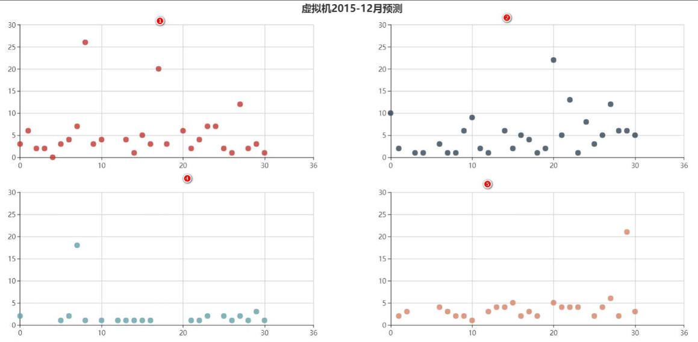
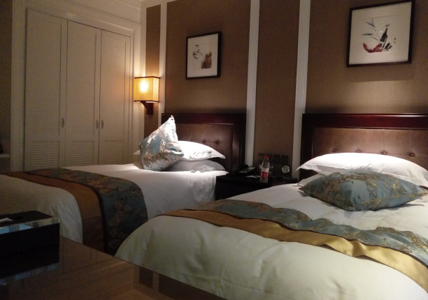
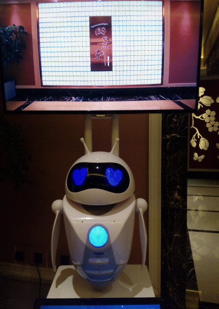
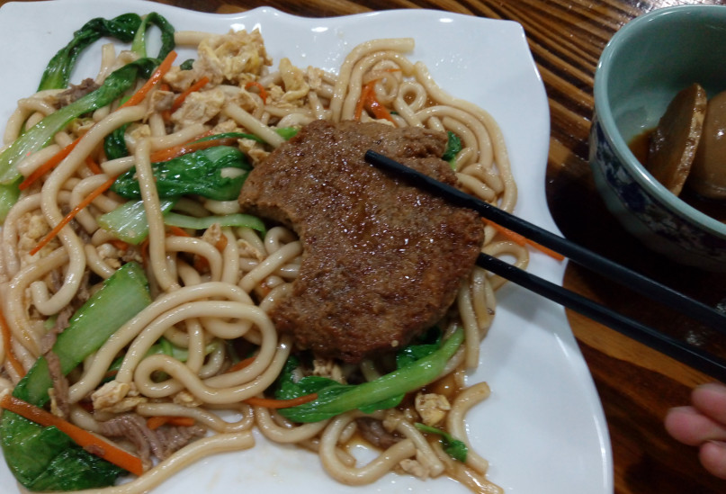
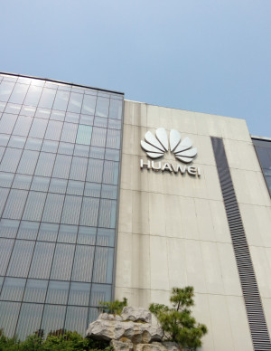
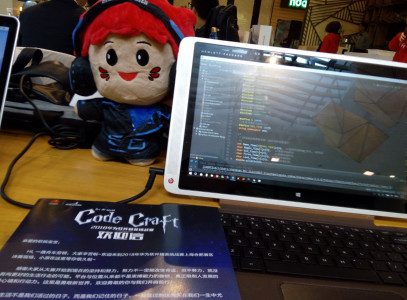
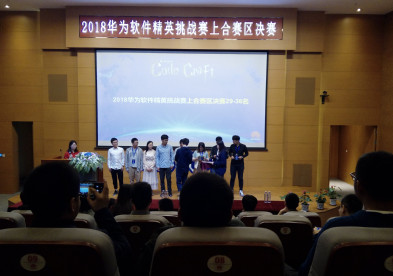
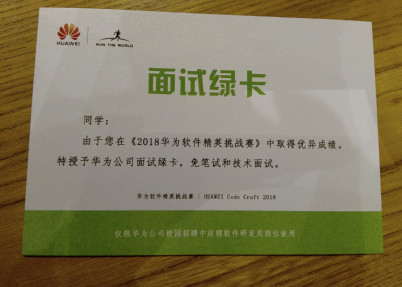
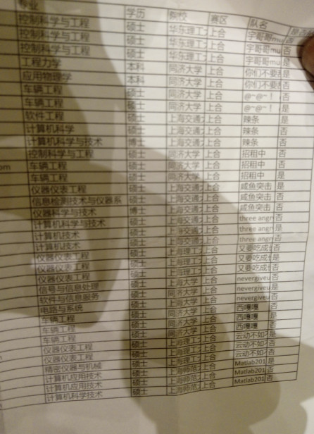

有趣的实习生之旅（二）

<!--more-->

> 又到了分享日志的时间了，今天主要想记录的事情是2018年华为软件精英挑战赛，这个比赛发生在2018年3月9日，比赛结束时间是2018年4月28日。

先让我好好的回忆一下当时的场景，2017年的下半年，当时我是大三上学期，早在开学之初就听闻了学校的一位2014级学长顺利的拿到了华为的SP offer，薪资：`18k*16个月` 算上年终奖大概在28万左右，当时第一次听到这个消息，整个人都没缓过神来，这。。。依然沉浸在无限的震惊中。作为一个本科生，能够拿到一个超级offer，而且是那种钱巨多的，而且还是华为的，要是给我，我这辈子都值了（当然了现在早就值了）。

简单的介绍一下这位神奇的学长吧，因为他实在是太过于优秀，他的整个大学生活感觉就像是书上说的一样。因为是他的忠实粉丝，且经常观光[他的博客](http://www.netcan666.com/)，所以对他比较的熟悉。他是广西人，大学以前就挺喜欢计算机方向的东西，搞过很多网站，估计对黑客技术也有些涉及，因为以前听说他在学校的某个网站上留下过一些东西，虽然到现在我也没找到那些东西到底是什么。除了一堆毛概题库。。额言归正传，他高中的时候因为发挥失常，被迫调剂到了我校食品专业，但他依然热爱着计算机，额有兴趣的可以去他博客翻翻看，我还是说一说我的日志吧。

因为那位学长就是通过这个比赛拿到的sp offer，再加上当时也有好友对我说起过这件事情，于是今年开学之初，我就和几位老哥一起租好了队，打算玩一玩这个比赛。

不得不说一开学的时候是真的忙啊，先是花了几天一来就熬了夜将操作系统的课设给搞定，然后再开始准备各种面试和笔试，因为大学只有三年，第四年压根就没啥事情了，哎说多了都是泪啊。当时时间已经是2018年3月7日了，比赛快要开始的前夕，我自己一点都没有准备什么，只知道这次的题目是和**机器学习方面**的知识，机器学习的接触我可以说是0经验，最接近它的一次是大三上完成了几个小小的爬虫项目，其余的就没了，当时的心情真是十分的沉重，比赛要开始了，心里一点底子没有，完完全全处于一种懵逼的状态。

2018年3月9日比赛正式开始，拿到题目的第一时间就是先去了解一下题目的意思，左看右看，花了老长的时间最终才算明白过来这个比赛到底想要我们做一件什么事情。

> 说白了就是华为有一堆物理机，每个物理机上有若干虚拟机，作为华为云的用户会在一定的时间内访问虚拟机，然后华为这个比赛就是提供一段时间内虚拟机的访问记录，然后需要参赛选手预测出以后一段时间内的虚拟机数量，最后就是将预测出来的虚拟机再分配到物理机上，输出结果。。

**2018年3月中旬**

预测采用最最最基础的线性回归–最小二乘法，因为使用echarts可视化之后，发现了这是个平稳的时间序列

……已完成以天数和以Wide_Time来预测……11点02分：目前周数和二维数组需要解决

第三次提交，借用帅帅得时间处理原生，分数84，增加1，分数83增加3，分数80增加5，分数85增加6，分数82增加7，分数84增加8，分数86增加9，分数87增加10，分数87增加11，分数81增加13，分数82增加14，分数83增加15，分数84增加17，分数83增加20，分数78

随机数8~10，分数87

以3天为基准，增加9，分数63以3天基准，不增加，分数66

时间：2018年3月25日，正在重新编写新的predict.cpp，发现一个大问题，一定要注意局部函数堆栈异常

第四次提交：时间22点42分终于重新重构了一下，感觉还行，但是居然有报错，说int Predict_ID[Predict_Count+1]={0}; 和double x[EndTime+1]=0;double y[EndTime+1]=0;无法被初始化，把={0}去掉之后就不报错了

`时间3月26日12点34分，终于提交几十次之后发现了我写得TimeToInt函数存在问题，第一个是超时，第二个是异常退出`

第五次提交：按照规范重新布局，没有用，还是那个问题,算了应该是那个时间函数的问题，再重新想一个把

时间2018年3月28日，官方用例已更改，跑分目前：

一次原生78，增加3，74增加5，77增加7，76增加8，79增加9，79增加10，79增加11，74增加13，75增加15，77

0次原生68增加10，74增加15，73增加6，73增加8，73

5次原生0分

3次0分

没时间了，还是周五弄一下把

2018年3月30日，自己写的数据清洗和预测算法新鲜出炉了，很不错，第一次运行跑分21，只可惜有两个还是有问题逐行排查，奶奶的，不一定是12和13行呐，随个数的变化而变化的呀68行到280行

56行以上没问题，问题已发现，获取预测开始和结束时间出现了问题，竟然惊奇的发现，不一定是12和13行呐！！！

训练数据集中也不一定只含有1~15的ID呀，

时间2018年3月31日第六次sdk-gcc已完成时间函数转化，现在需要做的就是再弄一个去噪函数和按时间段划分的函数 目前原生分数72，加9分数78，加10分数80，加11分数75，加13分数78，加14，78，加15分数77，

第七次sdk-gcc已完成时间段划分函数，原生n+2是56分，n+1是50，n+5，增加10是61分现在需要完成去噪函数,时间段划分函数存在问题，抓紧时间修复

第八次sdk-gcc已修复时间划分函数 原生分数60，加10分数70，加14，75，加15，77，加16分数75，加20，75，

第九次sdk-gcc修复预测BUG，记得每次归零，改良时间划分采用去除法，去除前面若干天数已到达整除效果，现在已经解决的BUG有：训练集中的ID不一定是１～１５，预测时间为止不一定是第１２和１３行，预测循环中记得归零，时间划分中采用抛去前几天以达到整除的效果原生73，加10，78加15，80加１６，８０加１７，７９加２０，７７

系数为0，加15，平均大法为71，不加55

现在需要做的就是去噪，试试以天数来预测，居然差不多，现在能够用的就是第六次以天数预测和第九次以改良法周数预测，下一步去噪去噪，去噪之前新进行可视化分析

可视化分析猜测结论：消除趋势波动分析法和波动分析算法。

第十一次sdk-gcc：采取的梯度下降法：梯度递增为1，原生55加10，69加20，75修改方差（4个）修改迭代a,b范围-1000~1000和梯度增加参数0.01 分数35

修改方差（2个），迭代递增参数0.001，ab范围：-1000~1000，分数72

迭代递增参数0.0001，ab范围-100~100，分数72,已得最优解72

上述最优解修改方差（4个）分数35

最优解上每个都加15，分数68最优解上每个都减5，分数71最优解上每个都减10，分数73最优解上每个都减15，分数70

编写一个去噪函数：取平均值的做法，采用梯度下降，为0等于2阈值5，原生分数：75，加10，分数69，减10，分数69，为0等于3，分数71阈值3，分数：75阈值7，分数74阈值2，分数73，加10，分数71

最小二乘：为0等于3，原生分数73，，为0等于3，加10分数76

为0等于2，分数70，等于2加10，分数78

修改去噪方法为取平均值，阈值5，为0等于2，梯度下降原始分数78最小二乘原生分数：69，加10分数77，加20分数79，加15分数80.0，加17分数76，加14分数80.2，加13分数80.3，加12分数81，加11分数79

最后依靠队友的指数平滑。。4月16日，很开心，今天中午放榜的时候28名进入了前36强，可以免费旅游一次了

以上是我的华为软条随手记录，初赛比较的坎坷，但最终的结果还是比较的开心，主要还是队友的给力，当然我也没少熬过夜，根据往常的经验，一般结果是比较好的。

**2018年4月28日** 华为软件精英挑战赛现场赛

别提有多爽，4月26日请假三天，然后28号回来又正好赶上学校的3天五一小长假，美美的过了个6天小长假。26号从学校开往上海，吃住行统统华为报销，美得很，26日抵达华为准备的**上海浦东新区的州海花园酒店** 酒店相当的nice，下面附赠几张美美的照片。

豪华套间

可爱的智能机器人，测试过了，应该是个傻狍子。。

晚饭是下的一个馆子，很香

27号上午是去华为上海研究所参观

27号下午2点开始复赛现场赛，本来就是来划水的，看看各位大佬的表演

最后比赛结束，开始颁奖，这是呼呼呼冠军队，据说队名是拼音时三个hhh打出来的。。。

给了一张绿卡，也是不枉此行啊

结束的时候，无意间看到了参赛选手的名单，看到满屏的研究生，瞬间就被震惊了,这趟来的太值了！!

继续回到酒店，美美的睡上了一觉，这几天真是太舒服了！!

尽管比较幸运的进入了复赛也拿到了绿卡，但同时也暴露出了本人依然处于一个初级菜鸟阶段，这次比赛中我突然有一种井底之蛙跳出井底之后的感觉，外面的各路大神真是太多了，那种被大神环绕的感觉真的不是特别舒服，尤其是现场赛中，大神们的谈定自若的纷纷表演自己的各种高水平操作，真是让我等菜鸟望尘莫及，我表示技术这条道路上，需要做的还有很多很多，大神太多，希望嗯确实应该加油加油再加油！

个性签名：人要先说很多话，然后保持静默。。。