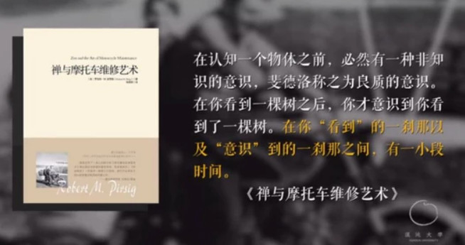

 近日偶然读了一篇文章，里面传达出的奇特观点，让人耳目一新

<!--more-->

最近 读了 一篇文章[《为什么越来越多的人，过的像行尸走肉一样？》](https://www.tuicool.com/articles/nUbqe2E) 别看标题唬人， 里面的知识丰富程度，让我至今还未完全消化，至少 阅读完这篇文章之后，我的结论是：时间是可以被淡化的，只有 位移才是 真的。

> 人类在追逐意义的过程中，创造出了文明。
>
> 但文明发展到今天，我们似乎丢失了对意义的追寻，整个社会，陷入了一场“意义危机”—— 很多人找不到人生的目标和意义，变得麻木不仁，过得像行尸走肉一般。
>
> 意义不会源于所做的事，而是来自于某个超越性的世界，可以将其称之为源头世界。
>
> 所以我们的解决方案是必须在自己的现象世界之外，建立源头世界作为根基。很多时候，我们之所以觉得内心痛苦，就是因为与源头世界失联。
>
> 而与源头连接的方法，就是“临在当下”。

文章指出 目前 在解决 **认识世界** 、**认识自己**  这两个根本问题中， 理学和文学 分别遇到了各自的拦路虎，

理学遇到了海森堡的 “测不准原理” ：

> 我们原以为把一个事物的最小单元找到后，了解了最小单元，就能了解这种物质，但海森堡认为，最小单元的位置和动量不可同时被确定——如果你知道最小单元所在的位置，就永远不知道它的速度；如果知道它的速度，就永远不知道它在哪。这等于给原子论这一脉“判了死刑”。

文学遇到了哥德尔的“不完备性定理”：

> 从数学上证明，在任何人类理性系统之外，总有一个“捣乱分子”跟这个系统是不相容的，如果想把“捣乱分子”包含进来，原有体系的自洽性就崩溃了。 也就是说，人类的理性有不可克服的结构性缺陷，等于给理念论这一脉“判了死刑”。

世界到底有没有源头，历史上 的中外 学者 给出了不同的答案和解释，无论是 柏拉图的“洞穴隐喻” 还是  老子的 道学，亦或者是 笛卡尔的 “我思故我在”， 都无一不在试着追寻并揭开 这个 问题最终的答案， 但就目前而言，似乎 这个答案并没有找到， 但这并不妨碍我们从中 感悟到 一些 知识。

时间 可能是不存在，它更像是一种主观意识的存在，即虚拟的。

> 想想看，历史学里有很多大事记，某年某月发生了什么事，我们心里会把这些点画成一条线。但这条线我们能感受到吗？它看不见，摸不着，什么仪器也测量不到。
>
> 即便钟表上也不是真实的时间。我们把地球绕太阳一周定义为一年，地球自转一周定义为一天，大家根据这个约定了时间，并且做成钟表，也就是说，钟表里的时间只是地球运动的标识，不是真实的存在。
>
> 可是我们却以为有一个时间存在，那是我们的心理时间，康德称之为“先天直观形式”，意思是时间客观不存在，是内置到我们心中的。

 所以，时间根本不存在，而且对于每个人而言，我们所能接触到的东西，既没有过去，也没有未来，只有当下。

**个体的觉性存在和整个宇宙的本体存在是同一个存在。** 

请你想一下，什么叫过去？过去是你此时此刻的回忆，也就是说，你只能直接感触到此时此刻对过去的回忆，根本无法直接感受到过去。什么叫未来？未来是你此时此刻的想象，所以未来也发生在此时此刻，发生在当下。

所以《新世界》这本书里说，到处都有时间确实存在的间接证据。比如，你见到小时候的发小变得很苍老，你感叹时间是把杀猪刀，认为是时间让他发生了变化。但你找不到任何时间存在的直接证据，你从未经历过时间本身，如果需要直接证据才能证明时间存在的话，那么，时间就是不存在的，而当下则永远存在。

我们所认知的过去，更像是 被动存储在 大脑 记忆存储空间的产物，就像 电脑 硬盘的存档，过去的状态 被快照般的保存在了我的大脑中，但遗憾的是 这是不可逆的，也即 宇宙在位移，地球在位移，我也在位移，生活中的每一帧 都被刷新着，这也很符合 当前社会一直朝前发展的主流思想。

未来永远是站在当下投射未来，我们永远抓不到未来，这是时间给我们最大的困扰。

接下来，我们再从科学的角度拆分一下时间。爱因斯坦说，时间是光速的函数。如果我们想搞明白时间，得先明白光是怎么运动的。

光运动时并不是每个空间都经过，它其实是从一个地方消失，到另一个地方重新出现，可以看成“跳着走”，中间极小的时间里是没有光的，这段时间可能只有10的42次方分之一秒，也有人说是10的28次方分之一秒。

什么叫当下？

当下是极微小的光和光之间的那条缝，但是无限小等于无限大，如果我们从这个缝切下去，就能连接上源头。也就是说，当下不是时间，而是时间和时间之间那条缝。

所以，那一瞬间才是你跟源头连接的地方。《禅与摩托车维修艺术》中的一段话特别棒：在认知一个物体之前，必然有一种非知识的意识，斐德洛称之为良质的意识。在你看到一棵树之后，你才意识到你看到了一棵树。在你“看到”的一刹那以及“意识”到的一刹那之间，有一小段时间。

这段时间就是当下。

我们换个极大的尺度来理解，你晚上看星星，你此刻看到的星星并不是现在的，而可能是几亿、几十亿，甚至上百亿年之前的星星，已经都是过去了。无限小也一样，我们看到一个事物一刹那之后，才形成对这个事物的意识，在一刹那的当下，我们是在体验事物，之后才形成意识，意识相当于为看到的事物拍了张相片，而且这张相片不是一刹那时候的相片，而是一刹那之前的相片，是过去了。

所以，我们能接触到的现实，只有一刹那的当下。

时间禁锢了我们和源头世界的连接，假如我们想从中越狱，需要找一个漏洞，这个漏洞就是时间居然有条缝，只要你保持临在切入进去，把缝变得越来越宽，有一天就会突然击穿阈值，跟源头连上了。我称这种跟源头连接的方式为“90度革命”。

**今天我们基本上都在时间的水平线上奔跑，追求更多更快，几乎很少有人告诉你，真正的力量不在未来，而在当下，“临在当下”这四个字是一个重要的方法论。**

要想更好地抓住当下，达到“No Mind”的状态，还要注重寂静。时间在我们身上的体现就是当下，而空间对应的是寂静。

寂静其实是人极力抗拒的，通常我们自己呆着的时候，会觉得无聊，甚至恐惧，仿佛跟世界失去了联系，尤其是我们年轻的时候，总希望能参加各种聚会，在觥筹交错的热闹中寻找自己。

你跟朋友一起吃饭、喝酒或喝茶，你们的状态是什么样的？会说个不休，觉得无话不谈才是朋友间的最高状态，一旦你说完停下来了，我就得接上去，如果中间没人说话，就有点冷场。

而灵魂伴侣是什么样的？就是你们在一起待一天，哪怕一句话都不说，也不觉得尴尬，尽管一句话都不说，实际上所有的话都说了。

《新世界》里有一段话写到了寂静之美：

> 静默的确是空间的另一种表达。在生活中碰到静默的时候有意识地觉知它，这样可以使我们与内在那个无形和永恒的向度联结，那个向度是超越思想和小我的。
>
> 在静默之中，你在本质上以及更深的层面上，是最接近自己的。在静默中，你是原来的你，在暂时承继了这具肉体和心理形式而被称作一个“人”之前的那个你。

如果能临在于当下，临在于寂静，就能超越思维，产生觉性智慧。

觉性智慧在我们的工作生活中可以用“灵感”这个词来表达，我们通常把灵感理解成思想里的灵光乍现，突然有了个好主意，突然冒出了个好创意。其实不然，灵感是正常状态，只不过被遮蔽住了，如果你能去除那些遮蔽物，让它自然流淌出来，那才是最美妙的一种意识状态，我称之为“灵感流淌”。

要想实现灵感流淌的状态，既要有基础性动作的训练，又要通过临在当下和寂静留白把思维清空，达到“No Mind”的状态，两件事情加起来，你所做的事情就会有更高的质量。

用勤奋击穿每一个当下，美好就会自然而然涌现。

感谢 李善友 老师，拜读你的这篇 文章后，让我 受益匪浅，这真是一篇不可多得的好文章

