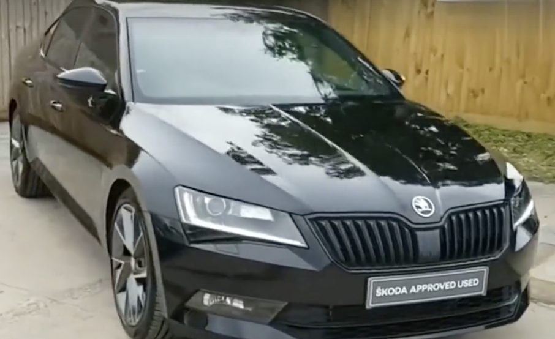
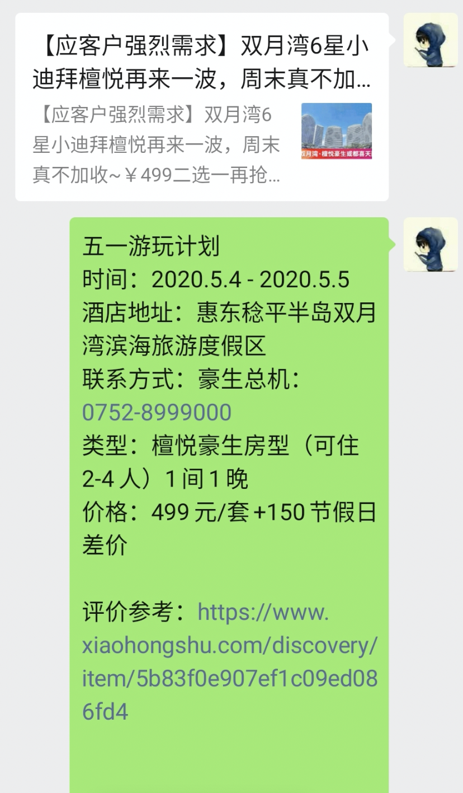
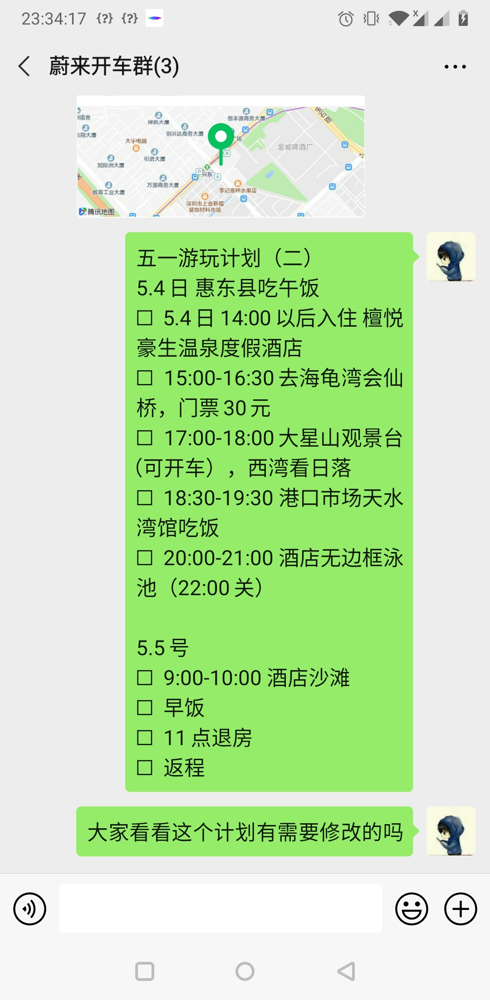
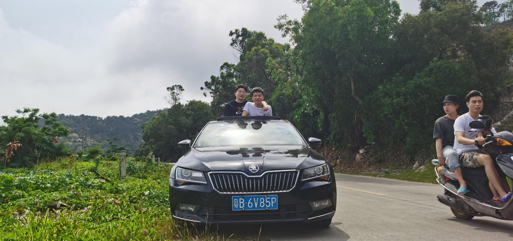
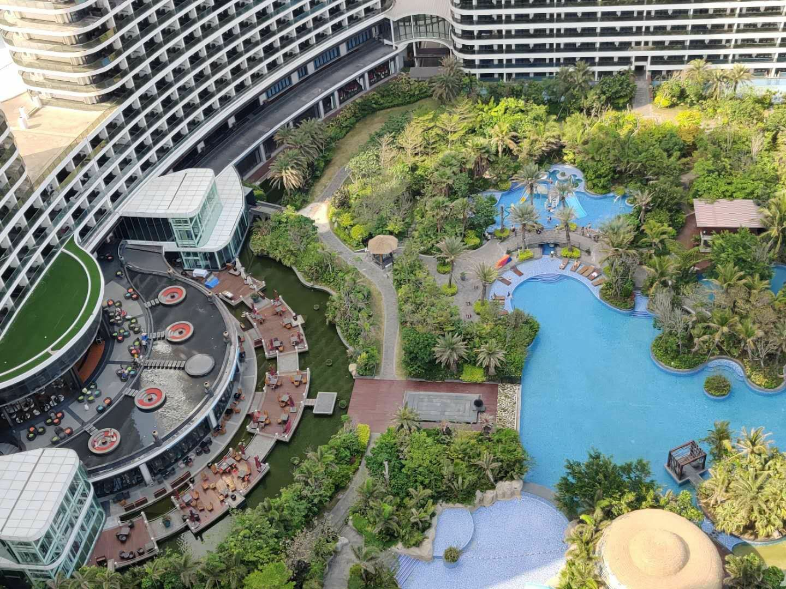
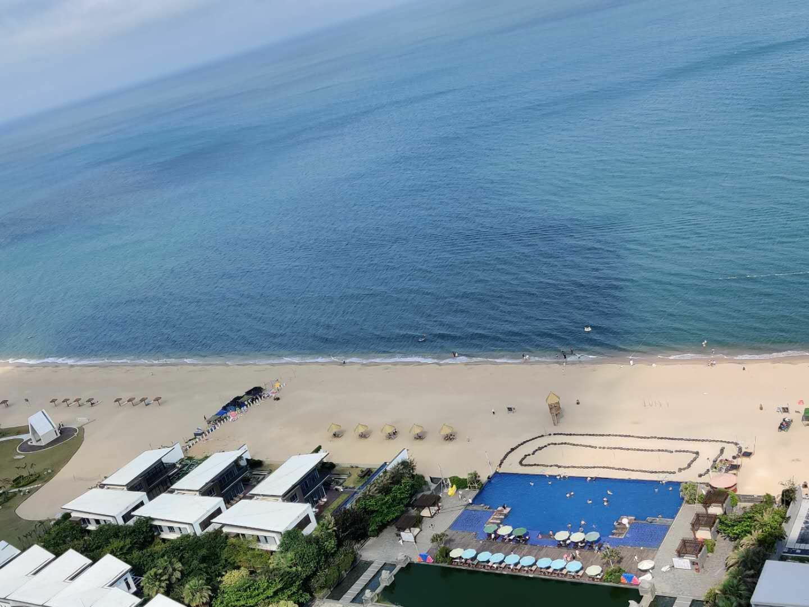
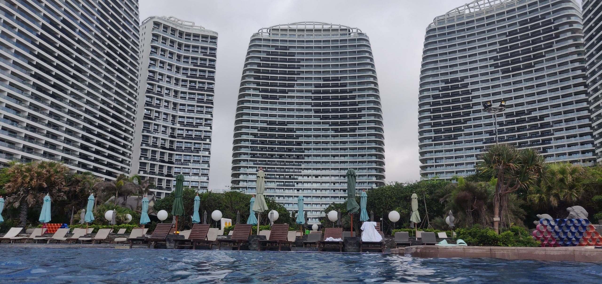
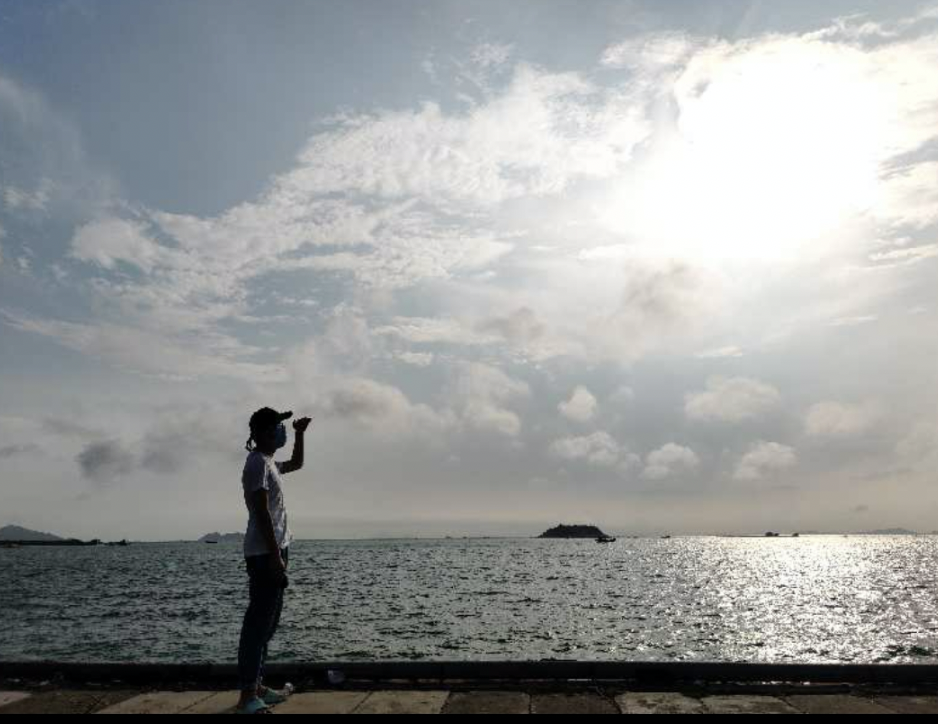
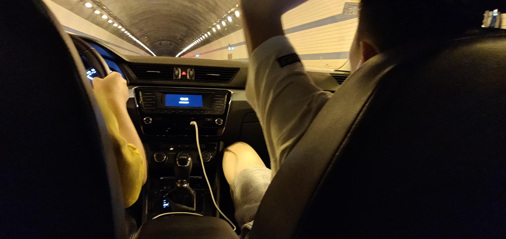

今年的五一劳动节，自驾游了一趟惠州双月湾，感觉很不错

<!--more-->

&nbsp;&nbsp;工作了之后，衡量时间的单位变成了天数，对于假期的到来，显得有些额外的兴奋，这次五一劳动节，加班了2天，还剩下0503-0505这3天，按照提前规划好的出行计划，一切都在有条不紊的进行中。

2020年 4月25日，还剩下一个礼拜就要到五一劳动节了，不可多得的假期让人充满了无限的遐想，深圳好友主要是甘、张两位大学老同学，自打上次开了蔚来汽车后，大家都对开车上路这回事念念不忘，这次五一劳动节的难得机会正好给了我们一个不错的契机，于是我们打算来一次自驾游，租上一辆汽车，开上高速公路，走出深圳，四处玩一玩。这个时候我们的出行方案还没有确定下来，时间上开始有些紧张了，虽然还有一个礼拜，但是对于这种国民级别的假期，如果不提前半个月甚至更久开始准备，那大概率你将会得到一个negative的体验，再加上大家都是工作狂，白天指定是没时间商讨了，晚上忙着睡觉那就更没时间了，所以留给我们的时间不多了。

&nbsp;&nbsp;一回生二回熟，还是那句话，大多数事情都可以用熟练度来衡量，这是第一次自驾游，心里多少有些没谱。目前从出行计划来看，可拆分为两大块：1、租车  2、出行目的地。于是任务可以并行处理了，对于租车这块，交给张老板应该是没啥问题的，我和甘老弟负责出行计划这块应该问题也不大。话分两头，先说说租车的事情，大家都是第一次，所以也没啥经验可以借鉴，根据讨论的结果，目前市面上比较可以的租车公司主要是：一嗨租车、神州租车和携程租车了。考虑到性价比的问题，横向对比后，我们最终选定了一嗨租车，不仅便宜，主要还是图个方便(就在张老板住处附近)。问题来了租啥车比较好呢，大多数年轻人肯定会说越贵越好啊，这还用选，是的前期我们专注于选择具备强推背感的车型比如马自达super，特斯拉model 3之类的，后来绕了一圈发现还是大众系列香啊，咳咳咳，主要还是要考虑安全第一，事实上租车很便宜，上保险贵，出门在外难免有些小意外，这些上了保险之后再开车心里就有底了。最终我们敲定了一辆黑色大众斯科达速派，这是一款混力电动汽车，有着不错的性能，租车费再算上全险，900RMB/2天，价格方面也处于能接受的范围。

租车问题解决之后，另外一件事情就是出行目的地和详细的出行计划了。出现目的地有很多，深圳周边的有大小梅沙、较场尾、远一点的有惠州或者清远之类的，关键还是要看想玩啥，来深圳记忆中只游过一次泳，看过一次海，所以出行地点得是海边，包含泳池，关键还得远一些，方便我们开车玩。于是惠州成了不二的选择，事实上计划一个国民级别的假期，确实需要提前准备，之前公司团建 正好协助过一些团队信息对接这块的事情，所以手上有了一些旅游供货商的信息，每逢节假日，他们都会在朋友圈等其他社交渠道发送一些比较热门的旅游景点，这一次，我翻了翻朋友圈，这个时间有些尴尬，很多项目都已经被售空了，不过，努力翻一翻，还真的找到一个满足条件的出行目的地，商量了一下就是它了，于是，再通过其他途径(比如小红书、抖音等)了解了一些该目的地的旅行攻略，最终我们的目的地和出行方案也就敲定了，目的地是：**惠州双月湾檀悦豪生温泉度假酒店** 。

详细出行计划：

&nbsp;&nbsp;时间一天天过去，令人期待的假期也如约到来，老规矩，加班两天，5月3号上午拜访了一位长辈，京东速度还可以，前一天买的白酒第二天准时就送到了，真的是隔日达。5月3号下午，按照计划，得把租的车提出来了，明天就要上高速了，手握方向盘的啥感觉早就忘光了，得赶紧找个地方练练车了，时间比较紧张，所幸天气还不错，风和日丽，视野宽阔，提车的时候，大家都很忐忑又开心，围绕这款即将属于我们2天的车摸了很多遍，为了防止还车时发生意外，我们对车况进行了360度无死角的检查，拍了大量可能会产生不必要纠纷的磨损点照片，事实上这种担心是十分有必要的，最后也起到了不错的效果。

在和一嗨租车的工作人员交割完手续之后，车子终于属于我们了，开车，上路！

拿到车的第一时间当然是打开音响了，不过奇怪的是，这车的音响似乎有些问题，每次打开都是播放FM，这让我们有些头疼，毕竟开车听歌这是最重要的一件事情之一了，上路半个小时，这个音响还是没有搞定，我有些迷了，在仔细查看了百度之后，又是半个小时过去了，突然，音响播放了我那熟悉的旋律，成功了，真是太high了，那种感觉真是太美妙了！原来这车的屏幕按键设计的有些反人类，多次尝试之后才无意中发现正确的操作方式，不得不说，事情还是要多多尝试才行啊。深圳的街道是极其复杂的，我们很快就在车流中迷失了方向，虽然有导航，但不太敢随意变道，毕竟这车经不起磕碰啥的，第一次在市区瞎晃悠，居然开着开着就上了环城高速了……要不是眼疾手快，及时变道下高速，恐怕此刻我们已经出现在深圳之外的某个地方了，所以开车还是要仔细看路，不能三心二意。

&nbsp;&nbsp;练车的过程比较短暂，5.4号上午10点，按照计划我们开始出发了，第一次上高速，忐忑，因为按照规定实习期的新手司机是需要在老司机的陪同下才能上高速的，这是科目一的知识点，不过幸运的是，我们仨中有个驾照超过一年，但驾驶估计不过10公里的老司机，再加上张老板有过高速公路驾驶经验，虽然我们是同一时间段拿的驾照，但至少心里有底气了。上高速，原来节假日出行是免费的，不错的国家政策；不得不说虽然高速路上有些危险，但是在高速路上开车是最容易进入状态的，因为只需要关注前方就行了，不过因为我们仨都是新手，所以大家精神都比较高度集中，一个人在开车，其他两个人就分别注意后方和侧方来车，方便在下一个高速路口到来前及时完成变道。有惊无险的高速驾驶终于在漫长的3个多小时后结束了，从深圳开车到惠州大概是150公里，来回就是300公里，我们三个人轮流开，每个人大概都开了100公里左右，事实上，经验就是这么来的，从此我们的驾驶身份成功的从新手司机步入到老司机的行列中了。

不过最让人过瘾的是下高速后，进入惠州县道，按照攻略的记录，这是一段崎岖不平的道路，然而我们因为意外错过了一个路口，只能选择绕道前往目的地，就是这个意外之喜，我们居然开上了一条刚修好的柏油4人道马路，重点是路况极好，无车，这个机会真是太赞了，高速路上不敢提速是有原因的，一是因为高速限速违规拍照，二是怕发生交通意外；但此刻这车道，这路况真是开车的好地方，慢慢的我的脚踩在油门上，1秒、2秒、3秒……依然没有减速的想法，油门似乎踩到底了，车速转盘开始慢慢变高，车外的景象开始越来越快的向后方飞去，我的背部也慢慢的感受到了座椅的阻力，车子也开始变得轻飘飘的，仿佛一动方向盘就能飞起来一样，偷偷瞄了一眼当前车速，哈哈 140km/h, 不错的体验，这个速度，确实很飘！本着安全考虑，我采用小范围点刹逐步将车速降低到合理的范围了，不过心里已经很满意了，因为油门踩到底的感觉，确实很飘！

&nbsp;&nbsp;2020年5月4日，下午15点半左右，我们终于抵达了目的地： **惠州双月湾檀悦豪生温泉度假酒店** ，酒店相当气派，官方介绍说是 亚洲 六星级酒店，就是不知道打了引号没有，我的影响中好像没也体验过五星级酒店，所以也就不太方便对此酒店作出评论了。

到了酒店第一件事情当然是去房间放行李了，酒店外景确实不错，我们这次住在了31/32层，舒服的海风迎面吹来，风平浪静的海面在午后显得十分的惬意。

海边的沙滩有些硌脚，这倒是一个让人不得不吐槽的点，之前还担心疫情原因，露天泳池可能不会开，不过幸运的是，居然是开的，于是心满意足的体验了一把露天泡澡的滋味，游泳这种技能真的学会一次就不会再忘记了，自打上了高中我的记忆中就再没有游过泳了，来了深圳后这是第二次，仰泳、蛙泳、狗刨、自由泳……各种游泳技巧都体验了一番，感觉还行，就是有点费体力，这可能和工作工种有关系，看来平时得多加强身体体能方面的训练了。

按照攻略计划，我们前往了海龟港会仙桥等著名景点，不过可惜的是，尽管是五一劳动节的尾巴，这些著名景点热度依然不减，人很多，考虑到时间的原因，我们就在附近的港口呆了呆，但这依然很不错，深圳这座城市很喧闹，这里的港口却很安静，夕阳下，照的海面有些刺眼，看着远方，好像轮船的烟囱里面冒出来的烟是静止的，画面很安静。

&nbsp;&nbsp;2020年5月5日，休闲的时光总是那么的短暂，一个舒服的懒觉过后，第二天我们就开始返程了，这次五一出行很舒服，完成了很多让人意料之外的体验，收获颇丰，在返程的路上，一个舒服的懒腰，已经证明这将是一个不错的经历，真是一次美妙的旅行

