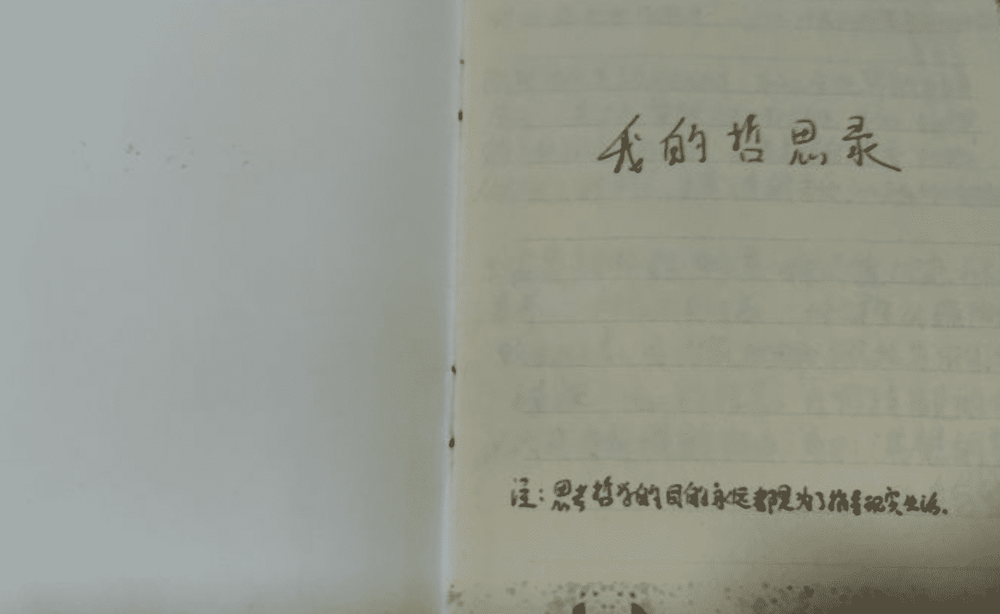

&nbsp;&nbsp;时隔5年，尽管已经放弃了去探索哲学的大门，但并没有放弃思考人生的价值，今天谈一谈我所总结的价值观，需要明确的是，价值观是一种务虚的东西，千人千面，你看它是什么，它就是什么。

<!--more-->

&nbsp;&nbsp;2015年，时值高三，一本《**时文精选*哲思散文**》把我带到了哲学的大门前，在门前伫立，未敢前进，因为我的经历跟不上里面的思想，所以我选择了摘读，饶是这样，也培养了我去追求价值的思考。

&nbsp; &nbsp; 在摘录本的扉页，我这样写道：“思考哲学的目的永远都是为了指导现实生活。”

现在看来鸡汤味十足的哲思，也不由得让我赞叹不已，难怪5年前我会沉迷于此，摘录几段如下：

> 既然自私是人类的天性，为什么全世界的历朝历代，人类又在宣传无私和利他，为什么全世界的人都要跟自己较劲？后来才明白，原来利他，从而长久的利己，才是人类的本质。--《无私到底有多高尚》

真不错，你品品，细品。

> 与富贵相称的更多是一种价值规范和人格、素养、一种社会责任感，一种健康优雅阳光的生活方式。有作家把文化概括为四句话：“根植于内心的修养；无需提醒的自觉；以约束为前提的自由；为别人着想的善良。”--《富贵与留余》

不简单，大学这个大染坊，我失去了一些好的东西，实在是一件遗憾的事情。

> 能主宰自己灵魂的人，将永远被称为征服者的征服者。--《三枚钱》

> 不是把焦点放在明天或后天，也不是明年或十年，而是把精神集中在“现在”这一刻，假如你已经预测到了未来可能会发生那样的情况，在事情实际发生前，何不能把那些预想忘掉？只要以这种态度定下基本的思维方式，我想：“不安的未来也将会离你越来越远。” --《给感到不安的你》

难以想象高三的我能够找到这么优秀的哲思文摘。

> 人生本来是没有意义的，人生的意义需要我们去赋予。我们只有把生命的热爱以及热情注入到人生中，生命才会显出意义。人生的意义就在于过好每一天，珍惜眼前人。--《读者》

是啊，现在的我多少带了一些功利的色彩，社会的熔炉大背景真不是盖的。

> 成熟也和人的身体相关，欲望和权利，激情和持久，成熟意味着一个内心渐次平和，不再因细小的诱惑而放弃，追逐的目标不再为即将到来的惩罚而逃避责任。--《成熟的过程》

…………再写两个，摘录的结尾是这样写道。

> 精神世界的追求，没有功利性，完全在于自由和享受，其实，我们很多人都在做着重复的工作，缺乏精神上的培养，如果没有精神生活，人会惶恐茫然，空洞乏味，陷入无所适从的境地。

讲的很有道理，尽管从象牙塔出来，踏入社会已有半年，但只有实践，才能领悟到字里行间中包含的意义。

> 检验一个人的标准，就是看他把时间都放在了哪里，别自欺欺人，当生命走到尽头，只有时间不会撒谎。

------------------------------------

以上，是关于五年前的事情，自从上了大学，我慢慢领悟到了上面提到的痛苦，迷失过，也颓废过，还好未曾放弃过。在摸索中，我慢慢积累了自己的价值观，主要有这几种：**概率、认可、定位、技术爆炸** 。

#### 概率

&nbsp;&nbsp;概率，虽然是数学的专有名词，但是用在人身上，真是太棒了，想要做成一件事情，成功并不是100%的，因为会有很多因素影响，但是，你可以提高这些因素，虽然不能达到100% ，但只要这些因素无限接近于它，那么你就能把这件事情办好；这让我想起初中时想到的一句话：人不可能十全十美的，但是人可以无限接近于它，以其达到十全十美。至于当时怎么得到这句话的，我到现在也没弄明白。

#### 认可

&nbsp;&nbsp;人是群体动物，并且在群体中具有流动性，但是想要从一个群体转移到另外一个群体，需要获得一种认可，这个群体的认可，这个道理是2018年去苏州微软离开时，我想获得一些建议，一位Principal告诉我，工作之后，当你和某个层次的人打交道多了，慢慢的你就成了这个层次的人了。后来仔细琢磨一下，悟到了两个字“认可”，当你想去某个群体时，只要获得了对方的认可，你就是这个群体的人了。

#### 定位

&nbsp;&nbsp;《明朝那些事》这是一本好书，我没看过，但不代表我没听过，事实上，我用听书软件，反反复复听了不下三遍，第一次听是在大学时期，正逢大二，压力难眠，于是听了这本书，有趣幽默，是我第一次听完后的感受，大四又开始了空闲，闲来无事，又开始听了一遍，乏味，感觉明朝那二百多年的历史中，文官集团的你争我夺很无聊，搞不清楚为啥能讲这么多，后来我开始了换位思考，假如我是一个明朝人，我会怎么办，定位，在明朝这段历史中，我想找到我的历史坐标，我突然意识到我根本找不到我在哪里，如果说需要追求的点什么，大概就是期望能够在历史的长河中留下一个清晰的坐标吧。

#### 技术爆炸

&nbsp;&nbsp;这是在《三体》这本书中我找到的答案，书里写的是科学在很长一段时间止步不前，后来在某个瞬间突破了宇宙的真理，紧接着科技飞速发展，于是将这段发展时期称之为：“科技爆炸”，我想用在技术上也是同样适用的，人掌握的技能就像复读机一样，它就在那里，你学会了就是你的了，而且当你在短时间内学会，那么你的技术也将会得到突飞猛进的进步。

&nbsp;&nbsp;以上就是我的价值观基本面了，学会运用在生活中，我想应该会起到一些帮助作用，至少是精神上的。

