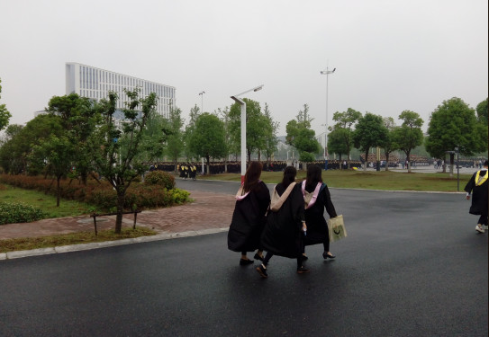
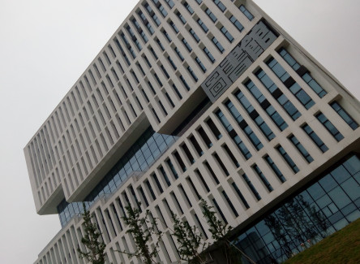
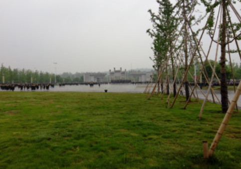

又是一年毕业季节，心里还是挺有感触的   前几日早上匆忙从食堂赶往教室去上课，途中碰见一群群身着毕业服饰的学长学姐们，结着伴的走往学校图书馆门前的广场，2018年5月8日，感触良多。

<!--more-->

> 又是一年毕业季节，心里还是挺有感触的

 前几日早上匆忙从食堂赶往教室去上课，途中碰见一群群身着毕业服饰的学长学姐们，结着伴的走往学校图书馆门前的广场，2018年5月8日，感触良多。

 不知不觉的时间就如流水般的度过了今年的一大半，想像着自己也即将披上那件端庄的学士服，心里却没有丝毫的喜悦之情，取而代之的是一种难以描述的复杂感情，就好像是心中有一块大石头一样，死死的压着，有种让人喘不过气来的感觉，天气很朦胧，脑子里面一片空白，不自觉的加快了前进的脚步。

 良久，当我停下脚步再次远望着这群学士服时，心里有了一个答案，确切的说是一个很模糊的答案—–我害怕了。我很害怕自己在还未取得任何骄傲的成绩时，就这么落寞的走完这段历程，这人生中只有这么一次地历程。脑袋如轰鸣般的激荡着，三年前，我曾揣着无限的期望来到这座学校，就像每一个热血青年一样，我也渴望着有一天能够名扬天下，衣锦还乡，博江东父老们的一片赞誉。然而随着时间的推移，逃脱不了迷茫的我也像大部分年轻人一样，迷失在了前进的道路中，就像黑暗中的一颗火种正在慢慢的消耗着它原本的想要照亮一片天地的激情。

 快步前进的脚步依旧掩盖不了我那近乎恐惧般的害怕，回到三年前入学不久的那一节课堂，当我面对着系主任，发出“大学可不可以辅修一个其他学位”的疑问时，系主任笑了，当时的我却十分的不解，现在的我懂了，懂了那个笑的真正含义，那是一种苦涩的笑，大学，如果连自己专业都未能够精通下来，还谈何什么辅修学位呢。以前的我一直认为高中地教学是一种选拔式地教学理念，是存在着激烈地竞争地，因为我们都是靠着比别人更加优异地表现获得继续深造机会地，而到了大学那应该是全方面发展地教学理念，所以我认为竞争应该是不存在地，然而我错了，因为这种观点，我整整消极怠工了一年有余，为此我付出了惨重地代价。大学地竞争比之以前地任何时候有过犹不及之处，与其说是与别人竞争，倒不如说大学是你第一次真正意义上地面对自己，与心里地那个自己竞争！那是真正地人生起点地地方，是你自己真正决定命运地地方，每到这个时候，我总是无不羡慕那些大学闷声发大财地同学们，辛辛苦苦了三年，大三是一个决定性地时刻，那些大学以来一直表现优秀地同学们终于可以收获自己地丰收果实，获得保研资格，在这种全民转CS，全民皆硕博地大潮流背景下，他们无疑是这个时代中优秀地杰出人物和人生赢家，我确实感慨万千过，也曾经幻想过自己也是他们其中地一员，然而公平是不允许这样做的，你小子消极怠工这么久，哪里来的白日梦还想着成为人生赢家，做梦。

 唉，一声叹息，足以表达我对这件事情地看法，既有对自己地惋惜也有对他们地羡慕，然而，真的就只能这样下去了吗，难道就仅仅因为自己曾经犯过一些错误就只能默默无闻地生活下去吗，难道就仅仅是因为觉悟地比较晚就要如此地折磨这些后知后觉地人吗，世界是公平地，你付出过多少苦，相应地就会收获多少果实。我认为对自我地认识需要无比地清晰，对自己地地位地精确定位，才能够明确自己地现阶段目标。很幸运的是，我属于这一类人，三年前的自己是多么的无知和自狂，随着现实的打脸，自己逐渐的迷失了自我，以至于丧失了斗志，慢慢的朝着自己年少轻狂时的反方向发展过去，如果照这条道路发展下去，我估计这辈子就只能老老实实的当个普通吃瓜群众，领盒饭过日子去了。所幸，万幸，现实和机遇，打破了这一僵局，**人定胜天** 这是我对这个转变的唯一评价。

 绝大多数人的智商应该都是差不多的，之所以会出现不一样的人生路径，主要还是在于思想上的深度，感谢以前高三的经历，那本神奇的书，那些神奇的事情，让我有了一把打开世界之门的钥匙，同时也感谢大学的那些人，那些事，让我有了对生活处事，人文交流更加深刻的理解，2018年5月12日，距离毕业季一年左右，只要大学还没有结束，我想留给我的机会还是很多的，打败心中的那个自我，不断的突破自己，审时度势，抓住机遇，我相信，老天爷是公平的！

个性签名：人要先说很多话，然后保持静默。。。