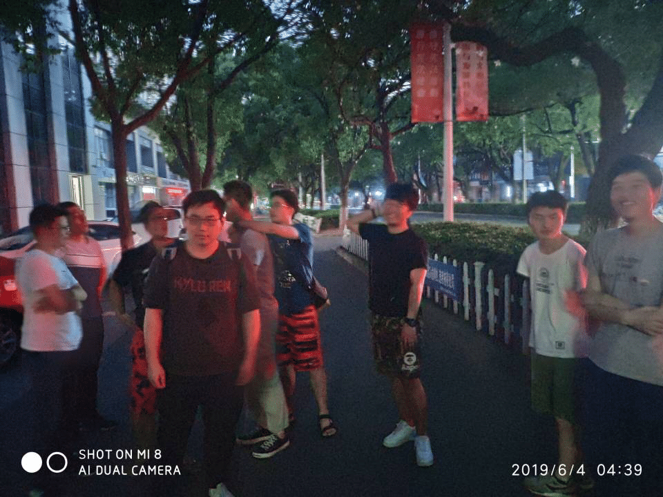
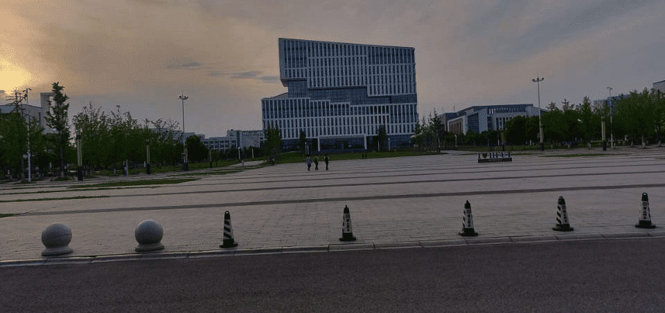
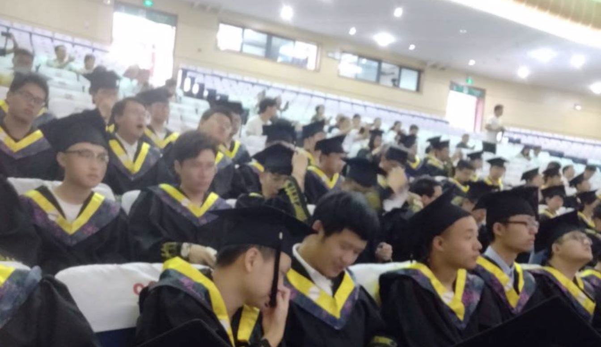
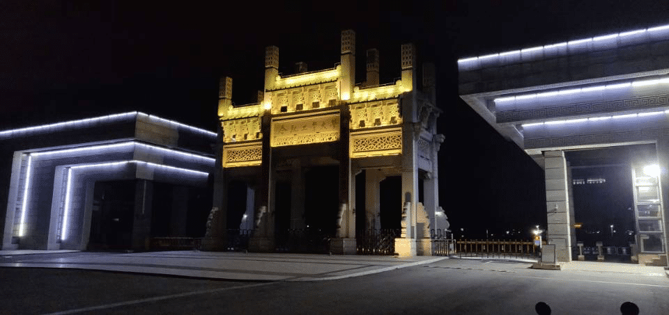

> 毕业了，作为一名半只脚踏入社会的青年，有收获也有遗憾，至于哪样多一点，我不知道

<!--more-->

#### 校园夜行之旅

&nbsp;&nbsp;2019年6月3日，毕业前最后的狂欢开始了，深夜凌晨，组队打牌的队伍已经坐在了棋牌室，人很多，虽然已经很晚了，但现场的人似乎都没有睡意，作为其中的一员，在这个晚上，我学会了很多种棋牌的玩法，狼人杀、阿瓦隆、……

我试图还原当时的内心状态，但无论怎样去努力，依然无法呈现当时的状态，那种发自内心的笑容，由内到外的代表着毕业季的我。大学四年很枯燥，如果让我再回到那个校园生活，我是不乐意的，但毕业季很快乐，身上没有担子，轻松和愉悦让人不禁感慨时间的飞逝。

打牌玩至深夜，有人提议回去，是的走回去，我们学校处在郊区，而我们正在市区的某个角落，这个距离，步行还是有点远的，如果是平时，那有人肯定会说这个人的脑子指定是抽了；但当时这个疯狂的计划得到了大家的一致赞同。于是，深夜的马路上，一群青少年正大摇大摆的挪着步子，那场面让我想起了古惑仔……

当时正逢高考，全城戒严，不得不说，我们没被警察叔叔请去喝茶真是万幸。

在四处漫无目的闲逛了一段时间后，太阳终于升起来了，每个人似乎都涌现出了困意，就这样，一人拦辆出租车，回校去了，似乎已经没有人记起来刚刚发起的那个走回去的提议，到了校园，人很好，天空刚刚朦胧，镜头下的图书馆，显得格外的安静。

拍完照，困意袭来，走在宿舍的道路上，我看到了那轮耀眼的红日，正冉冉升起。

#### 毕业学位授予仪式

毕业中最重要的一环，也开始了，弄完授予仪式，大学四年，也算是正儿八经的结束了。

和电影中描述的可能不太一样，这里只有安静和背景音乐，令人动容的离别场景反倒没有出现

夜色中，望着灯光下的大学校园门口，我知道，大学四年的校园生涯确实是结束了。

#### 上海外滩之行

&nbsp;&nbsp;毕业了，因为火车票的缘故，我选择去上海转车，顺便拜访一下一位金融高材生--我的小叔子，按照家族辈分，我得叫他叔，尽管他也才26岁左右，很让我意外的是，他从复旦大学金融系毕业选择了公务员这条路，这一次去上海，除了想让他帮我指点一些社会经验，就是顺便听一听他的故事。

当我表达了来沪之意，星期天，是一个很凑巧的日子，他很热情的接待了我，小叔邀请我到了上海最繁华的地方-外滩，尽管我已经来过多次，但每一次来我都不得不惊叹这里的繁华，隔着黄浦江，这边是民国时代旧上海时代的各种建筑，那边是改革开放后建成的新建筑，到了这里，历史的错乱感十分突出，人群的涌动，豪车云集，灯红酒绿的夜色，让人只感觉一阵阵的恍惚。他谈论起了他的事情，大学毕业后站在十字路口，面临着很多选择，选了从政这条路，这三年下来，感觉有点累，得到的机会很多，浪费的机会也很多。“见路不走”，这是我第一次和他聊天时，他告诉我的，他解释道，前人走过的路你仍然可以去走，这不是模仿，而是实践，因为你是你，他是他，你走的路就是你自己的路，一条属于你自己实践过的路，可见，实践是检验真理的唯一标准，而这又和总工程师邓公的思路不谋而合。

&nbsp;&nbsp;上海之行，触动很大，别人走的路，你走的路，唯有实践，才能检验真理。

