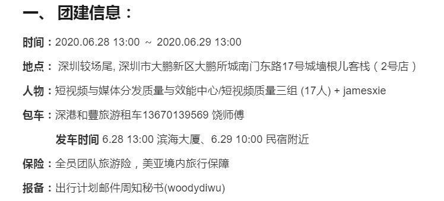
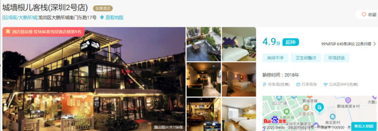
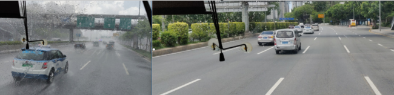
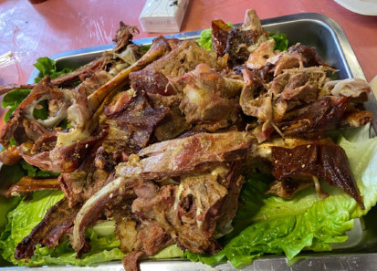
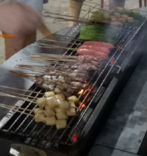
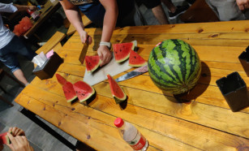
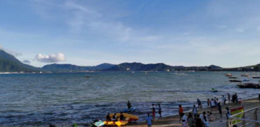
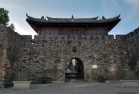
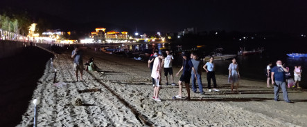

2020.06.28，赶在6月的尾巴，得益于wesee项目奖金，小组计划深圳海边民宿之旅

 <!--more-->

&nbsp;&nbsp;&nbsp;2020年6月24日，紧张的项目建设快要接近尾声了，小组因为wesee项目的原因，获得了一笔约2万￥的项目奖金，赶在6月的小尾巴，于是开始了小组的团建活动。

&nbsp;&nbsp;&nbsp;&nbsp;小组人数规模接近20人，团队建设活动，一般有这几种选择： 都市圈网红美食、轰趴馆娱乐、户外散步爬山、海边休闲烧烤之类的，于是在民主的投票下，大家的建议得不到统计，本着少数服从多数的原则，考虑到最近工作加班时间的原因，我们的方案仅限于离工作地不远的地方，就是去深圳湾散散步，然后再去一个高档点的餐厅享受一顿美食，时间花费大约一个下午+晚上就可以了，因为 6.28日 是为了补充前几日端午节放假所带来的额外工作，所以我们周天也是要上班的。没想到这个方案很快就被大boss否决了，大boss的意思是既然都打算出去玩了 就不要这么约束，可以给自己多点放松的时间。一时间大家都欢呼起来，毕竟前段时间 经常996的工作制度 让大家难免有些疲劳，现在官方都这么给力了我们也就不再顾虑什么了，于是经过一番研究，最终拍板 深圳大鹏新区的较场尾--海边民宿，共计花费时间 第一天下午~第二天中午，约1天时间。

&nbsp;&nbsp;&nbsp;&nbsp;组织一次小组团队建设活动不容易，作为活动的组织者，由于之前没有较多的经验，所以考虑事情比较谨慎，事实证明，活动的组织确实需要仔细演练可能发展的每个环节，争取做到全面保障活动顺利进行。

团建必要的信息， when、where、who、what，是不可或缺的。

首先是确定 出发和返程的时间，这个很重要，直接决定了这次行程活动的有效范围是多少，深圳南山区 距离 深圳较场尾 大约 75公里，正常驾车行驶大约1.5个小时。这确保了我们可以下午出发，第二天早饭过后返程，行程时间上比较宽裕。预定民宿不是一个轻松的事情，在这之前我只预定过酒店住宿，预定民宿倒是头一次进行，后来证明，民宿和酒店的区别在于前者 费钱多一点外，倒也没有啥太大区别，不过第一次预定，心里没底，为了货比三家，分别下载了 飞猪、马蜂窝、airbnb、booking之类的app，期望能够从一无所知的民宿中获取一些其他客户对意中民宿的评价，横竖对比后，决定预定一家如下民宿，靠近大鹏古城，环境优雅舒适，评分还ok

实际情况和照片上相差不大，按照网上预留的电话 call过去之后，说明自身团队情况，比较幸运的是 我们是端午节假日之后去的，所以房间有较多空闲，总价4000的包场价格，优惠下来 3800元，交完1800的预付款之后，房子就这么确定下来了。摆在面前的就是住房分配问题了，此时最需要的就是店家沟通实际情况了，我们一行18人，安排在了 11个房间，大boss和组长肯定是各一间的，剩余9房就按照实际情况来自由分配了，总体来说 住宿分配问题完美的解决了。

住的问题解决了，剩下的就是出行问题了，一开始计划的是大家开车过去，但是组内的车少人多，加上安全隐患问题，于是方案就变成了包车出行了，因为公司团建属于年度计划，所以每个组基本上都有一两个比较熟的包车司机信息，我们找其他组要了一个包车师傅联系方式，call过去，沟通了一下，18人出行可以包20座的巴士，这趟行程来回接送 1800元，合计人均100￥，这也是可以接受的范围。

住行都已解决，接下来就是 活动的具体安排细节了，团建旅游险这个是每个人都需要买的，之前去惠州团建时，印象中需要购买，这里通过统计 出行人员身份信息时就帮忙每人买了一份出行险，人均5元，安心。买完保险又考虑到 以前 公司内部有团建医疗包可以申请来着，后来询问才知道 医疗包在今年年初取消了，得自行购买，不过可以报销，考虑到必要性，于是购买了一些晕车贴、盐酸小檗碱、小柴胡颗粒等之类的日常药品。

我们的活动是海边休闲烧烤项目，所以烧烤是必不可少的，木屋烧烤是一个不错的选择，可以购买半成品食材，民宿有烧烤摊，于是一个不错的计划就这么诞生了，18人的分量我们选择了[木屋烧烤 899￥](https://www.meituan.com/meishi/d620523943.html#1)的套餐，担心不够吃，于是又加了 1800￥买了一只 15斤的烤全羊，事实证明，高估了大家的食欲，还是多了点。

6月28 13:00，出发的日子终于到了，司机师傅也如期到了公司门口等待，于是我们在准备了几大箱京东快递的酒水饮料后，愉快的团建就这么开始了，刚出深圳就开始下雨了，深圳的夏天多少有些 恐怖，大雨瓢泼，道路都有些模糊了起来，然而变化也很突然，前后不到 10分钟的车距，右图的地面好像什么也没有发生，如果不是汽车挡风玻璃上还挂着雨水，我都怀疑刚刚是否下过雨，深圳的变化之快，连天气都学会了。

6.28，15:00 终于到了 民宿了，一天的快乐时光也正常进行着，打牌、看剧、唱歌、玩王者、吃瓜等通俗有趣的活动大家也很快就打开了局面

夏日傍晚的海边，徐徐的海风吹的让人 着迷，古城 也在 傍晚的余晖下显得无比的安宁，生活在这里的人 想必日子是悠闲自在的

 

打着赤脚 踩在 柔软的沙滩上，这里的细沙是 双月湾那种人造沙滩无法比拟的，这里的很舒服，从脚底传来的一阵阵舒适感，释放出了我多日加班以来的疲惫，生活是美好的

带着睡意，有趣的团建活动也差不多接近了尾声，在睡梦中 我忘记了 工作，有的只是全身上下无比的放松，这样的生活真好