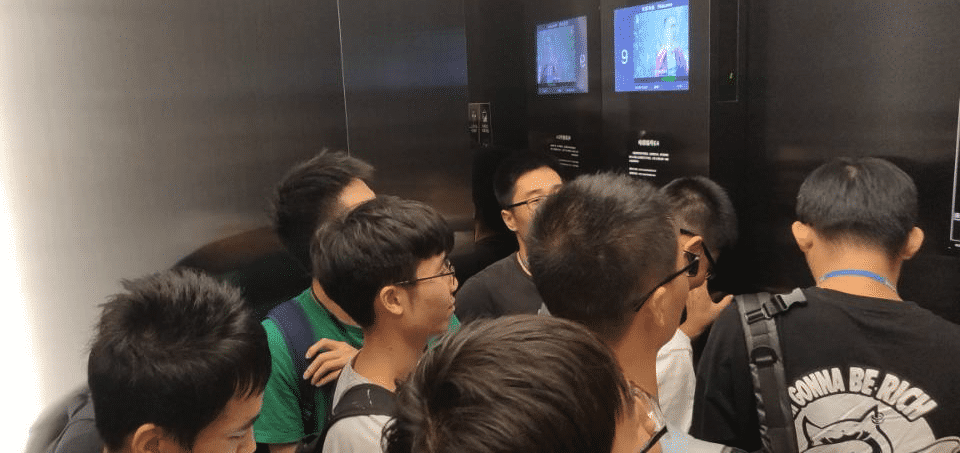
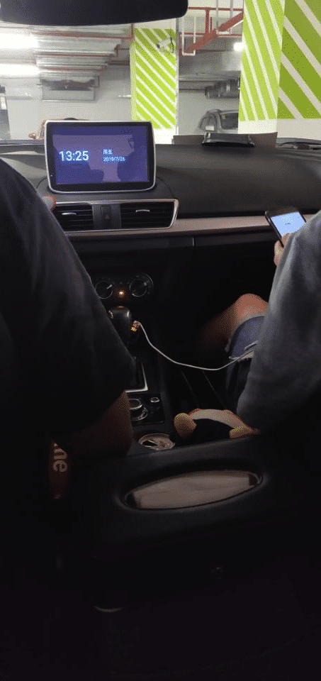
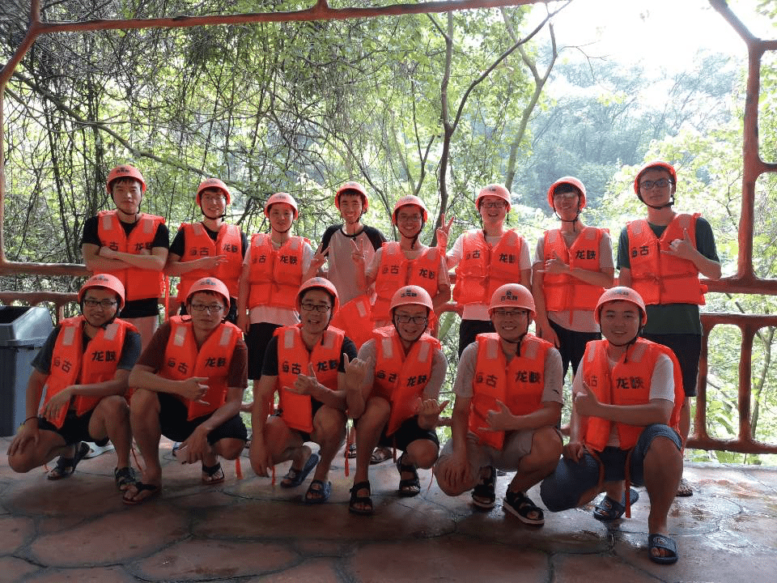
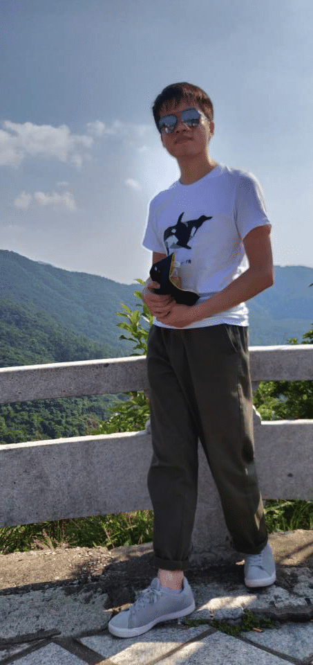
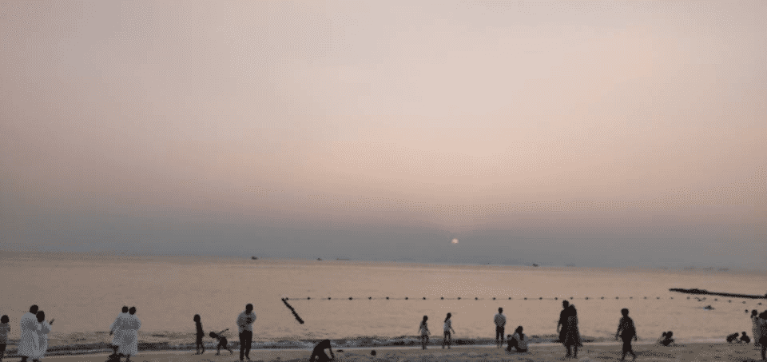

炎炎夏日带来的清爽，很不错的体验

<!--more-->

#### 清远漂流

&nbsp;&nbsp;2019年7月26日，赶在炎炎夏日的尾巴，为期二天的清远漂流正式拉开了帷幕，很幸运，在入职不久之后，就能够跟着团队出去游山玩水，这次的目的地是清远，从深圳滨海大厦出发，走高速公路，大约3个小时车程，从开始到准备出发已经计划了一个礼拜左右，于是在某个星期五下午，大家不约而同的起身开始了清远漂流之旅。

人很多，电梯刚刚挤得下，看上去每个人都很开心，因为这可是繁重工作之后难得的放松时间。

路上稍显乏味，在耳机的作用下，我很快就陷入了沉睡，迷迷糊糊中，车子已经到了目的地，这次住的是一个民宿，在一个花园里面，房子看上去很豪华，但周围的痕迹显示似乎很久没有人光顾过了。到了晚饭的时间，我们开始寻找美食，最终确定了一家当地大众点评排名第一的清远客家菜，无辣，不免有些失落，作为一个地道的江西人，靠近长沙，辣文化一直都很不错。不过广东菜的味道还是相当给力的，至少吃的很香。第二天，正式开始了清远漂流，尽管已是7月底，但广东的太阳依然毒辣。作为当地的5A级景区，这种漂流依山而建，显得十分神秘，也很有趣味，清远漂流的人很多，而且还有国际游客，胆小，没敢去闲谈。

水很清爽，气阀容纳两个人刚刚好，整个过程紧张刺激又舒服，不错的体验。

大合照是免不了的，毕竟需要留下一些纪念，这真是一次不错的清远漂流。

#### 惠州之旅

&nbsp;&nbsp;厂里素来就有一个福利，那就是年度旅游，每个人给予一定的资金正好可以cover住这次惠州之旅，目的地是惠州当地一个知名的5A级酒店，有私人沙滩和无边框泳池，自从上了高中，就再也没有游过泳了，好像已经不太记得浮在水里的感觉了。

&nbsp;&nbsp;2019年10月19日，旅游计划是先去爬山，然后再下海游泳，爬的山是深圳当地有名的山，年代有些久远，忘记了叫啥名了，只记得征服这座山很不容易，费了九牛二虎之力，才拍下了一张靓照。

原计划是爬完山之后去参观某个动物园，但天气实在是太过于炎热，大家都想直接休息去了，于是司机师傅开着大巴直奔目的地：惠州金海湾嘉华度假酒店，初到酒店，就感受到了这个酒店的气派，金碧辉煌，在傍晚显得十分高端典雅，放下行李后，趁着霞辉，跑进了那片沙滩，很美，第一次看到海，真正的海。

在又累又饿的情况下，酒店为我们提供了十分可口的晚餐，各式各样的海鲜和美味的佳肴，忙着吃忘记了拍照，然而美好的时光总是那么的短暂，在夜色降临中，我们结束了这次令人难忘的惠州之旅。