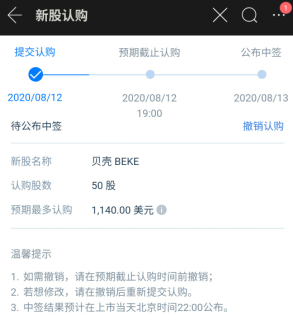
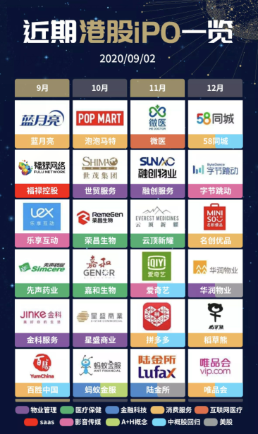

2020.0808，这是个吉利的数字，这一天我激活了香港汇丰账户，开始了港股打新篇

 <!--more-->

得益于大公司福利，汇丰银行的雇员计划让我有条件办理了一张香港汇丰运筹理财银行卡，在顺利的激活卡片之后，我开始迫不及待的准备着港股入金的事情，考虑到时间紧张，2020.0813，[贝壳(NYSE:BEKE)](https://xueqiu.com/S/BEKE)  即将上市，在此之前我得赶在 IPO截止前，认购一些股票，喝口热汤。

毕业一年有余，大多数人步入社会之后 就会开始有计划的进行理财的事情了，毕竟要用钱的地方开始变多了，周围的朋友大抵如此，我也不例外， 大四下学期，为了弥补对金融知识的欠缺，我开始接触 国内股市，先补充了一些开户的知识，然后 开通了 国泰君安的证券账户，作为一个 股票 新手，我对于很多概念都是一概不知的，但如今我已经多多少少知道了些股票入门的必备知识，有了这些知识差不多就可以成为一名合格的韭菜了。

想要交易股票，需要借助证券公司 ，在证券公司登记开户才可交易

**交易股市：A股、港美股**

A股：A股也称为人民币普通股票，是指那些在中国大陆注册、在中国股票市场股票上市的普通股，以人民币认购和交易。 

港美股：也称大陆离岸股市，是指在港或美等地上市的股票。

**交易方式：人民币、港币(美元)**

在A股交易使用 证券公司账户，绑定国内银行卡 ，使用人民币进行交易

在港美股交易使用 证券公司账户，绑定 非大陆银行卡，使用港币(美元)进行交易

**交易时间：**

A股：T+1，即当天交易的股票需要间隔一天才能买卖出

港美股：T+0，即当天交易的股票可以当天买卖出

**盈利模式：**

股票严格意义上是不存在 亏损的，只是有被套牢的风险。举个例子：投入 100元，购买 a股 100/股，一段时间后 a股价格变为 150/股，此时你盈利50元，但是如果你此时没有落袋为安，选择继续持有 a股，假设 一段时间之后，a股价格变为 50/股，此时你亏损 50元，但如果你继续持有，理论上a股有继续上涨的可能性，但此时你是无法 挪动这笔资金，除非你愿意接受这个亏损，此时你就被a股套牢了。

所以 炒股，其实就是炒一个信息差，在综合信息的影响下，低价格买入，高价格套现，讲究的是一个信息差的博弈游戏。

在A股的这一年里，看好了好几家 股票，不得不说我的眼光还是可以的，[分众传媒(SZ:002027)](https://xueqiu.com/S/SZ002027) 、[赤峰黄金(SH:600988)](https://xueqiu.com/S/SH600988)、[紫金矿业(SH:601899)](https://xueqiu.com/S/SH601899)这几只股，持有时间都挺长的，但拿不住，全年本金1万，才盈利2000元，跑输大盘。考虑到 A股 信息差 获取有限，我开始将目光转移到 更为轻松的 港股打新领域，在公司BBS论坛上，讨论最多的除了 某某姑娘们征友的帖子外，最多的就属 手慢无! 港股打新专贴了，别看标题唬人，但内容确实货真价实的好，仔细研究了 2个礼拜之后，感觉 还不错，正好看到 汇丰香港的雇员开户计划，于是就办了一张非大陆银行卡，顺利的开始了港股打新之旅。

2020年8月12日，香港银行卡已经准备好了，港股证券开户(富途牛牛)已经成功开通了，就差证券账户的入金操作了，公司员工在 港股打新这块 还是比较积极的，每天都有一些 交流群，时不时的在群里 抛出一些 诸如：出100wGB 招行中间价、恒生出20w刀 企微xxx，收汇丰20gb等等暗语，所以我就从某个老员工手中收了一些 gb作为入金的基础了。

时间刚刚好，在完成入金的时候，富途开启了 [贝壳(NYSE:BEKE)](https://xueqiu.com/S/BEKE) 认购手续，在仅有的现金流下，我认购了一些，剩下的就是期待 中签了，港股打新，有破发的概率，大概 各占一半， 但像这种 热门IPO，破发的可能性几乎为0，所以 是一门稳赚不赔的买卖。

事实证明，结果和预期的差不多， 50股中10， 贝壳IPO发行价 21元，在 中签后的暗盘挂单32.28卖出，盈利大约750元左右，后续的小鹏汽车IPO，50股中5，盈利大约200元左右，一顿操作下来，不到一个月就已经达到了 我在A股操作一年的50%盈利总数，这还只是在最基础的认购资金的情况下，假如加大筹码，相应的收益也会变大，不得不说 港股打新，确实是一门值得好好研究的 课题，2020年上半年 平淡无奇，2020年下半年 才是港股市场的重头戏，吾等且看且行，继续当一个合格的小韭菜。

