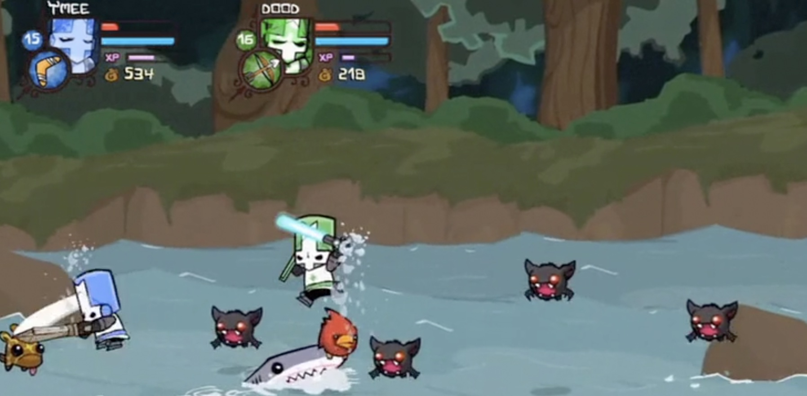
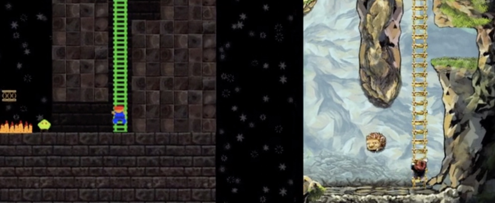
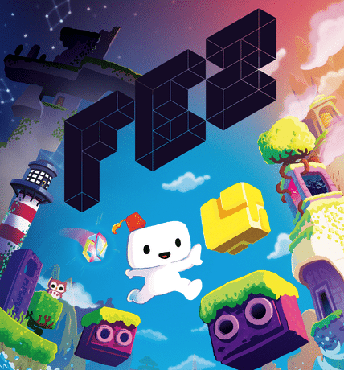

被好友安利了一波，看了一部制作游戏的记录片-[《独立游戏大电影》](https://www.bilibili.com/video/av19570263?from=search&seid=10183043575656878704)，讲的是三个团队，四个开发者，三款游戏，一个终极目标 —— 通过这部纪录片共同表达了出来的故事

<!--more-->

《独立游戏大电影》这部记录片，讲述了《超级肉肉哥》、《时空幻境》、《菲斯帽》这三款游戏，三个团队的故事。

&nbsp;&nbsp;故事起源于2008年，相比于大厂制作的主机游戏，个人团队制作的独立游戏开始大方异彩，同年《音乐战机》开始在Steam发售，

然后是《毁灭城堡》

紧接着是《时空幻境》和《粘粘世界》，其中《星噬》表现良好，《地狱边境》上市打破了游戏的销售记录，之后就是火遍全球的《我的世界》

不难发现，2008年是独立游戏崛起的时代，同年iPhone3G手机在全球发售，移动互联网的快速发展，加速了人们生活对游戏的依赖，这是一种全新的娱乐方式，可以说游戏正在成为我们生活的一部分。

#### 《时空幻境》

这款游戏的制作者是幸运的，乔纳森，一个从业22年的游戏制作者，他说：“ 我们正在老去，有了岁月的痕迹，这难免让人有些意志消沉，你就会情不自禁的想，也许我永远也不会像我以前以为的那样去做我想做的事情了，然后有一天，我告诉自己：“我要去做一件事情，并且一定要把它做完，然后就有了《时空幻境》。“  游戏制作花了他三年的时间，《时空幻境》一开始是几个不同想法的综合体现，作者当时发邮件给朋友们，其中一个正在玩《波斯王子-时之沙》，这款主机游戏里面有一个’倒退’的功能，可以让玩家在游戏过程中 回到之前的某个过程继续游戏，他当时思考有没有一种录像机的功能，然后他得到了灵感，先是花了一周的时间开发了一个雏形，左边的是雏形，右边的美术后的最终版本。不得不说，乔纳森的开发能力还是很牛的。

《时空幻境》实现了乔纳森个人对当代游戏开发趋势所作的批判。他为该游戏专案自掏腰包，开发时间历时三年。[网络漫画家](https://zh.wikipedia.org/w/index.php?title=网络漫画家&action=edit&redlink=1)大卫·海尔曼（David Hellman）为本作进行原画设定，几经修改才满足布洛所愿。《时空幻境》尚未加入最后场景图案的初版赢得了2006年度[独立游戏节](https://zh.wikipedia.org/wiki/独立游戏节)的「最佳创意奖」，该游戏于2008年8月6日在[Xbox 360 Live Arcade](https://zh.wikipedia.org/w/index.php?title=Xbox_360_Live_Arcade&action=edit&redlink=1)发行，而[Windows](https://zh.wikipedia.org/wiki/Windows)版则在2009年4月10日发布，最终版亦赢得了诸多额外的赞誉。本游戏得到了来自许多游戏编辑的正面评价，最后成为[Xbox Live](https://zh.wikipedia.org/wiki/Xbox_Live)上评价最高的游戏。

#### 《超级肉肉哥》

 游戏制作团队仅有两人分别是：麦克米伦负责了《超级肉肉男孩》的关卡设计和美术设计工作，雷费恩则负责编程工作，这款游戏的诞生比较特别，起因是雷费恩的儿时的悲惨经历，他期望这款游戏能够表达自己儿时那种自由自在，没有伪装，不受约束的行为，

> "他是个没有皮肤的小子，这就是我们为什么叫他meat boy，所以他是直接暴露在环境之下，也许他随时都能感觉到疼痛，但他能面对这些，他面对任何东西都必须很小心，因为任何东西都能杀死他，就连最小的东西比如盐，就绝对让他痛不欲生，我想要他的女朋友不仅只是个爱人，她可以使他变得完整，不只是心理上的，就连生理上也是一样，这就是为什么她会是bandage girl的原因，她就像是meat boy的外壳一样，能够保护他，这也是他需要她的一个原因，他需要她回来，不仅是因为爱她，是因为。。有了她生命才完整。” 

这是雷费恩在纪录片说的话。

&nbsp;&nbsp;《超级肉肉男孩》以其精准细腻的操作手感和对时机把握的极高要求而著称，设有超过300个富有挑战性的关卡，另有更多玩家的自制关卡可供免费下载。玩家在游戏中扮演一位颜色深红，方方正正，犹如肉块的“肉肉男孩”（Meat Boy）。游戏中的大反派“胎儿博士”（Dr.Fetus）绑架了肉肉男孩的[女朋友](https://zh.wikipedia.org/wiki/女朋友)“绷带女孩”（Bandage Girl），玩家需要通过闯关来营救她。

过程比较曲折，当你作为一个成年人，一个在生活上和精神上都算不上是非常丰富的时候，你很难下定决心去做你自己想做的事情，你需要工作来维持生活，你需要劳动来换取报酬，一旦你放弃了这些东西，然后投身去做一件可能会成功，更有可能会失败，尽管是你想做的事情，那么你将不得不面临这种精神上的折磨。从2008年开始，一直到2010年，这两年的时间，对于麦克米伦和雷费恩来说，可以称得上是一种修行，为了自己的目标，忍受了常人难以忍受的磨难，幸运的是结局是皆大欢喜的，他们成功了，在纪录片中，2010年的Xbox发售日，他们的《超级肉肉哥》打破了销售的记录，好评如潮，他们是幸运的。

#### 《菲斯帽》

这款游戏 是由 菲尔-费舍 设计的，故事讲述的是：

> 住在二维世界的戈麦斯，有一天遇到了闪闪发光的立方体。他从立方体得知了三维世界的存在，并获得了在二维和三维世界移动的能力。但与此同时，金色立方体破碎了，其碎片散落在了世界各地。为了拯救在立方体碎裂后开始崩溃的世界，戈麦斯开始了寻找立方体碎片的旅程。

菲尔的经历可以说用过山车来形容，2008年的独立游戏艺术节上，《菲斯帽》凭借发布的一版技术演示，拿了奖，当菲尔在领奖台上说到：“我叫菲尔，我是一名独立开发者， In the clear blue sky, an awards ceremony and this is fucking awesome……“，可以看出他是一个很随性的人，事实上，当他拿奖的时候，这款游戏仅近只是完成了一部分，在众人的翘首以盼中，游戏开发进度缓慢，紧接着，他开始了他的悲惨经历，他的父亲意外得了白血病，父母离婚后，他不得不帮父亲寻找新的住所；一段时间后，因为开发进度原因，合作者要求停止合作，然后投资人开始撤资，这段日子是悲伤的，他在记录片中 说到：“ 我很疯狂，这个游戏几乎是我的全部，我期望大家能够喜欢它，因为它真的可以给大家带来快乐。如果不能的话，也许我会选择离开。“ 确实有些疯狂，不过 他坚持下来了，结局也是美好的.

2012年，他们成功的完成了游戏的制作，开始了对外宣传，一经发售，很快游戏得到了极高评价，并且获得了2012年[独立游戏节](https://zh.wikipedia.org/wiki/独立游戏节)的最高奖项

有人评价说：

>菲斯（FEZ）可以说是最出色的解谜类独立游戏没有之一，纪念碑谷在fez面前简直不值一提

&nbsp;&nbsp;事实上，我没有玩过这些游戏，所以不好对其妄作评论，但是当看到纪录片中，他们从沮丧，迷茫，再到接受，坚定的走下去，最后取得成功，这个过程是让人振奋的，所以兴趣很重要，保持这份兴趣，尽管它可能不会给你带来物质上的满足，但至少在另一方面你是没有遗憾的。

