去年买的笔记本电脑开始鼓包了，记录一下维修日记

<!--more-->

2020年上半年，使用家用笔记本电脑的频率越来越高了，在不知不觉中，笔记本的盖子 开始合不上了，D面有些突出，这种情况下，一般都是笔记本电池鼓包造成的，脑海中回想起 三星手机爆炸事件，遂开始着手更换笔记本电池。

首先说下电脑配置 -- HP EliteBook Folio G1

> Intel Core m7-6Y75处理器（1.2 GHz、4 MB三级缓存、双核）
>
> Intel HD 515显卡
>
> 8GB LPDDR3-1866 SDRAM内存
>
> 512GB M.2 SATA TLC固态硬盘
>
> 12.5英寸1080P防炫目超薄型LED背光显示屏
>
> 4芯38Whr锂电池

配置中规中矩，办公没啥太大问题。

笔记本看上去也比较轻薄，笔记本重量越1KG，最厚处为1.24cm（注意是最厚），用起来十分的轻巧方便。

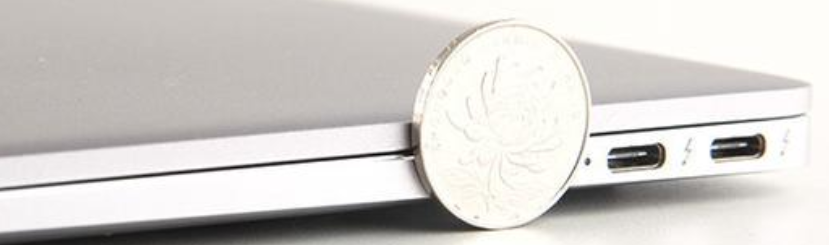

在查看了 对应的笔记本电池维修攻略之后，开始去某宝购买了电池，某东购买了维修工具，一天工作日后，东西悉数到达，于是开始了具体的维修过程。

### **动手前**

在动手前，先观察笔记本现状，发现 笔电D面鼓包严重，已经肉眼可见的肿胀，盖子合上后出现凸面，确认电池故障无误。

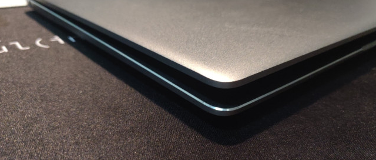

开始盘点物资：

- 笔记本一台

- 全新笔电锂电池

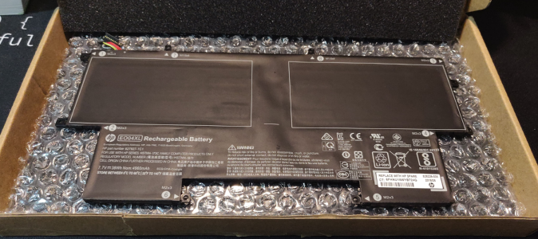

- 专业电子维修螺丝盒

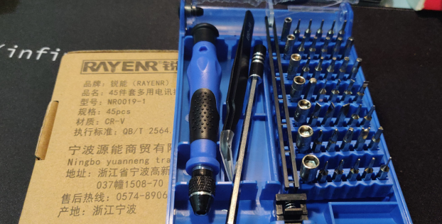

### **动手中**

将笔记本完全断电，然后反面朝上，使用螺丝工具，拧下D面的梅花星螺丝，拉出D面底壳即可看见主板、电池、扬声器一系列部件。

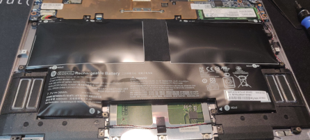

打开笔电D面，可见电池鼓包现象严重，与最初猜测基本吻合。

不过在接下来步骤就要集中精神了，因为要按照顺序拧下螺丝，拆除各种连接在主板上的数据线。首先是电池，拔出电池与PCB的接线，让Folio G1完全断电，防止拆机过程中误启动电脑。

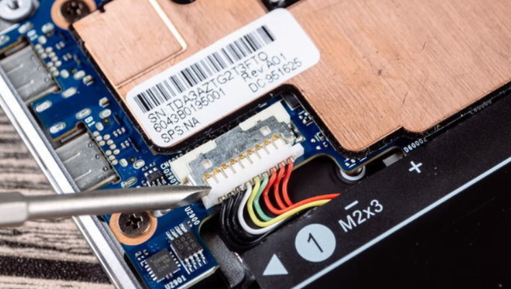

然后是螺丝，电池一共有8颗螺丝环绕其四周，每一个螺丝都标有号数，1至6是将电池固定在C面外壳上的，先将它们拧下来。7、8号两颗螺丝则是贯穿电池、主板与C面外外壳。把它们拧下来后即可拆卸电池以及对主板进行进一步拆解

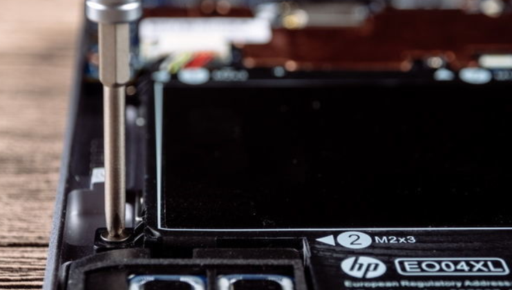

​                      （Folio G1采用的锂聚合物电池，重量为178.3g，约占整机重量18%）

整个过程耗时约10分钟，这款笔记本的CPU、内存、硬盘等设备都是高度集中的，我没敢碰（注意，螺丝需要按照顺序排列整齐，以便安装时顺利）

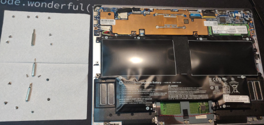

然后，就是把鼓包电池换下，将新电池换上的操作，此处简单略过，不过在正式装机之前，需要测试一下是否一切正常，将笔记本做开机处理，发现屏幕亮了，红外摄像正常，一次点亮，可以愉快的装机了:)

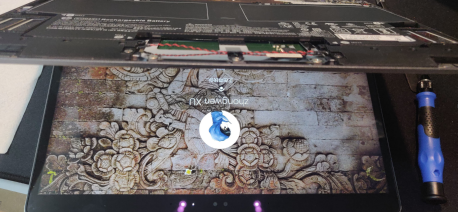

### **动手后**

按照拆机顺序再装机完毕，打开电脑，再将盖子合上，发现之前的肿胀已经消失，一切又恢复了正常。

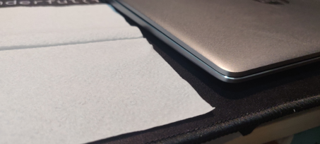

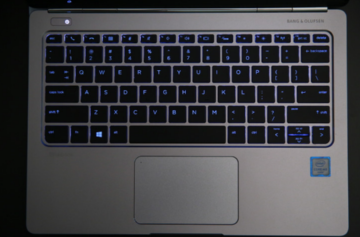

不过最后，可以再通过 一些 windows10自带的电池检测工具，检测一下电池的基本情况，

**电池报告**

使用管理员权限打开CMD，输入 

`powercfg /batteryreport`

查看 电池使用情况报告

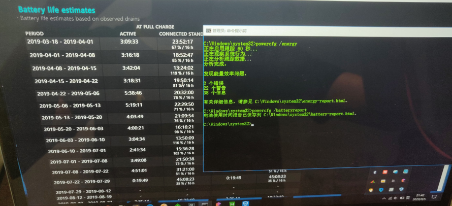

**结束**

整个过程耗时大约30分钟，维修的过程简单而又轻松，一切都很顺利。

参考文献： [【新技研】都说CPU是笔记本瘦身关键 以HP EliteBook Folio G1看个真假](https://www.evolife.cn/html/2016/88166.html)

