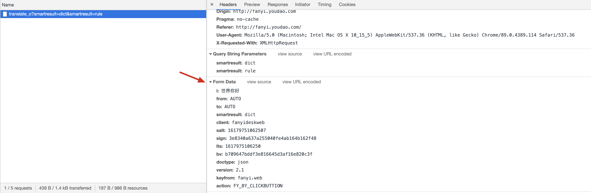
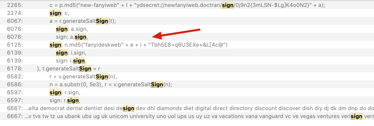

 Chrome插件 translate-man用的不爽，想自己弄个翻译API，翻了下网上冲浪手册，收费是不可能的，还是白嫖比较香

<!--more-->

### 翻译资源

- 有道翻译： http://fanyi.youdao.com/
- 百度翻译：http://fanyi.baidu.com/


#### 有道翻译


打开 有道翻译官网，有道 翻译 API 是一个 post 请求，从 Form Data 中看到 有 许多参数，实验多次，发现 参数 i, salt, its, sign 是变化的， 

官网介绍说 sign = md5( appkey + q + salt )，salt是一个随机数不出意外应该是 毫秒级时间戳+1位随机数，its为 毫秒级时间戳，i为待翻译的内容




检查 网站 加载的 js资源，发现 fanyi.min.js 资源有料，看来 sign = md5(固定字符串 + 待翻译内容 + salt + 固定字符串)，  见下图



于是，白嫖代码如下：

```
import random
import time
from _md5 import md5

import requests


class YouDao(object):
    def __init__(self, msg):
        self.url = 'http://fanyi.youdao.com/translate_o?smartresult=dict&smartresult=rule'
        self.msg = msg
        self.lts = self.get_lts()
        self.salt = self.get_salt()
        self.sign = self.get_sign()

    def get_salt(self):
        return self.lts + str(random.randint(0, 10))

    def get_sign(self):
        initial = 'fanyideskweb' + self.msg + self.salt + 'Tbh5E8=q6U3EXe+&L[4c@'  # 加密前需要编码 可能会出现TypeError: Unicode-objects must be encoded before hashing
        return md5(initial.encode('utf-8')).hexdigest()

    def get_lts(self):
        return str(int(time.time() * 1000))

    def get_res(self):
        data = {
            'i': self.msg,
            'from': 'AUTO',
            'to': 'AUTO',
            'smartresult': 'dict',
            'client': 'fanyideskweb',
            'salt': self.salt,
            'sign': self.sign,
            'lts': self.lts,
            'bv': '3da01a09873456cfb5dba05f2124b148',
            'doctype': 'json',
            'version': '2.1',
            'keyfrom': 'fanyi.web',
            'action': 'FY_BY_CLICKBUTTION'
        }

        headers = {'User-Agent': 'Mozilla/5.0 (Windows NT 10.0; Win64; x64) AppleWebKit/537.36 '
                                 '(KHTML, like Gecko) Chrome/88.0.4324.150 Safari/537.36',
                   'Referer': 'http://fanyi.youdao.com/',
                   'Cookie': 'OUTFOX_SEARCH_USER_ID=-610384760@10.169.0.83'
                   }

        resp = requests.post(self.url, headers=headers, data=data)

        return resp.json()['translateResult'][0][0]['tgt']


if __name__ == '__main__':
    YouDao = YouDao("亲测有效，本文章全系对技术的兴趣爱好,欢迎大家学习交流。")
    print(YouDao.get_res())
```


#### 百度翻译

讲究比较多，最重要的是 token 和 Cookie 是其中的关键，有 过期时间

```
class BaiDu(object):
    def __init__(self, msg, comef, to):
        self.initial_url = 'https://fanyi.baidu.com/?aldtype=16047'
        # 从'comef'语言翻译为'to'语言
        self.comef = comef
        self.to = to
        self.url = 'https://fanyi.baidu.com/v2transapi?from={comef}&to={to}'.format(comef=self.comef, to=self.to)
        self.msg = msg

    def get_sign(self):
        with open('bd_sign.js', 'r', encoding='utf-8') as f:
            ctx = execjs.compile(f.read())

        sign = ctx.call('e', self.msg)
        return sign

    def get_result(self):
        data = {  # 翻译内容语言
            'from': self.comef,
            # 翻译后的语言
            'to': self.to,
            # 翻译内容
            'query': self.msg,
            # 固定值
            'transtype': 'realtime',

            # 固定值
            'simple_means_flag': 3,
            # js生成(难点)
            'sign': self.get_sign(),
            # 固定值
            'token': '3cfcb1404cc2190966d72ff25661b730',
            # 固定值
            'domain': 'common',
            'sec-ch-ua': 'Google Chrome";v="89", "Chromium";v="89", ";Not A Brand";v="99'
        }
        # X-Requested-With': 'XMLHttpRequest' 该请求是AJAX 异步请求，否则为同步请求, Cookie可以理解为客户端的标识,有效时间应该很长
        headers = {
            'User-Agent': 'Mozilla/5.0 (Macintosh; Intel Mac OS X 10_15_5) AppleWebKit/537.36 (KHTML, like Gecko) Chrome/89.0.4389.114 Safari/537.36',
            'Referer': self.initial_url,
            'X-Requested-With': 'XMLHttpRequest',
            'Cookie': 'BIDUPSID=2EE35AEA7915669A6F7DB2E1912AAE50; PSTM=1600081094; MCITY=-278%3A; BAIDUID_BFESS=2EE35AEA7915669A6F7DB2E1912AAE50:FG=1; __yjs_duid=1_019740946ba76fcc6d77625732d821aa1617974521962; REALTIME_TRANS_SWITCH=1; FANYI_WORD_SWITCH=1; HISTORY_SWITCH=1; SOUND_SPD_SWITCH=1; SOUND_PREFER_SWITCH=1; Hm_lvt_64ecd82404c51e03dc91cb9e8c025574=1617974522,1617979263,1617979266; Hm_lpvt_64ecd82404c51e03dc91cb9e8c025574=1618136739; __yjs_st=2_ZTdkMmI2MjZmMTA0N2U5NWU0MzUzZjFiMWYxNGUzZmQ0MTM4Nzk4YmFiODU2Yzc4NDBmNzRhNGQ3YTYxMzUwMjgzZjViNjk2MWFhNjQ1YzNjZDM1NzcwNGRjYTIzZTUyZWRlOTg3NGVkNWEwYThhMDlmMGJlM2RkYTBmYzEyNGJiMTUzZWE2MGRmY2QzZTI4NTVkOGY1ZDNlMjM1NTM1NzMyZjQ2ZWFiMDYyYzcyZjBkNzgzMDI5YTQxMDc4Zjc0MTI4MTMyY2IwYjQyY2Y0MDQ2NThhNGIyMmVmMjYwZjk1ZjMyNmRjNDdjZTYwMTAwMGMyOTIzZDFhMDJjZWZkZl83XzMxYzA5OWFj; ab_sr=1.0.0_ZjMxYjU4NWFjNDFmYzUyYzFhNjIxZDljNWY2MjQ3M2JmOGExNzEwMTc2ZDBjMDFkMDBlMjg3MGUzOGVhMTM3NmFiYzFkNGU1ODhjODQwZTJjNTE5YmQxMmM1MzE3NTFk'
            }
        resp = requests.post(self.url, data=data, headers=headers)
        return resp.json()['trans_result']['data'][0]['dst']
        # return resp.json()
if __name__ == '__main__':
  
    # 百度语言代码
    lang_dict = {
        'zh': '中文', 'jp': '日语', 'jpka': '日语假名', 'th': '泰语', 'fra': '法语', 'en': '英语', 'spa': '西班牙语', 'kor': '韩语',
        'tr': '土耳其语', 'vie': '越南语', 'ms': '马来语', 'de': '德语', 'ru': '俄语', 'ir': '伊朗语', 'ara': '阿拉伯语', 'est': '爱沙尼亚语',
        'be': '白俄罗斯语', 'bul': '保加利亚语', 'hi': '印地语', 'is': '冰岛语', 'pl': '波兰语', 'fa': '波斯语', 'dan': '丹麦语', 'tl': '菲律宾语',
        'fin': '芬兰语', 'nl': '荷兰语', 'ca': '加泰罗尼亚语', 'cs': '捷克语', 'hr': '克罗地亚语', 'lv': '拉脱维亚语', 'lt': '立陶宛语',
        'rom': '罗马尼亚语',
        'af': '南非语', 'no': '挪威语', 'pt_BR': '巴西语', 'pt': '葡萄牙语', 'swe': '瑞典语', 'sr': '塞尔维亚语', 'eo': '世界语', 'sk': '斯洛伐克语',
        'slo': '斯洛文尼亚语', 'sw': '斯瓦希里语', 'uk': '乌克兰语', 'iw': '希伯来语', 'el': '希腊语', 'hu': '匈牙利语', 'hy': '亚美尼亚语',
        'it': '意大利语',
        'id': '印尼语', 'sq': '阿尔巴尼亚语', 'am': '阿姆哈拉语', 'as': '阿萨姆语', 'az': '阿塞拜疆语', 'eu': '巴斯克语', 'bn': '孟加拉语',
        'bs': '波斯尼亚语',
        'gl': '加利西亚语', 'ka': '格鲁吉亚语', 'gu': '古吉拉特语', 'ha': '豪萨语', 'ig': '伊博语', 'iu': '因纽特语', 'ga': '爱尔兰语', 'zu':
            '祖鲁语', 'kn': '卡纳达语', 'kk': '哈萨克语', 'ky': '吉尔吉斯语', 'lb': '卢森堡语', 'mk': '马其顿语', 'mt': '马耳他语', 'mi': '毛利语',
        'mr': '马拉提语', 'ne': '尼泊尔语', 'or': '奥利亚语', 'pa': '旁遮普语', 'qu': '凯楚亚语', 'tn': '塞茨瓦纳语', 'si': '僧加罗语',
        'ta': '泰米尔语', 'tt': '塔塔尔语', 'te': '泰卢固语', 'ur': '乌尔都语', 'uz': '乌兹别克语', 'cy': '威尔士语', 'yo': '约鲁巴语', 'yue':
            '粤语', 'wyw': '文言文', 'cht': '中文繁体'}

    bd = BaiDu('亲测有效，本文章全系对技术的兴趣爱好,欢迎大家学习交流。', comef='zh', to='en')
    print(bd.get_sign())
    res = bd.get_result()
    print(res)

```

