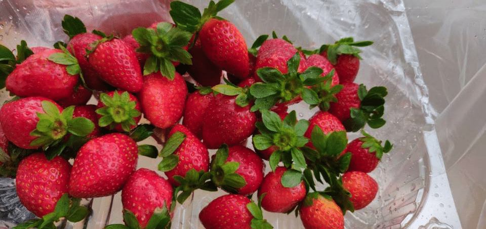
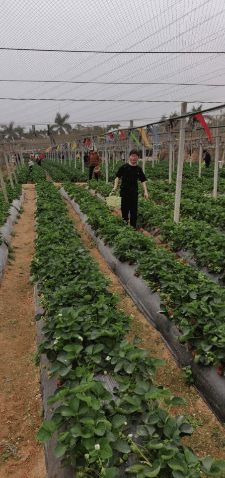

&nbsp;毕业半年了，老李拿到了留学的offer，赶在离别前，到深圳聚一聚

<!--more-->

&nbsp;&nbsp;2019年12月初，老李发来了喜讯，拿到了留学offer，不容易啊，2019年国际形势十分不好，特朗普的高压政策使得海外求学者的竞争压力不小，又加上香港爆发的反送中事件，间接导致留学压力激增，老李放弃了保研名额选择了海外求学，这是一个艰难的决定，我无法体会这种压力，也不知道6月份到12月份这几个月他是怎么熬过来的，但结果是幸运的，我们都有了新的出路。

&nbsp;&nbsp;按照计划，他将会在12月下旬来深聚会，约上深圳的小伙伴，张、甘两位同学，时间是我定的，因为我996，所以需要规划好大家都满足的时间，12月27号，星期五晚上，我向leader借口有急事，先溜了，这是老李下飞机的日子，他已经到了，但还没有吃饭，我也还没有吃，所以我需要接到他去吃饭，地点就在公司附近的79号渔港，令人感动的是，他很信任我，毕竟目前社会还不是特别稳定，传销之类的事情时有发生，感谢他的这份认可。79号渔港很不错，我们去的时候需要排队，但人不多，十几分钟之后，轮到我们了，肚子早就饿了，于是开始狼吞虎咽起来。

&nbsp;&nbsp;住宿的地方，离我住的地方不远，就在我住的小区门口，太子山庄小区--门口，价格适中，150/晚，环境一般但也算凑合。正好老李带了switch，作为今年热门的游戏机，超级马里奥确实做的很可以，任天堂在这方面还是很靠谱的，不知不觉，组队就玩了几个小时了。

&nbsp;&nbsp;

第二天一大早，我就被吵醒了，一般我都是9点起，结果这次直接8点，睡意朦胧，按照计划，今天是去玩，为了这个地点，我查了很久，考虑了一下，最终决定去欢乐谷，类似于迪士尼的游玩场所，说实话之前我是没有去过的，但这一次玩的十分开心，空中飞人、过山车、矿山车、激流勇进等惊险刺激的项目让我记忆犹新

看上去十分刺激

，晚上活动看了电影《叶问4》，因为我的上次志愿者活动发了几张电影票，本来是过期了的，但是机缘巧合之下又续期了，所以算是免费看了一场电影吧，另外爆米花十分可口。

&nbsp;&nbsp;第二天，计划是去和张、甘集合，但甘小伙担心天气原因，又加上早上的天气确实不好，但机会难得，最后拍板，去吧。于是四人终于在宝安区石岩镇的牛肉火锅店里集合了，吃完饭后，就进入到了主题了，今天的目的是去摘草莓，我知道草莓的成熟季节就是在12月份，所以，这个机会当然得珍惜了，一开始跟着导航，我有些诧异，似乎走错了方向，抱着试一试的心态，我们逐渐的往园内走去，总算是发现了草莓种植大户，于是入园开始摘草莓了。

草莓很新鲜，很久没有摘草莓了，其实入园是可以吃草莓的，只是众人不敢，唯我和张乔二人，吃了好几个大号的草莓，感觉超赞

摘草莓，讲究的是眼法和身法，看见了就要过去瞧瞧，如果超大个，则摘下即吃，如果一般个头，则看色泽和纹理，正常就摘下放在篮子里。

摘完草莓后，草莓不宜久留，所以我们又在路上开始消灭起来，不一会儿，我们就瓜分的差不多了，时间也不早了，我们就这样结束了这次聚会。