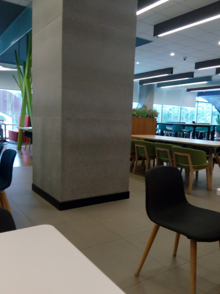
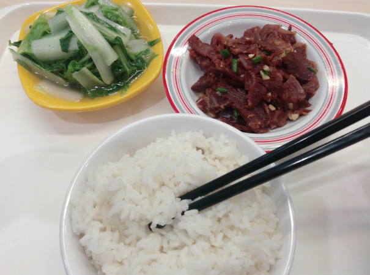
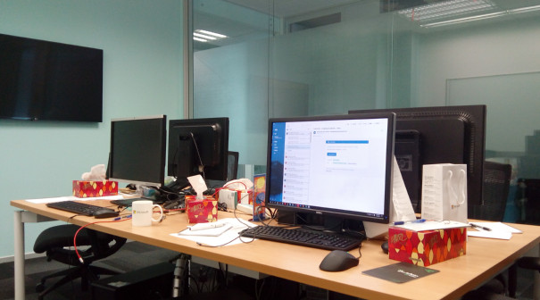
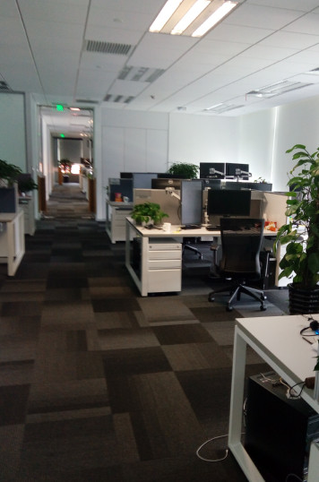
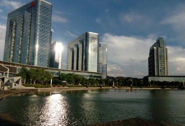
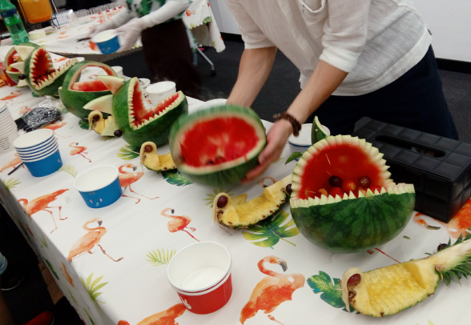
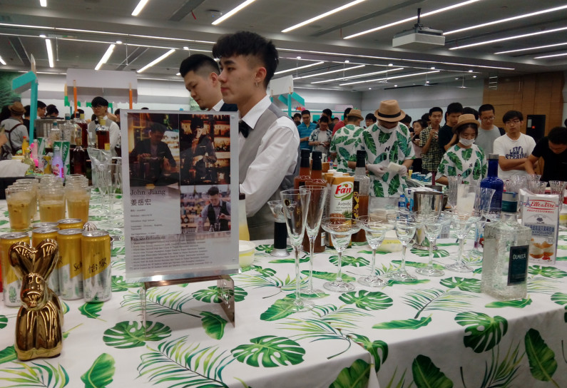
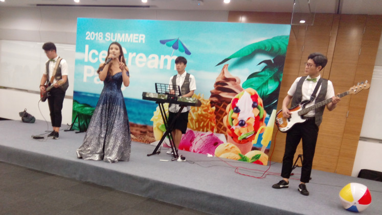
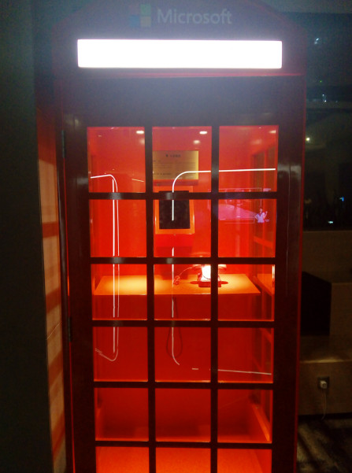

实习一个月，纪念一下
<!--more-->

#### 从何说起

*   [x]  简单的介绍一下这边的情况吧
    *   [x]  食堂
    *   [x]  办公室
    *   [x]  Intern 活动
    *   [x]  实习感受

#### 食堂

这边的食堂比学校贵，饭量不足，只有一个餐厅，具体表现为一个只能够容纳上百人的小食堂，但是这边的总的FTE也才700左右，这样的话，也就能够解释的通了，这个食堂里面，有一个西餐柜，一个面食馆，一个中餐馆（采用流水自助式取餐），一般开饭时间是早餐：7:30-9:00， 午餐(人比较多)11:30-13:00（去的晚的话基本上就光光了），晚餐17:30-18:30，基本上属于那种非常快的就餐方式，午休是不存在，没有午休室，当然一般的focus room，conference room，里面是有沙发的，如果你不嫌弃的话可以凑合一下，反正我每次都是这样干的。  

#### 办公室

看上去还是挺不错的，每个人可以免费拥有一台或者两台工作站，当然性能内存一般最低16G，硬盘只有2T的机械，这种应该是用过很久了的，所以一般都是比较卡的，你可以向IT部门申请一些虚拟机，当然是通过Skype通讯工具，内部同意一个alias或者邮箱，弹性工作制8个小时即可，给人的感觉还是挺可以的，工作内容有大有小，但都离不开英文，作为一个英语loser，我表示这一点不得不加强了，办公室很大，每个人的位置也很宽敞，作为一个Intern,我表示能够拥有一个team room简直就是难以想象.每天工作的时候，你可以四处走动，没人会管你，当然前提是你得把你手中的活都干的差不多了，给人的自由空间和时间都是相当 的充足的，哦对了，这里总共有9层，每一层都是不同的业务，当然苏州这边就只有o365、小冰、bing、sharepoint这几个组了，我处在最高层9层，当然这并不代表什么，除了每天都要做最久的电梯。每一层都有一个tea room，确实是一个福利，每天早上8点会准时将面包，八宝粥，常见的饮料，小吃等等放好，也许是食物购买的太多，导致我每天都看到的几乎是重复的食物，当然作为一个boy，我最爱的早餐还是面包加八宝粥，管饱！中午会送上一些乳酸菌饮品，感觉也还可以，当然每天早上下午都会有一波水果，这个水果有时候是苹果，有时候是葡萄，有时候是哈密瓜，当然最多的时候还是西瓜了。I love it，坚持每天都去吃一点吧。

#### Intern活动

这个怎么说呢，赶的比较巧，这里举办了一次ice Cream festival，在一个大的会议室里，里面有很多好吃的冰淇淋、蛋糕、酒水，等等，哦对了还请了乐队和调酒师，感觉还行。还举办了一次HAckathon,这里的Hackkathon和我前面介绍的hackatho差不多，都是头脑风暴，我显然错过了文化衫的好机会，争取下次有机会再参加了。

#### 感受

2018年7月10日，心情还是比较开心的，毕竟踏上了一条充满着未知的但却又无比让人向往的道路，第一周熟悉了公司人文环境和开发环境，第二周接触了具体项目，体验了开发流程。第三周开始划水，第四周也是如此，第五周更是如此，第六周，接触了另外一个项目，很有意思，做一个Azure上的WorkFlow DataPlatForm Framework OSP(one-shop portal)，如果你还没有体验到公司凌晨四点的情况，那么我可以告诉你，那将会是一次美妙的体验！目前是第六周的周二晚上，也就是2018年8月14日，距离第一天已经过去一个月了，这一个月以来，我错失了很多东西，总的来说应该是态度上发生了一些改变，我知道我不应该这么做的，但是事情已经发生了，接下来还有大约半个月的时间，希望自己能够把握住机会，把握当下，嗯下次再聊了。