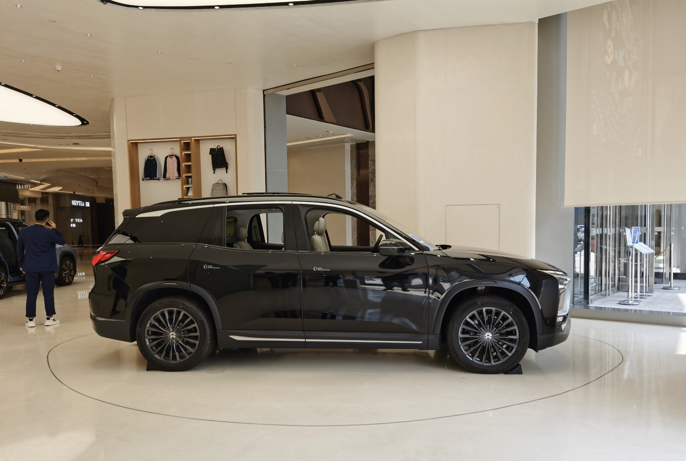
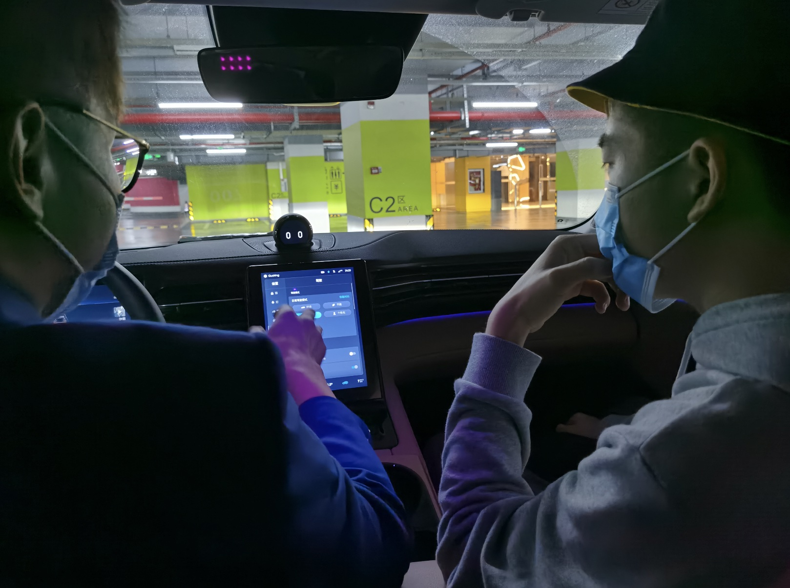
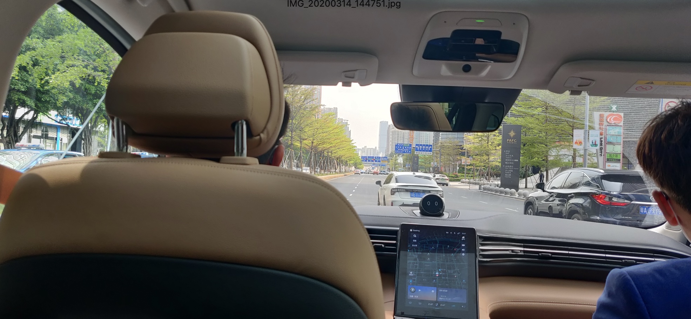

最近迷上了能上路的电动车，周末前往深圳福田平安金融中心，试驾了蔚来汽车，感觉很酷

<!--more-->

&nbsp;&nbsp;2020年疫情几乎贯穿了整个春节假期前后的休闲时光，一个偶然的机会，和好友周末前往深圳福田平安金融中心，试驾了蔚来汽车，感觉很酷

&nbsp;&nbsp;因为疫情的原因，部门开始没有强制996，这对于我来说，突然闲下来的时光多少显得有些不自在，正好最近在围观蔚来汽车的股票，仔细研究发现这是一家充满理想和未来风格的国产企业，汽车产品外观造型独特，内饰豪华，再加上接近平民的价格，给人的感觉是十分的靠谱。但不知为何，这家企业在2019年底～2020年初遭到了市场的质疑，股价从发行价的6块多跌到2块多，一时之间，雪球社区充满了各种对蔚来汽车未来的讨论……当然，这不是现在的重点，这次是去体验一下电动车上路的感觉。

&nbsp;&nbsp;一回生二回熟，大多数事情都可以用熟练度来衡量，这是第一次试驾汽车，心里多少有些没谱，遂借助搜索引擎找了几篇点击率比较高的文章，做起了攻略。在查看攻略的过程中，发现原来试驾汽车是一件十分简单的事情，因为在汽车销售过程中，需要提高汽车的知名度，所以每个城市都会有类似于展厅一样的试驾中心，你只需要在相应的官方应用上选择一个合适的时间，点击预约即可。不过，我还是有些担心我的着装问题，大裤衩+休闲卫衣+自如送的遮阳帽，感觉不像是去为了买车而试驾的，为此还专门和好友讨论了几番，衣服着装搭配依次从脑海中闪过，西装皮鞋、运动休闲装、还是成熟衬衫啥的，最后绕了一圈，好像我也没其他衣服可以穿了，再说我也确实不是为了买车而去试驾的啊，管那么多着装干啥，于是最后一个障碍也没了。

2020年3月12日，为了周六的试驾，我提前按照攻略步骤，下载了 蔚来汽车 app，按照app内的指示，找到了体验专区模块，选择好对应的城市之后，就可以看到指定的蔚来空间-试驾中心了

从app的体验角度来看，蔚来做的还是十分出色的，界面简约但又充满科技感，很快，上午刚预约完，一位试驾中心的工作人员就开始联系我了，说:” 我是蔚来汽车顾问xxx，感谢关注蔚来……”，整个沟通过程十分高效畅快，不一会儿，试驾中心就安排好了周六试驾的事情，这一次我选择的是蔚来汽车的ES8车型，众说周知，蔚来汽车总共有5个子品牌，分别是ES6、ES8、EC6、EVE和EP9，在没有了解蔚来汽车之前，我只知道ES6和ES8，并且一直以为ES8更新于ES6，后来才明白，原来ES6是2019年款、ES8是2018年款，不过这两款车型看上去差别不大，都是SUV型的。(图左为ES8，图右为ES6)

2020年3月14日，星期六，天气不错，没有下雨，按照约定时间，吃完午饭后(带着口罩吃火锅的味道还是差了点)，14:00准时出现在平安金融中心蔚来汽车试驾空间，打电话联系之前预约的蔚来汽车顾问xxx，蔚来汽车的工作人员工作服装挺不错的，蓝色休闲西服装，感觉让人很舒服，顾问围绕蔚来汽车做了一个简单的介绍，在检查一遍试驾上路前的必要身份信息(身份证、驾驶证)，check没问题后，我们就开始了让人期待已久的ES8路跑阶段了。

​        

&nbsp;&nbsp; 上车后，关键时刻掉链子了，我有点怂了，作为一个从没上过路的还没过实习期的菜鸟，我确实有点怕了，我这可是头一回开车啊(驾校不算)，万一这车砸我手里了咋办，万一路上熄火了咋办，脑子里的奇怪念头越来越多，有点乱了

但此刻，要淡定，来都来了，不溜一把车就显得太遗憾了，耐着性子，听完了顾问的上车注意事项介绍后，拨动了一下前进挡，车子终于开始发动了，首先环节是顾问先把车开出去，让我们领略一下蔚来汽车赖以自豪的百米加速效果，据官方资料介绍：ES8官方标定的0-100km/h加速时间是4.4秒。在深圳街道上，一条笔直的马路给了我们体验百米加速的机会，在顾问娴熟的一顿操作下，车子突然直接就达到了一个不可思议的速度，我只感觉自己像是突然被钉在了副驾驶座位上了一样，没法移动，心脏开始狂跳，来不及反应啥情况，车子就已经减速到了一个正常的速度，顾问不紧不慢的说：“  这车开起来还是蛮不错的，加速效果很明显.”    我咋没听到加速前的发动机轰鸣啊，冷不防的突然加速，看到对面来车了，连车牌都看不清。"因为这是电动车，加速都是通过电机在一瞬间完成的，特斯拉Model 3在这块做的更优秀一些，百米只需要3.5s左右，我们的车大概要4s左右。“  后来了解到原来顾问大哥以前是在对面的特斯拉试驾中心打工的，因为看中蔚来汽车的发展，今年就跑到蔚来这边工作了，难怪对于友商的情况这么了解，看来跳槽是一个很平常的事情呀，在闲聊中，顾问将车慢慢停到了路边。

&nbsp;&nbsp; 终于轮到我了，拉开主驾驶门，调整好座位和前后视镜后，我看着久违的方向盘，有些不太好意思的问了句：“左边的是刹车吧”，这个问题问出来，我自己都不太好意思了，当时确实很紧张，有些忘了怎么开车，两只手搭在方向盘上，脑子开始一片空白，这跟驾校开车完全没法比，深圳大街上车来车往很多，万一哪里碰到了，真就得在这跪下了，不过，电动车比燃油车好开一百倍不止！我仔细想了想，能形容的也只有这一个字: ”爽“。想要让车往前走，踩油门就可以了，想要让车停下，踩刹车就行了，其他的就是两只手握住方向盘，眼睛盯紧前方，同时注意看四周情况。第一次上路的感觉有些顺利，感觉开车稳的很，不过可能太激动了，开到红绿灯才发现，我忘了记安全带了！还好考驾照的时候带了脑子，难怪我上路的时候，车子总是滴滴个不停，原来是安全警报，这也说明蔚来汽车的安全模式还是蛮不错。

时间过的很快，等车子停稳后，短暂的试驾就这样结束了，整个过程，看上去有些枯燥，就是在大街上开着ES8溜了几下，不过对于当事人的我来说，感觉心里过了一万年，尤其是对于新手司机的我来说，这更是意义非凡的一次，原来开车的感觉可以这么的爽，方向盘握紧，精神高度集中，脑子里面只想着一件事情，看路开车。不过，我倒是没经历过百米加速的情况，把油门踩到底也不知道是啥感觉，会不会很飘？这个问题没想到很快就在一个月之后的那次惠州双月湾之旅有了答案，当然这都是后话了，不得不说，这次试驾蔚来汽车，真是美妙的一天！

