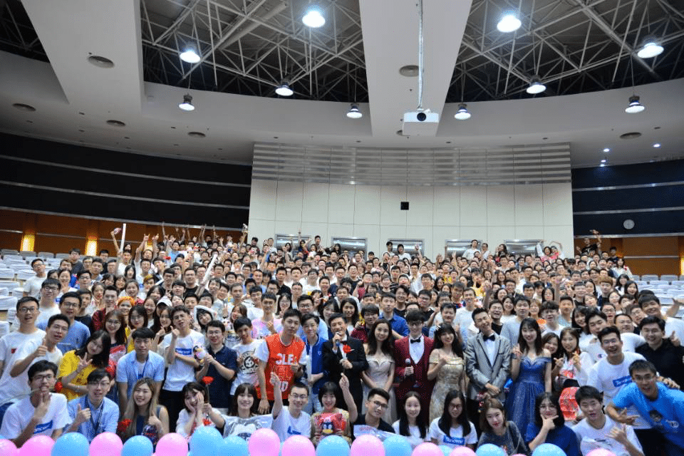
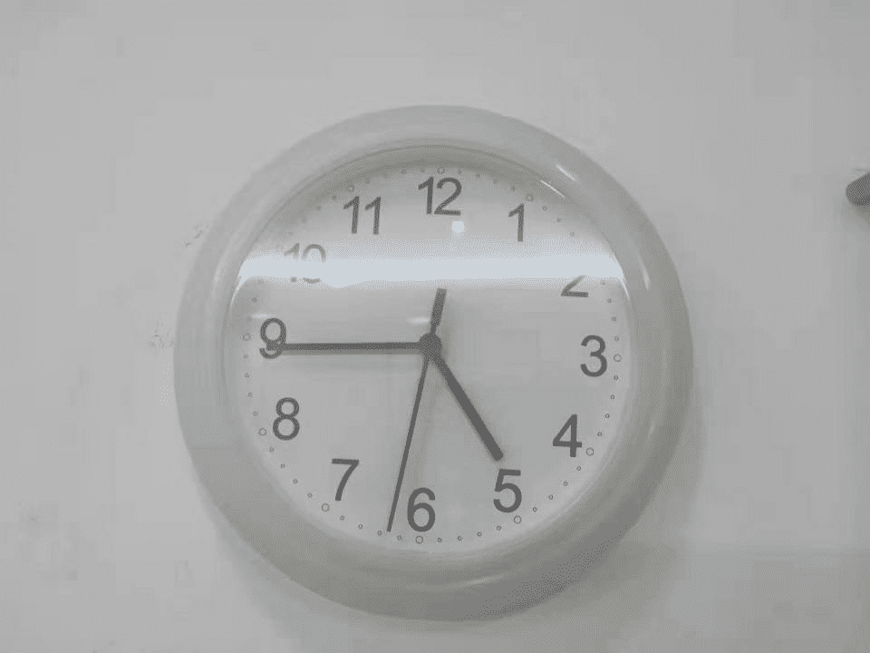

初入职场，厂里的培训过程，一个过程比结局更精彩的故事

<!--more-->

&nbsp;&nbsp;2019年7月13日，厂里素来就有封闭培训的传统，这一天，按照计划，我们聚集在一起开始接受入职培训，地点有很多，我们的地点就是 金百合酒店了。第一次看见这么多年纪相仿的人，心中不免有些羞涩，还是培训老师有经验，很快按照他的安排，我们人群被划分为几个小组，我在3组，组里人数8-10人，接下来的半个月，白天听课，吃饭，晚上卡牌游戏，周而复始。

在这期间，友谊正在迅速的升温，每天积累的一些印象也在不断的加深，组内的人都很有趣，我喜欢这种生活。

篮球趣味赛是这次的一个小插曲，毕业生组建团队和总办代表队比赛，我作为其中的队员，数字是13号，获得了两次上场的机会，两次接球，0失误，0投篮。

很快，半个月一晃而过，作为过来人我很难复现当时的状态，只感觉有点迷糊，从学校转变到职场的这个过程，我想我应该是没有做好准备的。

集体大合照是免不了的，人很多，这一期毕业生总共376人，好像有10期左右

很多人，在一起很热闹，这段经历，在每个人心中都留下了一个开心的记号，虽然最终要离去，但至少这份经历是一直存在的。

&nbsp;&nbsp;2019年8月4号，上面是公司级别的，而这一次是BG针对毕业生的培训计划，所以更加具备实战性。不脱产历时一个月，这次的收获更多，比较意外的是，还碰到了熟人，就是之前在金百合酒店一个小组的成员，有熟人合作起来就更加方便了，合作起来更加具备默契感，很快我们小组就按照既定的目标开始推进了，然而，无论怎么进行，我们还是无法改变下图的进度状态。

所以，经常我们需要集体加班，这种痛苦当时似乎并没有出现太大的感觉，现在想想那是一种近乎疯狂的执着，第一次来就经历了深圳的凌晨四点半，如果有人问我：你奋斗过吗？ 我会很自豪的对他说：是的，深圳的凌晨四点半很安静，还有点冷。

不知道过了多久，项目终于快要接近尾声了，临近答辩的前个周末，项目进度还剩下一部分没有完成，于是我们小组留下了这张，令人难以忘怀的合照，感谢拍照的高同学，无论从拍照角度和时间都恰到好处，你是一个合格的摄影师。

&nbsp;&nbsp;很多细节大多已经忘记了，只有看到照片的那一瞬间，才慢慢回忆起来，那段经历确实很赞。