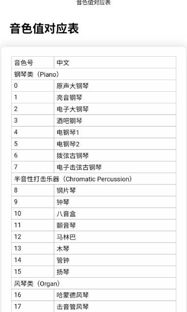
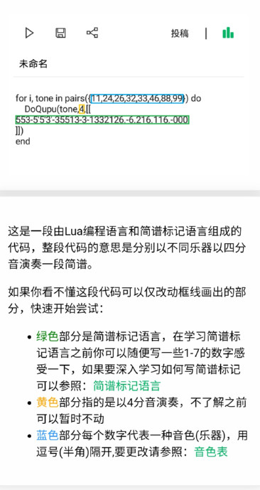
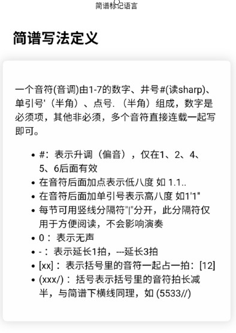

 近日发现一款 有趣的 app，使用 Lua语言编程实现音乐播放

<!--more-->


最近 在 一加应用商店，偶然发现一款 名为：**音乐编程** 的app，下载试用发现，确实是使用 编程语言来 实现音乐效果，


音乐编程app下载链接：[音乐编程 V1.1](https://www.shouyouzhijia.net/app/yingyuebiancheng/)


这个app的原理 应该是 通过 Lua语言驱动 手机蜂鸣器发音，一开始以为是在后台处理数据生成 MID 音频文件，后来测试断网情况 也能正常创作音乐，这说明音频处理逻辑在app内部实现了，从app里面看到可以选择这么多的 音色值，想要实现这些编程语言和音色之间的一 一对应关系实属不易，不得不说作者真是个牛人，不服不行





创作的过程还是挺简单的，app内部也有demo可供演示，大致就是 按照 app提供的编程符号，创作曲子，然后播放即可，编程语言是 Lua语言，理论上不需要特别掌握该语言也可以进行创作，所以重点是如何看懂 这些编程符号代表的含义就可以了。







初步了解了音色值对应表，简谱的写法定义，再看看音乐编程的示例基本上就可以快速上手创作了，我先初步创作了一首 《一闪一闪亮晶晶》钢琴版，听上去还不错，随后又开始创作《天空之城》钢琴版，被作者选为 精品了，很有成就感，于是又陆陆续续创作了《同桌的你》、《栀子花开》钢琴版，整体来说，这个app很有趣味，通过编程符号对应 音色和曲谱 发出声音，创意十足。


最后附上 我的 Lua语言音乐片段

《一闪一闪亮晶晶》

```lua
for j=5, 1, -1

do

	for i, tone in pairs({26}) do

		DoQupu(tone, 3, [[11|55|66|5-|44|33|22|1-|55|44|33|2-|55|44|33|2-|11|55|66|5-|4433|221-]])

	end

end
```


《天空之城》钢琴版

```lua
for j=5, 1, -1

do

	for i, tone in pairs({26}) do

		DoQupu(tone, 3, [[(67/)1'(7/)1'3'7--3|6(5/)61'5--34(3/)41'3--[01'1'6]7(4/#)4#7|7--(67/)1'(7/)1'3'7--3|6(5/)61'5--3|4(1'7)71'

		|(2'/)2'(3')1'-(1'766/)75#|6--(1'2'/)|3'(2'/)3'5'2'--(55/)|1'(7/)1'3'|3'---|

		(67/)1'(71')2'1'(5/)3'-4'3'2'1'3'--3'6'-5'(5'5'/)|(3'2'/)1'-(01'/)2'(1'/)2'5'|3'--3'6'-5'(5'5'/)(3'2'/)1'-(01'/)2'(1'/)2'7|

		6--|]])

	end

end

```


《同桌的你》钢琴版

```lua


for j=5, 1, -1

do 

	for i, tone in pairs({26}) do

		DoQupu(tone, 3, [[(505050/](503040/)5-7-|(606060)(604060/)|5-5-(505050)(507060)|5-40(0/)|(404040/)(403020/)(1--)1(0/)(1'-1'-1'-/)(1'-5-6-/)1'-(1'/)3'--|

		(2'-2'-2'-/)(2'-1'-7-/)|6--6--|(7-7-7-/)(7-7-1'-/)2'-5-(0/)(7-7-1'-/)(2'-1'-7-/)(1'--1'--)(1'--1'---)]])

	end

end

```


《栀子花开》钢琴版


```lua
for j=5, 1, -1

do

	for i, tone in pairs({1}) do

		DoQupu(tone, 3, [[131'|765|456|5-3|456|5-7.|(1--1-0/)|15.3|2-0|1[11][12]|2-0|4-(4/)|[45]5[5./]-|331|2-0|335|3-0|

		1'[1'1']5|6-[6'6']|4443|3-[5'5']|2-(2221/)-[000][000][000][000]|

		35.3|2-0|16.(1/)|2-0|44#(4/)|[45]5-|3[33][45]|5-0|332|3--|1'1'[56]|6-[7.7.]|4[44]4|5-[55.]|22[23]|1--|0|

		5[35][1'6]|1'-0|7[57][65]|6-0[06.]|4[45][65]|6-[66]|5[11][53]|3--|5[35][1'6]|1'-0|7[57][65]|6-(0/)(6./)|4[45][65]|6--|

		557.|1-0|000|000|1-0

		]])

	end

end

```


