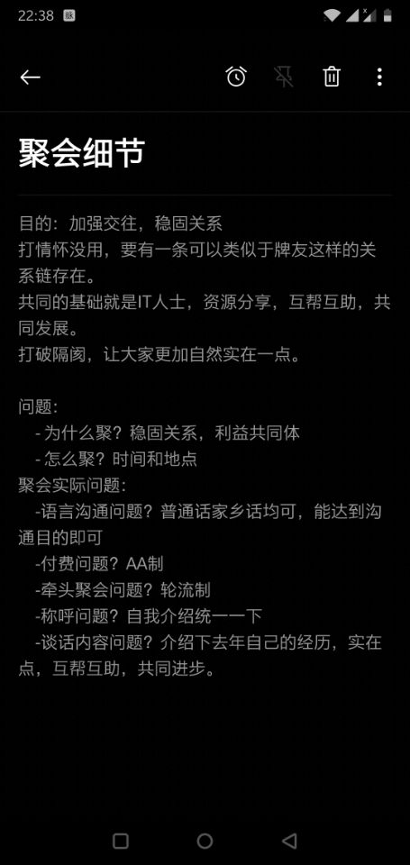
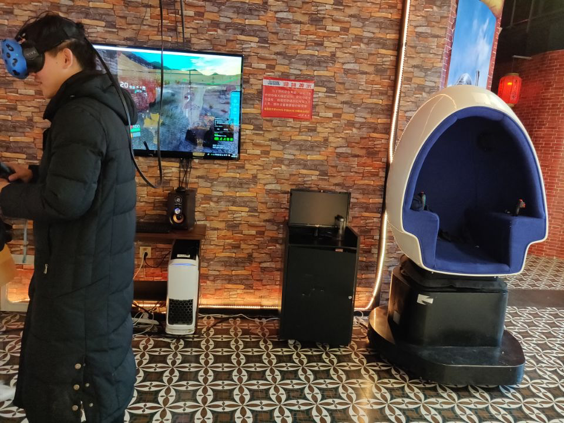
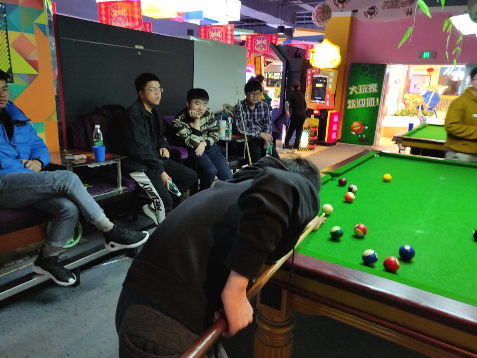

&nbsp; &nbsp; 高中好友聚会，第一次胜利会师

<!--more-->

&nbsp; &nbsp; 关系，自古以来都是重要的，只要是人，都或多或少的会在这上面花费功夫。如果处理得当，那么关系就会作为一种传承慢慢开始发扬下去，对于这个深刻的认识，我是深有体会的。

&nbsp; &nbsp; 2018年7月我作为一名Intern，前往苏州微软实习，很开心，因为那是一个全新的世界，在那里，我认识了一批优秀的人，做了一些优秀的事情，同时我也喜欢上了那里，但是好景不长，实习期结束，我不得不离开了；2018年12月份，我作为有赞的实习生，前往杭州西湖区实习，互联网的氛围让我感受到了忙碌的气息，热情和友情围绕在四周，那是一群有活力的人，但是工作不太适应最终也选择了离去；这两段经历让我结交了很多伙伴，但是让我十分意外的是，离开之后，我就再也没有和他们打过交道了，这是一个比较让人沮丧的事情，既然明知道会离去，我为何还要认识他们呢，这个问题困扰了我很久，最后，我想到了关系，并达成了共识。

&nbsp; &nbsp; 关系，确实需要刻意的去维护，但是这个刻意是指的是创造一个交流的机会，走亲访友，大致就是这样的一个机会，春节的传统天然的创造了这个机会，这也是为什么每个游子都需要回家过年的原因。我所在的这个行业，比较封闭，周围大多数是从事该行业的相关人员，这就造成了关系的封闭性，如果任由其发展下去，那么大概率我会孤独终老，这可不是一个好的事情，所以今年过年，我选择了联系，老家有三个好友，因为地理和读书缘故，交流颇多，因为年纪和成长经历相仿，我们的革命友谊很深，目前关系密切；高中是一个不错的圈子，曾经我有一批好友，但是大学期间，未能主动联系导致疏远，这应该是个人原因造成的，毕竟没事联系确实不是很好，也就是前面介绍的机会，没有人来创造一个机会进行沟通，这就很难踏出第一步，我打算从这里突破。

&nbsp; &nbsp; 幸运的是，高中的老铁-浩辉没有忘记我，我和他平时联系就比较密切，属于知根知底的伙伴，关于他的故事，大致可以讲三天三夜，以后有空开个专题写写吧，我先约他交流了成立一个圈子的想法，这个想法很快得到他的赞同，紧接着我又想到了义杰，谁能想到我与他的深入交流竟是起源于一本区块链白皮书，后来他从环境治理专业顺利入行计算机，算是赶上了晚班车了。于是，我开始陆续联系高中属于同一个方向的好友，毕竟有共同基础才会有话聊，有了可持续的话题，关系才会传承下去。就这样，9个小伙伴终于聚齐了，作为刻意创造机会的我来说，第一次聚会十分重要，我想了很多，最终决定和大家分享我的计划，大家深以为然，聚会十分成功。

休闲时光

&nbsp;&nbsp;从开始的那一刻，也曾动摇过，是否太过于刻意，但我又一想，如果不打破这种传统的思想观念，就会将自己束缚在举步维艰的牢笼里，这样是不行的，相反，去创造一个机会，让大家有一个可以相互认识和交流的平台，这是十分可取的，只有勇敢的踏出第一步，规划好全局，就大概率可以将事情办好。勇气和智慧，是能办成事情必不可少的因素。

